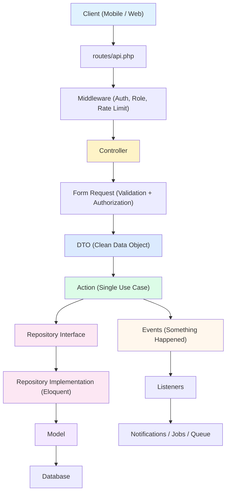
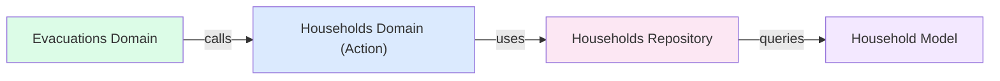

# Feature-Based Enterprise Architecture for EvaTrack

Combining the **Enterprise Layered Architecture** (Controllers → DTOs → Actions → Repositories) with a **Feature-Based (Domain-Driven) Directory Structure** is the ultimate way to build scalable Laravel applications.

Currently, your backend groups files by **type** (e.g., all Controllers in one folder, all Models in another). A feature-based architecture flips this around and groups files by **business domain** — just like your React frontend already does.

---

## The Full Request Lifecycle

Every single HTTP request flows through the exact same pipeline, from top to bottom, with no shortcuts:



> [!IMPORTANT]
> **The golden rule:** Each layer only talks to the layer directly below it. A Controller never touches a Model. An Action never reads from `$request`. A Repository never dispatches Events.

---

## Complete Folder Structure

Below is the full directory tree that your EvaTrack backend would have after migrating to this architecture. Every single domain in your current application is represented.

```
app/
├── Domains/
│   │
│   ├── Households/
│   │   ├── Controllers/
│   │   │   └── HouseholdController.php
│   │   │   └── HouseholdMemberController.php
│   │   ├── Actions/
│   │   │   ├── CreateHouseholdAction.php
│   │   │   ├── UpdateHouseholdAction.php
│   │   │   ├── DeleteHouseholdAction.php
│   │   │   ├── SearchHouseholdsAction.php
│   │   │   ├── ListHouseholdsAction.php
│   │   │   ├── AddMemberAction.php
│   │   │   ├── UpdateMemberAction.php
│   │   │   └── DeleteMemberAction.php
│   │   ├── DTOs/
│   │   │   ├── HouseholdDTO.php
│   │   │   ├── HouseholdFilterDTO.php
│   │   │   └── MemberDTO.php
│   │   ├── Models/
│   │   │   ├── Household.php
│   │   │   ├── HouseholdMember.php
│   │   │   └── HouseholdStatus.php
│   │   ├── Repositories/
│   │   │   ├── HouseholdRepositoryInterface.php
│   │   │   └── EloquentHouseholdRepository.php
│   │   ├── Requests/
│   │   │   ├── StoreHouseholdRequest.php
│   │   │   └── UpdateHouseholdRequest.php
│   │   ├── Events/
│   │   │   ├── HouseholdCreatedEvent.php
│   │   │   └── HouseholdUpdatedEvent.php
│   │   └── Listeners/
│   │       └── SyncHouseholdCacheListener.php
│   │
│   ├── Evacuations/
│   │   ├── Controllers/
│   │   │   └── EvacuationController.php
│   │   ├── Actions/
│   │   │   ├── EvacuateHouseholdAction.php
│   │   │   ├── VerifyManualEvacuationAction.php
│   │   │   ├── ScanQREvacuationAction.php
│   │   │   ├── ListEvacuationRecordsAction.php
│   │   │   └── UpdateMemberStatusAction.php
│   │   ├── DTOs/
│   │   │   ├── EvacuationDTO.php
│   │   │   └── ManualVerificationDTO.php
│   │   ├── Models/
│   │   │   ├── EvacuationRecord.php
│   │   │   └── EvacuatedMember.php
│   │   ├── Repositories/
│   │   │   ├── EvacuationRepositoryInterface.php
│   │   │   └── EloquentEvacuationRepository.php
│   │   ├── Requests/
│   │   │   ├── StoreEvacuationRequest.php
│   │   │   └── VerifyManualEvacuationRequest.php
│   │   ├── Events/
│   │   │   └── HouseholdEvacuatedEvent.php
│   │   ├── Listeners/
│   │   │   └── NotifyEvacuationListener.php
│   │   └── Exceptions/
│   │       ├── HouseholdAlreadyEvacuatedException.php
│   │       ├── MembersAlreadyEvacuatedException.php
│   │       ├── NoCenterAssignedException.php
│   │       └── NoAvailableSlotsException.php
│   │
│   ├── EvacuationCenters/
│   │   ├── Controllers/
│   │   │   ├── EvacuationCenterController.php
│   │   │   └── AccommodationUnitController.php
│   │   ├── Actions/
│   │   │   ├── CreateCenterAction.php
│   │   │   ├── UpdateCenterAction.php
│   │   │   ├── DeleteCenterAction.php
│   │   │   ├── GetCenterCapacityAction.php
│   │   │   ├── CreateUnitAction.php
│   │   │   ├── UpdateUnitAction.php
│   │   │   └── DeleteUnitAction.php
│   │   ├── DTOs/
│   │   │   ├── CenterDTO.php
│   │   │   └── UnitDTO.php
│   │   ├── Models/
│   │   │   ├── EvacuationCenter.php
│   │   │   ├── AccommodationUnit.php
│   │   │   ├── AccommodationType.php
│   │   │   ├── UnitAllocation.php
│   │   │   └── CenterOccupancy.php
│   │   ├── Repositories/
│   │   │   ├── CenterRepositoryInterface.php
│   │   │   └── EloquentCenterRepository.php
│   │   └── Requests/
│   │       ├── StoreEvacuationCenterRequest.php
│   │       ├── UpdateEvacuationCenterRequest.php
│   │       ├── StoreAccommodationUnitRequest.php
│   │       └── UpdateAccommodationUnitRequest.php
│   │
│   ├── Events/
│   │   ├── Controllers/
│   │   │   └── EvacuationEventController.php
│   │   ├── Actions/
│   │   │   ├── CreateEventAction.php
│   │   │   ├── EndEventAction.php
│   │   │   ├── AssignCentersAction.php
│   │   │   └── UnassignCenterAction.php
│   │   ├── DTOs/
│   │   │   └── EventDTO.php
│   │   ├── Models/
│   │   │   ├── DisasterEvent.php
│   │   │   ├── DisasterEventType.php
│   │   │   ├── DisasterType.php
│   │   │   └── SeverityLevel.php
│   │   ├── Repositories/
│   │   │   ├── EventRepositoryInterface.php
│   │   │   └── EloquentEventRepository.php
│   │   └── Requests/
│   │       └── StoreEventRequest.php
│   │
│   ├── Alerts/
│   │   ├── Controllers/
│   │   │   └── NotificationController.php
│   │   ├── Actions/
│   │   │   ├── SendAlertAction.php
│   │   │   ├── CancelAlertAction.php
│   │   │   └── PreviewRecipientsAction.php
│   │   ├── DTOs/
│   │   │   └── AlertDTO.php
│   │   ├── Models/
│   │   │   ├── Notification.php
│   │   │   ├── NotificationLog.php
│   │   │   ├── NotificationChannel.php
│   │   │   ├── NotificationRecipient.php
│   │   │   └── NotificationStatus.php
│   │   ├── Repositories/
│   │   │   ├── AlertRepositoryInterface.php
│   │   │   └── EloquentAlertRepository.php
│   │   ├── Requests/
│   │   │   └── SendNotificationRequest.php
│   │   ├── Jobs/
│   │   │   └── SendScheduledNotification.php
│   │   └── Services/
│   │       ├── OneSignalService.php
│   │       └── TextBeeService.php
│   │
│   ├── CenterIssues/
│   │   ├── Controllers/
│   │   │   └── CenterIssueReportController.php
│   │   ├── Actions/
│   │   │   ├── CreateIssueReportAction.php
│   │   │   ├── UpdateIssueReportAction.php
│   │   │   ├── UpdateIssueStatusAction.php
│   │   │   ├── DeleteIssueReportAction.php
│   │   │   └── ListIssueReportsAction.php
│   │   ├── DTOs/
│   │   │   ├── IssueReportDTO.php
│   │   │   └── IssueFilterDTO.php
│   │   ├── Models/
│   │   │   ├── CenterIssueReport.php
│   │   │   ├── CenterIssueCategory.php
│   │   │   └── CenterIssueReportStatus.php
│   │   ├── Repositories/
│   │   │   ├── IssueRepositoryInterface.php
│   │   │   └── EloquentIssueRepository.php
│   │   └── Requests/
│   │       ├── StoreCenterIssueReportRequest.php
│   │       └── UpdateCenterIssueReportRequest.php
│   │
│   ├── ResourceRequests/
│   │   ├── Controllers/
│   │   │   └── ResourceRequestController.php
│   │   ├── Actions/
│   │   │   ├── CreateResourceRequestAction.php
│   │   │   ├── UpdateRequestStatusAction.php
│   │   │   ├── DeleteResourceRequestAction.php
│   │   │   └── ListResourceRequestsAction.php
│   │   ├── DTOs/
│   │   │   └── ResourceRequestDTO.php
│   │   ├── Models/
│   │   │   ├── ResourceRequest.php
│   │   │   ├── ResourceRequestStatus.php
│   │   │   └── UrgencyLevel.php
│   │   ├── Repositories/
│   │   │   ├── ResourceRequestRepositoryInterface.php
│   │   │   └── EloquentResourceRequestRepository.php
│   │   └── Requests/
│   │       └── StoreResourceRequestRequest.php
│   │
│   ├── Analytics/
│   │   ├── Controllers/
│   │   │   ├── AnalyticsController.php
│   │   │   └── AnalyticsExportController.php
│   │   ├── Actions/
│   │   │   ├── GetLiveAnalyticsAction.php
│   │   │   ├── GenerateSnapshotAction.php
│   │   │   └── ExportAnalyticsAction.php
│   │   ├── DTOs/
│   │   │   ├── AnalyticsFilterDTO.php
│   │   │   └── ExportOptionsDTO.php
│   │   ├── Models/
│   │   │   ├── Analytic.php
│   │   │   ├── AnalyticsJobLog.php
│   │   │   └── AnalyticsJobStatus.php
│   │   ├── Services/
│   │   │   └── LiveAnalyticsService.php
│   │   └── Commands/
│   │       └── GenerateAnalyticsSnapshots.php
│   │
│   └── Auth/
│       ├── Controllers/
│       │   ├── AuthController.php
│       │   └── UserController.php
│       ├── Actions/
│       │   ├── LoginAction.php
│       │   ├── LogoutAction.php
│       │   ├── UpdateProfileAction.php
│       │   └── UpdatePasswordAction.php
│       ├── DTOs/
│       │   ├── LoginDTO.php
│       │   └── ProfileDTO.php
│       ├── Models/
│       │   ├── User.php
│       │   ├── Role.php
│       │   └── DeviceToken.php
│       └── Middleware/
│           └── RoleMiddleware.php
│
├── Infrastructure/
│   ├── Exceptions/
│   │   └── Handler.php
│   ├── Middleware/
│   │   └── TrustProxies.php
│   ├── Providers/
│   │   ├── AppServiceProvider.php
│   │   └── RepositoryServiceProvider.php
│   └── Models/
│       ├── Address.php
│       ├── Barangay.php
│       ├── City.php
│       ├── Province.php
│       ├── Region.php
│       ├── Purok.php
│       ├── Sitio.php
│       ├── ZipCode.php
│       ├── Gender.php
│       ├── CivilStatus.php
│       ├── Relationship.php
│       ├── VulnerableGroup.php
│       ├── MemberVulnerableGroup.php
│       └── RecurrenceType.php
│
├── Console/
│   └── Kernel.php
│
└── Providers/
    └── AppServiceProvider.php
```

---

## Detailed Layer-by-Layer Breakdown

### Layer 1: Controller (The HTTP Gatekeeper)

**Responsibility:** Accept the HTTP request, delegate to an Action, and return a response.
**Rule:** A controller method should NEVER exceed 5–8 lines of actual logic.

```php
namespace App\Domains\Households\Controllers;

use App\Domains\Households\Actions\CreateHouseholdAction;
use App\Domains\Households\Actions\ListHouseholdsAction;
use App\Domains\Households\Actions\UpdateHouseholdAction;
use App\Domains\Households\Actions\DeleteHouseholdAction;
use App\Domains\Households\DTOs\HouseholdDTO;
use App\Domains\Households\DTOs\HouseholdFilterDTO;
use App\Domains\Households\Requests\StoreHouseholdRequest;
use App\Domains\Households\Requests\UpdateHouseholdRequest;
use Illuminate\Http\Request;

class HouseholdController
{
    // LIST — thin, delegates entirely to the Action
    public function index(Request $request, ListHouseholdsAction $action)
    {
        $filters = HouseholdFilterDTO::fromRequest($request);
        return response()->json($action->execute($filters));
    }

    // CREATE — validates via Form Request, maps to DTO, passes to Action
    public function store(StoreHouseholdRequest $request, CreateHouseholdAction $action)
    {
        $dto = HouseholdDTO::fromRequest($request);
        $household = $action->execute($dto);
        return response()->json([
            'message' => 'Household created successfully',
            'data'    => $household
        ], 201);
    }

    // UPDATE — same clean pattern
    public function update(UpdateHouseholdRequest $request, string $id, UpdateHouseholdAction $action)
    {
        $dto = HouseholdDTO::fromRequest($request);
        $household = $action->execute($id, $dto);
        return response()->json([
            'message' => 'Household updated successfully',
            'data'    => $household
        ]);
    }

    // DELETE — one line of logic
    public function destroy(string $id, DeleteHouseholdAction $action)
    {
        $action->execute($id);
        return response()->json(['message' => 'Household deleted successfully']);
    }
}
```

> [!TIP]
> Notice how every method is 3–5 lines. The controller knows **nothing** about database tables, caching, or business rules.

---

### Layer 2: Form Request (Validation Gateway)

**Responsibility:** Validate and authorize incoming HTTP data before it ever reaches the Controller body.
**Rule:** All validation rules live here. The Controller never manually checks `if ($request->has(...))`.

```php
namespace App\Domains\Households\Requests;

use Illuminate\Foundation\Http\FormRequest;

class StoreHouseholdRequest extends FormRequest
{
    public function authorize(): bool
    {
        // Role-based authorization can also live here
        return $this->user()->hasAnyRole(['super_admin', 'evac_admin', 'evac_personnel']);
    }

    public function rules(): array
    {
        return [
            'household_name'  => ['required', 'string', 'max:255'],
            'contact_number'  => ['nullable', 'string', 'max:20'],
            'address_id'      => ['nullable', 'integer', 'exists:addresses,address_id'],
            'barangay'        => ['nullable', 'string', 'max:100'],
            'street'          => ['nullable', 'string', 'max:255'],
            'purok'           => ['nullable', 'string', 'max:100'],
            'city'            => ['nullable', 'string', 'max:100'],
            'province'        => ['nullable', 'string', 'max:100'],
            'full_address'    => ['nullable', 'string', 'max:500'],
        ];
    }

    public function messages(): array
    {
        return [
            'household_name.required' => 'A household name is required.',
        ];
    }
}
```

---

### Layer 3: DTO (Data Transfer Object)

**Responsibility:** A clean, immutable PHP object that carries validated data between layers. It completely decouples your business logic from the HTTP `$request` object.
**Rule:** DTOs should be readonly. They carry data — they never modify it.

```php
namespace App\Domains\Households\DTOs;

use Illuminate\Foundation\Http\FormRequest;

class HouseholdDTO
{
    public function __construct(
        public readonly string  $householdName,
        public readonly ?string $contactNumber = null,
        public readonly ?int    $addressId = null,
        public readonly ?string $barangay = null,
        public readonly ?string $street = null,
        public readonly ?string $purok = null,
        public readonly ?string $city = null,
        public readonly ?string $province = null,
        public readonly ?string $fullAddress = null,
    ) {}

    /**
     * Factory method — builds the DTO from a validated Form Request
     */
    public static function fromRequest(FormRequest $request): self
    {
        $data = $request->validated();

        return new self(
            householdName:  $data['household_name'],
            contactNumber:  $data['contact_number'] ?? null,
            addressId:      $data['address_id'] ?? null,
            barangay:       $data['barangay'] ?? null,
            street:         $data['street'] ?? null,
            purok:          $data['purok'] ?? null,
            city:           $data['city'] ?? null,
            province:       $data['province'] ?? null,
            fullAddress:    $data['full_address'] ?? null,
        );
    }
}
```

```php
namespace App\Domains\Households\DTOs;

use Illuminate\Http\Request;

class HouseholdFilterDTO
{
    public function __construct(
        public readonly int     $page = 1,
        public readonly string  $search = '',
        public readonly string  $status = '',
        public readonly ?int    $centerId = null,
        public readonly ?int    $eventId = null,
    ) {}

    public static function fromRequest(Request $request): self
    {
        return new self(
            page:     (int) $request->query('page', 1),
            search:   $request->query('q', ''),
            status:   $request->query('status', ''),
            centerId: $request->query('center_id') ? (int) $request->query('center_id') : null,
            eventId:  $request->query('event_id') ? (int) $request->query('event_id') : null,
        );
    }
}
```

> [!NOTE]
> **Why is this important?** Without a DTO, your Action classes would need to accept a raw `$request` (which ties them to the HTTP layer) or a loose PHP array (which has zero type safety). With a DTO, your Action can be called from a Controller, a Job, a Command, or even a test — it doesn't care where the data came from.

---

### Layer 4: Action (Single Use Case)

**Responsibility:** Execute exactly one business operation. Each Action class does one thing and does it well.
**Rule:** One Action = One use case. Never pile multiple operations into a single Action.

```php
namespace App\Domains\Households\Actions;

use App\Domains\Households\DTOs\HouseholdDTO;
use App\Domains\Households\Events\HouseholdCreatedEvent;
use App\Domains\Households\Repositories\HouseholdRepositoryInterface;
use Illuminate\Support\Facades\DB;

class CreateHouseholdAction
{
    public function __construct(
        private HouseholdRepositoryInterface $repository
    ) {}

    public function execute(HouseholdDTO $dto): array
    {
        return DB::transaction(function () use ($dto) {
            // 1. Create the household via the repository
            $household = $this->repository->create($dto);

            // 2. If address data was provided, create/link the address
            if ($dto->barangay || $dto->fullAddress) {
                $this->repository->createAddress($household, $dto);
            }

            // 3. Fire a domain event (decoupled side-effects)
            event(new HouseholdCreatedEvent($household));

            // 4. Return the fresh household with all relationships loaded
            return $this->repository->findWithRelations($household->household_id);
        });
    }
}
```

```php
namespace App\Domains\Households\Actions;

use App\Domains\Households\DTOs\HouseholdFilterDTO;
use App\Domains\Households\Repositories\HouseholdRepositoryInterface;
use Illuminate\Support\Facades\Auth;

class ListHouseholdsAction
{
    public function __construct(
        private HouseholdRepositoryInterface $repository
    ) {}

    public function execute(HouseholdFilterDTO $filters): mixed
    {
        $user = Auth::user();

        // Business rule: personnel can only see their assigned center
        $assignedCenterId = $user->isEvacPersonnel()
            ? $user->assigned_center_id
            : null;

        return $this->repository->getFilteredList($filters, $assignedCenterId);
    }
}
```

> [!TIP]
> Compare this to your current `HouseholdController@index` which is ~90 lines of mixed caching, querying, and filtering. The Action is clean, testable, and reusable.

---

### Layer 5: Repository (Database Abstraction)

**Responsibility:** All database queries, caching, and Eloquent interactions are isolated here.
**Rule:** The rest of the application never calls `Model::where(...)` directly. Only the Repository touches the database.

#### The Interface (Contract)
```php
namespace App\Domains\Households\Repositories;

use App\Domains\Households\DTOs\HouseholdDTO;
use App\Domains\Households\DTOs\HouseholdFilterDTO;
use App\Domains\Households\Models\Household;

interface HouseholdRepositoryInterface
{
    public function findWithRelations(string $id): array;
    public function getFilteredList(HouseholdFilterDTO $filters, ?int $assignedCenterId): mixed;
    public function create(HouseholdDTO $dto): Household;
    public function update(string $id, HouseholdDTO $dto): Household;
    public function delete(string $id): void;
    public function createAddress(Household $household, HouseholdDTO $dto): void;
    public function search(string $query): mixed;
}
```

#### The Implementation (Eloquent-Specific)
```php
namespace App\Domains\Households\Repositories;

use App\Domains\Households\DTOs\HouseholdDTO;
use App\Domains\Households\DTOs\HouseholdFilterDTO;
use App\Domains\Households\Models\Household;
use App\Domains\Households\Models\HouseholdStatus;
use Illuminate\Support\Facades\Cache;
use Illuminate\Support\Facades\DB;

class EloquentHouseholdRepository implements HouseholdRepositoryInterface
{
    private array $relations = [
        'members', 'members.gender', 'members.relationship',
        'address', 'currentEvacuation.center', 'currentEvacuation.event',
    ];

    public function findWithRelations(string $id): array
    {
        $household = Household::with($this->relations)
            ->where('household_id', $id)
            ->firstOrFail();

        return ['data' => $household];
    }

    public function getFilteredList(HouseholdFilterDTO $filters, ?int $assignedCenterId): mixed
    {
        $cacheKey = $this->buildCacheKey($filters, $assignedCenterId);

        return Cache::tags(['households'])->remember($cacheKey, 300, function () use ($filters, $assignedCenterId) {
            $query = Household::withCount('members')->with([
                'address', 'currentEvacuation.center', 'currentEvacuation.event',
            ]);

            if ($assignedCenterId) {
                $query->whereHas('currentEvacuation', fn($q) => $q->where('center_id', $assignedCenterId));
            }

            if (!empty($filters->search)) {
                $query->where(function ($q) use ($filters) {
                    $q->where('household_name', 'LIKE', "%{$filters->search}%")
                      ->orWhere('household_id', 'LIKE', "%{$filters->search}%")
                      ->orWhere('contact_number', 'LIKE', "%{$filters->search}%")
                      ->orWhereHas('members', function ($mq) use ($filters) {
                          $mq->where('first_name', 'LIKE', "%{$filters->search}%")
                             ->orWhere('last_name', 'LIKE', "%{$filters->search}%");
                      });
                });
            }

            $this->applyStatusFilter($query, $filters);

            return $query->paginate(15);
        });
    }

    public function create(HouseholdDTO $dto): Household
    {
        return Household::create([
            'household_name'  => $dto->householdName,
            'contact_number'  => $dto->contactNumber,
            'address_id'      => $dto->addressId,
        ]);
    }

    public function update(string $id, HouseholdDTO $dto): Household
    {
        $household = Household::where('household_id', $id)->firstOrFail();

        $household->update([
            'household_name'  => $dto->householdName ?? $household->household_name,
            'contact_number'  => $dto->contactNumber ?? $household->contact_number,
        ]);

        if ($household->address) {
            $household->address->update(array_filter([
                'barangay'     => $dto->barangay,
                'street'       => $dto->street,
                'purok'        => $dto->purok,
                'city'         => $dto->city,
                'province'     => $dto->province,
                'full_address' => $dto->fullAddress,
            ]));
        }

        Cache::tags(['households'])->flush();

        return $household->fresh($this->relations);
    }

    public function delete(string $id): void
    {
        $household = Household::where('household_id', $id)->firstOrFail();
        $household->delete();
        Cache::tags(['households'])->flush();
    }

    // ... helper methods like buildCacheKey, applyStatusFilter, etc.
}
```

> [!NOTE]
> **Why the Interface?** If you ever need to swap Eloquent for a different data source (e.g., an external API, MongoDB, or a read-replica), you only create a new Implementation class. Your Actions, Controllers, and DTOs remain completely untouched.

---

### Layer 6: Events & Listeners (Decoupled Side-Effects)

**Responsibility:** When "something happens" in a domain (e.g., a household is created), the Action fires an Event. Separate Listener classes catch the Event and trigger side-effects like cache invalidation, notifications, or logging.
**Rule:** The Action should never know or care what the side-effects are. It just fires the Event and moves on.

#### The Event
```php
namespace App\Domains\Households\Events;

use App\Domains\Households\Models\Household;
use Illuminate\Foundation\Events\Dispatchable;
use Illuminate\Queue\SerializesModels;

class HouseholdCreatedEvent
{
    use Dispatchable, SerializesModels;

    public function __construct(
        public readonly Household $household
    ) {}
}
```

#### The Listener
```php
namespace App\Domains\Households\Listeners;

use App\Domains\Households\Events\HouseholdCreatedEvent;
use Illuminate\Support\Facades\Cache;
use Illuminate\Support\Facades\Log;

class SyncHouseholdCacheListener
{
    public function handle(HouseholdCreatedEvent $event): void
    {
        // Invalidate the household list cache
        Cache::tags(['households'])->flush();

        // Log the creation for audit trail
        Log::info("Household created: {$event->household->household_id}");
    }
}
```

#### Registering Events in `EventServiceProvider`
```php
protected $listen = [
    HouseholdCreatedEvent::class => [
        SyncHouseholdCacheListener::class,
        // Could also add: SendWelcomeSMSListener::class,
        // Could also add: UpdateAnalyticsListener::class,
    ],
];
```

---

### Layer 7: Binding Repositories (Service Provider)

**Responsibility:** Tell Laravel which concrete implementation to use when an interface is requested.

```php
namespace App\Infrastructure\Providers;

use Illuminate\Support\ServiceProvider;
use App\Domains\Households\Repositories\HouseholdRepositoryInterface;
use App\Domains\Households\Repositories\EloquentHouseholdRepository;
use App\Domains\Evacuations\Repositories\EvacuationRepositoryInterface;
use App\Domains\Evacuations\Repositories\EloquentEvacuationRepository;
// ... all other domain bindings

class RepositoryServiceProvider extends ServiceProvider
{
    public function register(): void
    {
        $this->app->bind(HouseholdRepositoryInterface::class, EloquentHouseholdRepository::class);
        $this->app->bind(EvacuationRepositoryInterface::class, EloquentEvacuationRepository::class);
        // ... bind all domain repository interfaces
    }
}
```

---

## Cross-Domain Communication

> [!IMPORTANT]
> Domains should **never** directly import another domain's Models or Repositories. If the `Evacuations` domain needs household data, it should go through the `Households` domain's public interface (its Action classes or a dedicated query service).



**Example:** When evacuating a household, the `EvacuateHouseholdAction` needs to look up the household. Instead of calling `Household::find(...)` directly, it would do:

```php
// Inside EvacuateHouseholdAction
public function __construct(
    private EvacuationRepositoryInterface $evacuationRepo,
    private ListHouseholdsAction $householdQuery,  // ← uses the Household domain's public API
) {}
```

---

## Comparison: Your Current Structure vs. Feature-Based

| Aspect | Current (Type-Based) | Target (Feature-Based) |
|---|---|---|
| **Controller location** | `app/Http/Controllers/API/HouseholdController.php` | `app/Domains/Households/Controllers/HouseholdController.php` |
| **Model location** | `app/Models/Household.php` | `app/Domains/Households/Models/Household.php` |
| **Request location** | `app/Http/Requests/StoreHouseholdRequest.php` | `app/Domains/Households/Requests/StoreHouseholdRequest.php` |
| **Business logic** | Inside the Controller (fat) | `app/Domains/Households/Actions/CreateHouseholdAction.php` |
| **DB Queries** | Inside the Controller (fat) | `app/Domains/Households/Repositories/EloquentHouseholdRepository.php` |
| **DTOs** | ❌ Missing | `app/Domains/Households/DTOs/HouseholdDTO.php` |
| **Events** | ❌ Missing | `app/Domains/Households/Events/HouseholdCreatedEvent.php` |
| **Repository Interface** | ❌ Missing | `app/Domains/Households/Repositories/HouseholdRepositoryInterface.php` |
| **Finding related files** | Jump between 5+ root folders | Everything is inside one `Domains/Households/` folder |
