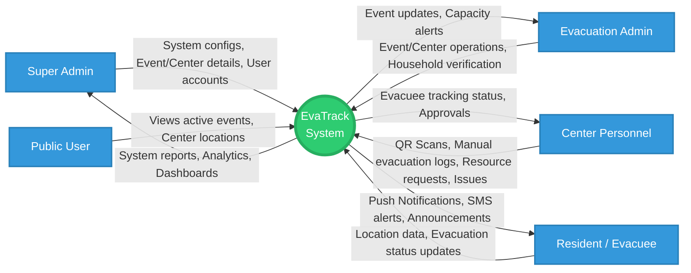
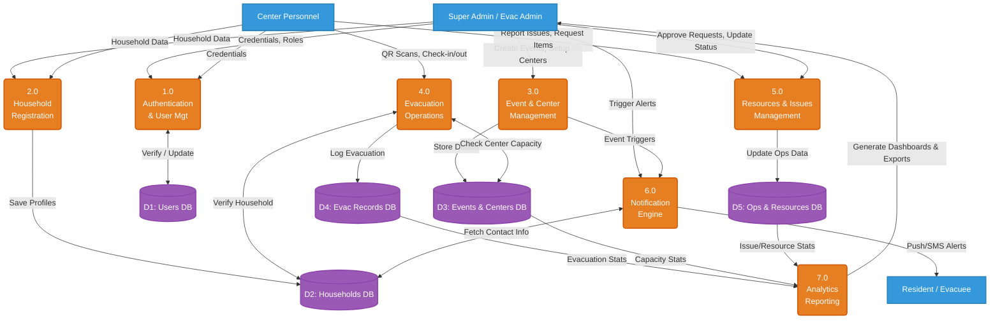

# EvaTrack – Data Flow Diagrams (DFD)

This document contains the Data Flow Diagrams (Context Diagram / Level 0, and Level 1) for the EvaTrack System. You can render these diagrams using [Mermaid Live Editor](https://mermaid.live).

---

## Level 0: Context Diagram

The Context Diagram shows the entire EvaTrack system as a single process interacting with external entities (Users).

---

## Level 1: Data Flow Diagram

The Level 1 DFD breaks down the main EvaTrack system into its primary sub-processes and shows the data stores (databases) they interact with.

