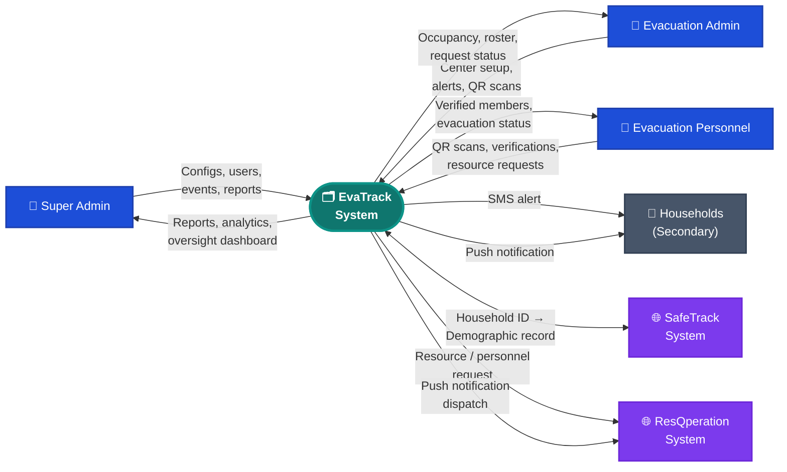
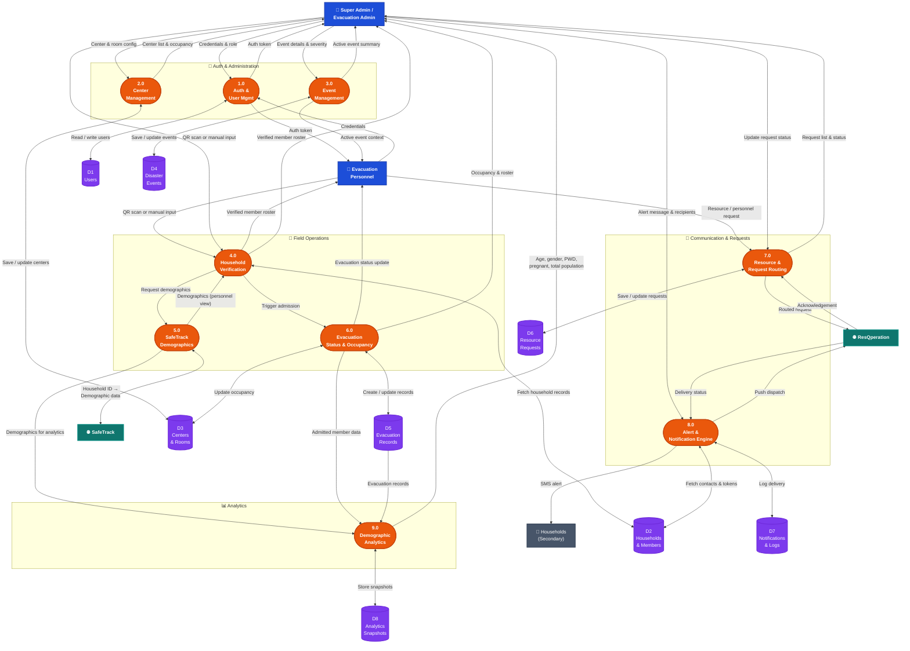

# EvaTrack – Data Flow Diagrams (DFD)

**Project Title:** EVATRACK: Streamlined Evacuation Processes and Coordination Platform Integrating SafeTrack Demographics and ResQperation Response Support
**Proponents:** Klint M. Ruales, Danica Gelbolingo, Anna Rhea Villadolid, Vhenz Cernal

Render these diagrams using [Mermaid Live Editor](https://mermaid.live).

---

## Level 0: Context Diagram

The Context Diagram shows the entire EvaTrack system as one process interacting with all external entities — internal users, external systems, and passive recipients.

---

## Level 1: Data Flow Diagram

The Level 1 DFD breaks EvaTrack into 9 sub-processes grouped by functional area, showing data flows between actors, processes, data stores, and external systems.

---

## Process Descriptions

| # | Process | Description | Must-Have |
|---|---------|-------------|-----------|
| 1.0 | **Auth & User Mgmt** | Login, token issuance, user creation, role assignment, personnel-to-center assignment. | Role-based workflows |
| 2.0 | **Center Management** | Admin creates/configures evacuation centers and rooms; tracks real-time occupancy. | Auto capacity updates |
| 3.0 | **Event Management** | Admin creates and manages disaster events; links centers to active events. | Role-based workflows |
| 4.0 | **Household Verification** | Personnel verifies households via QR scan or manual input using SafeTrack demographics (hidden from households). | SafeTrack integration |
| 5.0 | **SafeTrack Demographics** | Fetches demographic data (age, gender, PWD, pregnancy) from SafeTrack for verification and analytics. Never exposed to households. | SafeTrack integration |
| 6.0 | **Evacuation Status & Occupancy** | Creates evacuation records, updates household status (`Evacuated` / `Not Evacuated`), auto-updates center occupancy on admission and checkout. | Status tracking, Auto capacity |
| 7.0 | **Resource & Request Routing** | Records in-center resource shortages and personnel requests; routes them to ResQperation. | Alert & assistance routing |
| 8.0 | **Alert & Notification Engine** | Sends evacuation alerts — SMS direct for no-internet households, push via ResQperation for app users. Logs all delivery. | Alert & assistance routing |
| 9.0 | **Demographic Analytics** | Aggregates demographic data from personnel updates: age distribution, pregnant count, PWD count, gender, total affected population. | Demographic analytics |

---

## Data Store Descriptions

| Store | Contents |
|-------|----------|
| **D1 Users** | System user accounts, roles, passwords, assigned centers. |
| **D2 Households & Members** | Household profiles, member demographics, contact numbers, device tokens. |
| **D3 Centers & Rooms** | Center configs, GPS, capacities, accommodation units, occupancy counts. |
| **D4 Disaster Events** | Event records, type, severity, assigned centers, active/ended status. |
| **D5 Evacuation Records** | Admission and checkout records, `Evacuated`/`Not Evacuated` status, member lists, timestamps. |
| **D6 Resource Requests** | Resource shortage and personnel request records, urgency, status, ResQperation reference ID. |
| **D7 Notifications & Logs** | Alert records, delivery logs, channel (SMS/push), delivery status per household. |
| **D8 Analytics Snapshots** | Computed analytics per event/center: age groups, gender, PWD, pregnant counts, totals. |
