# EvaTrack – Entity Relationship Diagram Reference

> [!NOTE]
> This document contains **all 35 entities** used in the EvaTrack system, extracted directly from the database schema and Laravel Eloquent model relationships. Use this as the source of truth when building your ERD.

---

## Visual ER Diagram (Mermaid)

```mermaid
erDiagram

    %% ══════════════════════════════════════════
    %% AUTHENTICATION & USERS
    %% ══════════════════════════════════════════

    users ||--o| roles : "role_id"
    users ||--o| evacuation_centers : "assigned_center_id"
    users ||--o| households : "household_id"

    %% ══════════════════════════════════════════
    %% HOUSEHOLDS & MEMBERS
    %% ══════════════════════════════════════════

    households ||--o| addresses : "address_id"
    households ||--|{ household_members : "household_id"
    households ||--|{ evacuation_records : "household_id"
    households ||--|{ device_tokens : "household_id"
    households ||--|{ notification_recipients : "household_id"
    households ||--|{ notification_logs : "household_id"

    household_members ||--o| genders : "gender_id"
    household_members ||--o| civil_statuses : "civil_status_id"
    household_members ||--o| relationships : "relationship_id"
    household_members ||--|{ member_vulnerable_groups : "member_id"
    household_members ||--|{ evacuated_members : "member_id"

    member_vulnerable_groups ||--o| vulnerable_groups : "vulnerable_group_id"

    %% ══════════════════════════════════════════
    %% ADDRESS HIERARCHY
    %% ══════════════════════════════════════════

    addresses ||--o| barangays : "barangay_id"
    addresses ||--o| sitios : "sitio_id"
    addresses ||--o| puroks : "purok_id"

    regions ||--|{ provinces : "region_id"
    provinces ||--|{ cities : "province_id"
    cities ||--|{ barangays : "city_id"
    barangays ||--|{ sitios : "barangay_id"
    sitios ||--|{ puroks : "sitio_id"

    %% ══════════════════════════════════════════
    %% DISASTER EVENTS
    %% ══════════════════════════════════════════

    disaster_events ||--o| disaster_types : "type_id"
    disaster_events ||--o| severity_levels : "severity_level_id"
    disaster_events ||--|{ evacuation_records : "event_id"
    disaster_events ||--|{ notifications : "evacuation_event_id"
    disaster_events }|--|{ disaster_event_types : "event_id"
    disaster_event_types ||--o| disaster_types : "type_id"

    %% ══════════════════════════════════════════
    %% EVACUATION CENTERS
    %% ══════════════════════════════════════════

    evacuation_centers ||--o| disaster_events : "current_event_id"
    evacuation_centers ||--|{ evacuation_records : "center_id"
    evacuation_centers ||--|{ accommodation_units : "center_id"
    evacuation_centers ||--|{ notifications : "evacuation_center_id"
    evacuation_centers ||--o| center_occupancies : "evacuation_center_id"
    evacuation_centers ||--|{ center_issue_reports : "evacuation_center_id"
    evacuation_centers ||--|{ resource_requests : "evacuation_center_id"

    %% ══════════════════════════════════════════
    %% EVACUATION RECORDS
    %% ══════════════════════════════════════════

    evacuation_records ||--o| disaster_events : "event_id"
    evacuation_records ||--o| households : "household_id"
    evacuation_records ||--o| evacuation_centers : "center_id"
    evacuation_records ||--o| household_statuses : "household_status_id"
    evacuation_records ||--o| users : "verified_by"
    evacuation_records ||--|{ evacuated_members : "evacuation_id"
    evacuation_records ||--|{ unit_allocations : "evacuation_id"

    evacuated_members ||--o| evacuation_records : "evacuation_id"
    evacuated_members ||--o| household_members : "member_id"

    %% ══════════════════════════════════════════
    %% ACCOMMODATION UNITS
    %% ══════════════════════════════════════════

    accommodation_units ||--o| evacuation_centers : "center_id"
    accommodation_units ||--o| accommodation_types : "type_id"
    accommodation_units ||--|{ unit_allocations : "unit_id"

    unit_allocations ||--o| evacuation_records : "evacuation_id"
    unit_allocations ||--o| accommodation_units : "unit_id"
    unit_allocations ||--o| users : "assigned_by"

    %% ══════════════════════════════════════════
    %% CENTER ISSUE REPORTS
    %% ══════════════════════════════════════════

    center_issue_reports ||--o| evacuation_centers : "evacuation_center_id"
    center_issue_reports ||--o| users : "reported_by"
    center_issue_reports ||--o| users : "handled_by"
    center_issue_reports ||--o| center_issue_categories : "category_id"
    center_issue_reports ||--o| severity_levels : "severity_id"
    center_issue_reports ||--o| center_issue_report_statuses : "status_id"

    %% ══════════════════════════════════════════
    %% RESOURCE REQUESTS
    %% ══════════════════════════════════════════

    resource_requests ||--o| evacuation_centers : "evacuation_center_id"
    resource_requests ||--o| users : "requested_by"
    resource_requests ||--o| users : "handled_by"
    resource_requests ||--o| urgency_levels : "urgency_id"
    resource_requests ||--o| resource_request_status : "status_id"

    %% ══════════════════════════════════════════
    %% NOTIFICATIONS
    %% ══════════════════════════════════════════

    notifications ||--o| users : "sent_by"
    notifications ||--o| disaster_events : "evacuation_event_id"
    notifications ||--o| evacuation_centers : "evacuation_center_id"
    notifications ||--o| urgency_levels : "urgency_level_id"
    notifications ||--o| recurrence_types : "recurrence_type_id"
    notifications ||--|{ notification_recipients : "notification_id"
    notifications ||--|{ notification_logs : "notification_id"

    notification_logs ||--o| notifications : "notification_id"
    notification_logs ||--o| households : "household_id"
    notification_logs ||--o| notification_channels : "channel_id"
    notification_logs ||--o| notification_statuses : "status_id"

    notification_recipients ||--o| notifications : "notification_id"
    notification_recipients ||--o| households : "household_id"
```

---

## Entities by Domain

---

### 1. Authentication & Users

#### `users`
| Column | Type | Constraints |
|--------|------|------------|
| `user_id` | varchar(255) | **PK** |
| `first_name` | varchar(100) | |
| `last_name` | varchar(100) | |
| `name` | varchar(255) | |
| `username` | varchar(100) | |
| `email` | varchar(255) | |
| `email_verified_at` | timestamp | nullable |
| `password` | varchar(255) | |
| `role_id` | int | **FK → roles.role_id** |
| `contact_number` | varchar(50) | |
| `assigned_center_id` | varchar(255) | **FK → evacuation_centers.evacuation_center_id** |
| `household_id` | varchar(255) | **FK → households.household_id** |
| `is_active` | tinyint(1) | |
| `must_change_password` | tinyint(1) | default 0 |
| `temp_password` | varchar(255) | |
| `remember_token` | varchar(100) | |
| `profile_photo` | varchar(255) | |
| `created_at` | datetime | |
| `updated_at` | timestamp | |
| `deleted_at` | datetime | soft delete |

#### `roles`
| Column | Type | Constraints |
|--------|------|------------|
| `role_id` | int | **PK** |
| `role_key` | varchar(50) | |
| `role_name` | varchar(100) | |

---

### 2. Households & Members

#### `households`
| Column | Type | Constraints |
|--------|------|------------|
| `household_id` | varchar(255) | **PK** |
| `household_code` | varchar(255) | |
| `household_number` | varchar(255) | |
| `household_name` | varchar(100) | |
| `email` | varchar(255) | |
| `member_count` | int unsigned | default 0 |
| `created_by` | varchar(255) | |
| `address_id` | int | **FK → addresses.address_id** |
| `contact_number` | varchar(50) | |
| `emergency_contact` | varchar(50) | |
| `created_at` | timestamp | |
| `updated_at` | timestamp | |
| `deleted_at` | timestamp | soft delete |

#### `household_members`
| Column | Type | Constraints |
|--------|------|------------|
| `member_id` | varchar(255) | **PK** |
| `household_id` | varchar(255) | **FK → households.household_id** |
| `first_name` | varchar(100) | |
| `middle_name` | varchar(100) | |
| `last_name` | varchar(100) | |
| `birth_date` | date | NOT NULL |
| `gender_id` | int | **FK → genders.gender_id** |
| `relationship_id` | int | **FK → relationships.relationship_id** |
| `civil_status_id` | int | **FK → civil_statuses.status_id** |
| `occupation` | int | |
| `education_level_id` | int | |
| `is_graduate` | tinyint(1) | |
| `is_pwd` | tinyint(1) | default 0 |
| `is_senior` | tinyint(1) | default 0 |
| `is_pregnant` | tinyint(1) | default 0 |
| `created_at` | timestamp | |
| `updated_at` | timestamp | |
| `deleted_at` | timestamp | soft delete |

#### `household_statuses`
| Column | Type | Constraints |
|--------|------|------------|
| `status_id` | int | **PK** |
| `status_key` | varchar(50) | |
| `status_label` | varchar(100) | |

#### `member_vulnerable_groups` *(pivot table)*
| Column | Type | Constraints |
|--------|------|------------|
| `id` | int | **PK**, auto-increment |
| `member_id` | varchar(255) | **FK → household_members.member_id** |
| `vulnerable_group_id` | int | **FK → vulnerable_groups.vulnerable_group_id** |

---

### 3. Address / Location Hierarchy

#### `addresses`
| Column | Type | Constraints |
|--------|------|------------|
| `address_id` | int | **PK** |
| `street_address` | int | |
| `street` | varchar(255) | |
| `barangay_id` | int | **FK → barangays.barangay_id** |
| `barangay_name` | varchar(255) | |
| `sitio_id` | int | **FK → sitios.sitio_id** |
| `purok_sitio` | varchar(255) | |
| `house_number` | varchar(255) | |
| `purok_id` | int | **FK → puroks.purok_id** |
| `zipcode_id` | int | **FK → zip_codes.zipcode_id** |
| `zip_code` | varchar(50) | |
| `full_address` | varchar(500) | |
| `created_at` | timestamp | NOT NULL |
| `updated_at` | timestamp | |
| `deleted_at` | timestamp | soft delete |

#### `regions`
| Column | Type | Constraints |
|--------|------|------------|
| `region_id` | int | **PK** |
| `region_code` | varchar(20) | |
| `region_name` | varchar(100) | |

#### `provinces`
| Column | Type | Constraints |
|--------|------|------------|
| `province_id` | int | **PK** |
| `province_code` | varchar(20) | |
| `province_name` | varchar(100) | |
| `region_id` | int | **FK → regions.region_id** |

#### `cities`
| Column | Type | Constraints |
|--------|------|------------|
| `city_id` | int | **PK** |
| `city_code` | varchar(20) | |
| `city_name` | varchar(100) | |
| `province_id` | int | **FK → provinces.province_id** |

#### `barangays`
| Column | Type | Constraints |
|--------|------|------------|
| `barangay_id` | int | **PK** |
| `barangay_code` | varchar(20) | |
| `barangay_name` | varchar(100) | |
| `city_id` | int | **FK → cities.city_id** |

#### `sitios`
| Column | Type | Constraints |
|--------|------|------------|
| `sitio_id` | int | **PK** |
| `sitio_name` | varchar(100) | |
| `barangay_id` | int | **FK → barangays.barangay_id** |

#### `puroks`
| Column | Type | Constraints |
|--------|------|------------|
| `purok_id` | int | **PK** |
| `purok_name` | varchar(100) | |
| `sitio_id` | int | **FK → sitios.sitio_id** |

---

### 4. Disaster Events

#### `disaster_events`
| Column | Type | Constraints |
|--------|------|------------|
| `event_id` | varchar(255) | **PK** |
| `name` | varchar(100) | |
| `type_id` | int | **FK → disaster_types.type_id** |
| `severity_level_id` | int | **FK → severity_levels.severity_id** |
| `started_at` | datetime | |
| `ended_at` | datetime | |
| `created_at` | timestamp | |
| `updated_at` | timestamp | |
| `deleted_at` | timestamp | soft delete |

#### `disaster_types`
| Column | Type | Constraints |
|--------|------|------------|
| `type_id` | int | **PK** |
| `type_code` | varchar(20) | |
| `type_name` | varchar(100) | |
| `is_active` | tinyint(1) | |
| `created_at` | timestamp | |
| `updated_at` | timestamp | |
| `deleted_at` | timestamp | soft delete |

#### `disaster_event_types` *(pivot table)*
| Column | Type | Constraints |
|--------|------|------------|
| `event_type_id` | int | **PK** |
| `event_id` | varchar(255) | **FK → disaster_events.event_id** |
| `type_id` | int | **FK → disaster_types.type_id** |

#### `severity_levels`
| Column | Type | Constraints |
|--------|------|------------|
| `severity_id` | int | **PK** |
| `severity_key` | varchar(50) | |
| `severity_label` | varchar(100) | |

#### `event_center_history` *(pivot table)*
| Column | Type | Constraints |
|--------|------|------------|
| `id` | bigint unsigned | **PK**, auto-increment |
| `event_id` | varchar(255) | **FK → disaster_events.event_id** |
| `evacuation_center_id` | varchar(50) | **FK → evacuation_centers.evacuation_center_id** |
| `created_at` | timestamp | |
| `updated_at` | timestamp | |
| | | UNIQUE(`event_id`, `evacuation_center_id`) |

---

### 5. Evacuation Centers

#### `evacuation_centers`
| Column | Type | Constraints |
|--------|------|------------|
| `evacuation_center_id` | varchar(255) | **PK** |
| `current_event_id` | varchar(255) | **FK → disaster_events.event_id** |
| `name` | varchar(100) | |
| `center_type` | varchar(80) | |
| `latitude` | decimal(10,7) | |
| `longitude` | decimal(10,7) | |
| `capacity` | int | |
| `status` | varchar(30) | default 'active' |
| `current_occupancy` | int | |
| `contact_person` | varchar(150) | |
| `contact_number` | varchar(30) | |
| `osm_address` | varchar(255) | |
| `notes` | text | |
| `created_at` | datetime | |
| `updated_at` | datetime | |
| `deleted_at` | datetime | soft delete |

#### `center_occupancies`
| Column | Type | Constraints |
|--------|------|------------|
| `id` | int | **PK** |
| `evacuation_center_id` | varchar(255) | **FK → evacuation_centers.evacuation_center_id** |
| `current_occupancy` | int | |
| `last_updated` | datetime | |

---

### 6. Evacuation Records

#### `evacuation_records`
| Column | Type | Constraints |
|--------|------|------------|
| `evacuation_id` | int | **PK**, auto-increment |
| `event_id` | varchar(255) | **FK → disaster_events.event_id** |
| `household_id` | varchar(255) | **FK → households.household_id** |
| `center_id` | varchar(255) | **FK → evacuation_centers.evacuation_center_id** |
| `household_status_id` | int | **FK → household_statuses.status_id** |
| `evacuated_count` | int | |
| `method` | enum('qr','manual') | |
| `verified_by` | varchar(255) | **FK → users.user_id** |
| `verified_at` | datetime | |
| `created_at` | datetime | |
| `updated_at` | datetime | |

#### `evacuated_members`
| Column | Type | Constraints |
|--------|------|------------|
| `evacuated_member_id` | int | **PK**, auto-increment |
| `evacuation_id` | int | **FK → evacuation_records.evacuation_id** |
| `member_id` | varchar(255) | **FK → household_members.member_id** |
| `verified_at` | datetime | |

---

### 7. Accommodation Units

#### `accommodation_units`
| Column | Type | Constraints |
|--------|------|------------|
| `unit_id` | int | **PK**, auto-increment |
| `center_id` | varchar(255) | **FK → evacuation_centers.evacuation_center_id** |
| `name` | varchar(100) | |
| `type_id` | int | **FK → accommodation_types.type_id** |
| `max_capacity` | int | |
| `created_at` | datetime | |
| `deleted_at` | datetime | soft delete |

#### `accommodation_types`
| Column | Type | Constraints |
|--------|------|------------|
| `type_id` | int | **PK** |
| `type_key` | varchar(50) | |
| `type_label` | varchar(100) | |

#### `unit_allocations`
| Column | Type | Constraints |
|--------|------|------------|
| `allocation_id` | int | **PK**, auto-increment |
| `evacuation_id` | int | **FK → evacuation_records.evacuation_id** |
| `unit_id` | int | **FK → accommodation_units.unit_id** |
| `assigned_by` | varchar(255) | **FK → users.user_id** |
| `selected_by_resident` | tinyint(1) | |
| `created_at` | datetime | |

---

### 8. Center Issue Reports

#### `center_issue_reports`
| Column | Type | Constraints |
|--------|------|------------|
| `report_id` | varchar(255) | **PK** |
| `evacuation_center_id` | varchar(255) | **FK → evacuation_centers.evacuation_center_id** |
| `reported_by` | varchar(255) | **FK → users.user_id** |
| `handled_by` | varchar(255) | **FK → users.user_id** |
| `category_id` | int | **FK → center_issue_categories.category_id** |
| `title` | varchar(150) | |
| `description` | text | |
| `severity_id` | int | **FK → severity_levels.severity_id** |
| `status_id` | int | **FK → center_issue_report_statuses.status_id** |
| `attachment_path` | varchar(255) | |
| `created_at` | datetime | |
| `updated_at` | datetime | |

#### `center_issue_categories`
| Column | Type | Constraints |
|--------|------|------------|
| `category_id` | int | **PK** |
| `category_key` | varchar(50) | |
| `category_label` | varchar(100) | |

#### `center_issue_report_statuses`
| Column | Type | Constraints |
|--------|------|------------|
| `status_id` | int | **PK** |
| `status_key` | varchar(50) | |
| `status_label` | varchar(100) | |

---

### 9. Resource Requests

#### `resource_requests`
| Column | Type | Constraints |
|--------|------|------------|
| `request_id` | varchar(255) | **PK** |
| `request_source` | varchar(80) | |
| `source_reference` | varchar(120) | |
| `request_category` | varchar(50) | |
| `evacuation_center_id` | varchar(255) | **FK → evacuation_centers.evacuation_center_id** |
| `requested_by` | varchar(255) | **FK → users.user_id** |
| `handled_by` | varchar(255) | **FK → users.user_id** |
| `resource_type` | varchar(100) | |
| `item_name` | varchar(150) | |
| `quantity` | int | |
| `unit` | varchar(50) | |
| `description` | text | |
| `urgency_id` | int | **FK → urgency_levels.urgency_id** |
| `status_id` | int | **FK → resource_request_status.status_id** |
| `validation_status` | varchar(30) | default 'needs_validation' |
| `validation_notes` | text | |
| `validated_by_user_id` | varchar(255) | |
| `validated_at` | datetime | |
| `released_for_tracking_at` | datetime | |
| `tracking_reference` | varchar(120) | |
| `created_at` | datetime | |
| `updated_at` | datetime | |

#### `resource_request_status`
| Column | Type | Constraints |
|--------|------|------------|
| `status_id` | int | **PK** |
| `status_key` | varchar(50) | |
| `status_label` | varchar(100) | |

---

### 10. Notifications

#### `notifications`
| Column | Type | Constraints |
|--------|------|------------|
| `notif_id` | int | **PK**, auto-increment |
| `message` | text | |
| `sent_by` | varchar(255) | **FK → users.user_id** |
| `evacuation_event_id` | varchar(255) | **FK → disaster_events.event_id** |
| `evacuation_center_id` | varchar(255) | **FK → evacuation_centers.evacuation_center_id** |
| `urgency_level_id` | int | **FK → urgency_levels.urgency_id** |
| `scheduled_at` | datetime | |
| `is_recurring` | tinyint(1) | |
| `recurrence_type_id` | int | **FK → recurrence_types.type_id** |
| `recurrence_end_at` | datetime | |
| `last_sent_at` | datetime | |
| `channel` | varchar(50) | |
| `status` | varchar(50) | |
| `target_filter` | varchar(50) | |
| `created_at` | datetime | |

#### `notification_recipients`
| Column | Type | Constraints |
|--------|------|------------|
| `id` | int | **PK**, auto-increment |
| `notification_id` | int | **FK → notifications.notif_id** |
| `household_id` | varchar(255) | **FK → households.household_id** |
| `read_at` | datetime | |
| `acknowledged_at` | datetime | |

#### `notification_logs`
| Column | Type | Constraints |
|--------|------|------------|
| `log_id` | int | **PK**, auto-increment |
| `notification_id` | int | **FK → notifications.notif_id** |
| `household_id` | varchar(255) | **FK → households.household_id** |
| `channel_id` | int | **FK → notification_channels.channel_id** |
| `status_id` | int | **FK → notification_statuses.status_id** |
| `sent_at` | datetime | |
| `retry_count` | int | |
| `external_message_id` | varchar(255) | |

#### `notification_channels`
| Column | Type | Constraints |
|--------|------|------------|
| `channel_id` | int | **PK** |
| `channel_key` | varchar(50) | |
| `channel_label` | varchar(100) | |

#### `notification_statuses`
| Column | Type | Constraints |
|--------|------|------------|
| `status_id` | int | **PK** |
| `status_key` | varchar(50) | |
| `status_label` | varchar(100) | |

#### `recurrence_types`
| Column | Type | Constraints |
|--------|------|------------|
| `type_id` | int | **PK**, auto-increment |
| `type_key` | varchar(50) | |
| `type_label` | varchar(100) | |

#### `device_tokens`
| Column | Type | Constraints |
|--------|------|------------|
| `id` | bigint | **PK** |
| `device_uuid` | varchar(150) | |
| `household_id` | varchar(255) | **FK → households.household_id** |
| `member_id` | varchar(255) | **FK → household_members.member_id** |
| `device_name` | varchar(100) | |
| `platform` | varchar(30) | |
| `app_role` | varchar(30) | |
| `push_provider` | varchar(50) | |
| `player_id` | varchar(255) | |
| `expo_push_token` | varchar(255) | |
| `battery_level` | int | |
| `signal_strength` | int | |
| `location_permission_status` | varchar(30) | default 'unknown' |
| `notification_permission_status` | varchar(30) | default 'unknown' |
| `last_latitude` | decimal(10,7) | |
| `last_longitude` | decimal(10,7) | |
| `last_location_label` | varchar(255) | |
| `last_location_accuracy_m` | decimal(8,2) | |
| `last_location_at` | datetime | |
| `last_seen_at` | datetime | |
| `is_active` | tinyint(1) | default 1 |
| `logged_at` | datetime | |
| `created_at` | timestamp | |
| `updated_at` | timestamp | |

---

### 11. Analytics

#### `analytics`
| Column | Type | Constraints |
|--------|------|------------|
| `analytic_id` | varchar(255) | **PK** |
| `evacuation_event_id` | varchar(255) | **FK → disaster_events.event_id** |
| `evacuation_center_id` | varchar(255) | **FK → evacuation_centers.evacuation_center_id** |
| `barangay_id` | int unsigned | |
| `purok_sitio` | varchar(150) | |
| `record_period` | date | |
| `snapshot_type` | varchar(50) | |
| `total_households` | int unsigned | default 0 |
| `total_population` | int | |
| `total_males` | int unsigned | default 0 |
| `total_females` | int unsigned | default 0 |
| `total_pwd` | int unsigned | default 0 |
| `total_seniors` | int unsigned | default 0 |
| `total_children` | int unsigned | default 0 |
| `total_adults` | int unsigned | default 0 |
| `total_pregnant` | int unsigned | default 0 |
| `total_evacuees` | int unsigned | default 0 |
| `total_household` | int | |
| `children_count` | int | |
| `adult_count` | int | |
| `elderly_count` | int | |
| `pwd_count` | int | |
| `pregnant_count` | int | |
| `male_count` | int | |
| `female_count` | int | |
| `recorded_at` | datetime | |
| `created_at` | timestamp | |
| `updated_at` | timestamp | |

#### `analytics_job_logs`
| Column | Type | Constraints |
|--------|------|------------|
| `job_id` | int | **PK** |
| `status_id` | int | |
| `started_at` | datetime | |
| `finished_at` | datetime | |
| `message` | text | |

---

### 12. Reference / Lookup Tables

#### `genders`
| Column | Type | Constraints |
|--------|------|------------|
| `gender_id` | int | **PK**, auto-increment |
| `gender_key` | varchar(20) | UNIQUE |
| `gender_label` | varchar(20) | |

#### `civil_statuses`
| Column | Type | Constraints |
|--------|------|------------|
| `status_id` | int | **PK**, auto-increment |
| `status_key` | varchar(20) | UNIQUE |
| `status_label` | varchar(20) | |

#### `relationships`
| Column | Type | Constraints |
|--------|------|------------|
| `relationship_id` | int | **PK**, auto-increment |
| `relationship_key` | varchar(50) | UNIQUE |
| `relationship_label` | varchar(100) | |

#### `vulnerable_groups`
| Column | Type | Constraints |
|--------|------|------------|
| `vulnerable_group_id` | int | **PK**, auto-increment |
| `vulnerable_group_key` | varchar(20) | UNIQUE |
| `vulnerable_group_label` | varchar(20) | |

#### `urgency_levels`
| Column | Type | Constraints |
|--------|------|------------|
| `urgency_id` | int | **PK** |
| `urgency_key` | varchar(50) | |
| `urgency_label` | varchar(100) | |

---

## Relationship Summary

| From Table | FK Column | Relationship | To Table | PK Column |
|---|---|---|---|---|
| `users` | `role_id` | Many-to-One | `roles` | `role_id` |
| `users` | `assigned_center_id` | Many-to-One | `evacuation_centers` | `evacuation_center_id` |
| `users` | `household_id` | Many-to-One | `households` | `household_id` |
| `households` | `address_id` | Many-to-One | `addresses` | `address_id` |
| `household_members` | `household_id` | Many-to-One | `households` | `household_id` |
| `household_members` | `gender_id` | Many-to-One | `genders` | `gender_id` |
| `household_members` | `civil_status_id` | Many-to-One | `civil_statuses` | `status_id` |
| `household_members` | `relationship_id` | Many-to-One | `relationships` | `relationship_id` |
| `member_vulnerable_groups` | `member_id` | Many-to-One | `household_members` | `member_id` |
| `member_vulnerable_groups` | `vulnerable_group_id` | Many-to-One | `vulnerable_groups` | `vulnerable_group_id` |
| `addresses` | `barangay_id` | Many-to-One | `barangays` | `barangay_id` |
| `addresses` | `sitio_id` | Many-to-One | `sitios` | `sitio_id` |
| `addresses` | `purok_id` | Many-to-One | `puroks` | `purok_id` |
| `provinces` | `region_id` | Many-to-One | `regions` | `region_id` |
| `cities` | `province_id` | Many-to-One | `provinces` | `province_id` |
| `barangays` | `city_id` | Many-to-One | `cities` | `city_id` |
| `sitios` | `barangay_id` | Many-to-One | `barangays` | `barangay_id` |
| `puroks` | `sitio_id` | Many-to-One | `sitios` | `sitio_id` |
| `disaster_events` | `type_id` | Many-to-One | `disaster_types` | `type_id` |
| `disaster_events` | `severity_level_id` | Many-to-One | `severity_levels` | `severity_id` |
| `disaster_event_types` | `event_id` | Many-to-One | `disaster_events` | `event_id` |
| `disaster_event_types` | `type_id` | Many-to-One | `disaster_types` | `type_id` |
| `event_center_history` | `event_id` | Many-to-One | `disaster_events` | `event_id` |
| `event_center_history` | `evacuation_center_id` | Many-to-One | `evacuation_centers` | `evacuation_center_id` |
| `evacuation_centers` | `current_event_id` | Many-to-One | `disaster_events` | `event_id` |
| `center_occupancies` | `evacuation_center_id` | One-to-One | `evacuation_centers` | `evacuation_center_id` |
| `evacuation_records` | `event_id` | Many-to-One | `disaster_events` | `event_id` |
| `evacuation_records` | `household_id` | Many-to-One | `households` | `household_id` |
| `evacuation_records` | `center_id` | Many-to-One | `evacuation_centers` | `evacuation_center_id` |
| `evacuation_records` | `household_status_id` | Many-to-One | `household_statuses` | `status_id` |
| `evacuation_records` | `verified_by` | Many-to-One | `users` | `user_id` |
| `evacuated_members` | `evacuation_id` | Many-to-One | `evacuation_records` | `evacuation_id` |
| `evacuated_members` | `member_id` | Many-to-One | `household_members` | `member_id` |
| `accommodation_units` | `center_id` | Many-to-One | `evacuation_centers` | `evacuation_center_id` |
| `accommodation_units` | `type_id` | Many-to-One | `accommodation_types` | `type_id` |
| `unit_allocations` | `evacuation_id` | Many-to-One | `evacuation_records` | `evacuation_id` |
| `unit_allocations` | `unit_id` | Many-to-One | `accommodation_units` | `unit_id` |
| `unit_allocations` | `assigned_by` | Many-to-One | `users` | `user_id` |
| `center_issue_reports` | `evacuation_center_id` | Many-to-One | `evacuation_centers` | `evacuation_center_id` |
| `center_issue_reports` | `reported_by` | Many-to-One | `users` | `user_id` |
| `center_issue_reports` | `handled_by` | Many-to-One | `users` | `user_id` |
| `center_issue_reports` | `category_id` | Many-to-One | `center_issue_categories` | `category_id` |
| `center_issue_reports` | `severity_id` | Many-to-One | `severity_levels` | `severity_id` |
| `center_issue_reports` | `status_id` | Many-to-One | `center_issue_report_statuses` | `status_id` |
| `resource_requests` | `evacuation_center_id` | Many-to-One | `evacuation_centers` | `evacuation_center_id` |
| `resource_requests` | `requested_by` | Many-to-One | `users` | `user_id` |
| `resource_requests` | `handled_by` | Many-to-One | `users` | `user_id` |
| `resource_requests` | `urgency_id` | Many-to-One | `urgency_levels` | `urgency_id` |
| `resource_requests` | `status_id` | Many-to-One | `resource_request_status` | `status_id` |
| `notifications` | `sent_by` | Many-to-One | `users` | `user_id` |
| `notifications` | `evacuation_event_id` | Many-to-One | `disaster_events` | `event_id` |
| `notifications` | `evacuation_center_id` | Many-to-One | `evacuation_centers` | `evacuation_center_id` |
| `notifications` | `urgency_level_id` | Many-to-One | `urgency_levels` | `urgency_id` |
| `notifications` | `recurrence_type_id` | Many-to-One | `recurrence_types` | `type_id` |
| `notification_recipients` | `notification_id` | Many-to-One | `notifications` | `notif_id` |
| `notification_recipients` | `household_id` | Many-to-One | `households` | `household_id` |
| `notification_logs` | `notification_id` | Many-to-One | `notifications` | `notif_id` |
| `notification_logs` | `household_id` | Many-to-One | `households` | `household_id` |
| `notification_logs` | `channel_id` | Many-to-One | `notification_channels` | `channel_id` |
| `notification_logs` | `status_id` | Many-to-One | `notification_statuses` | `status_id` |
| `device_tokens` | `household_id` | Many-to-One | `households` | `household_id` |
| `device_tokens` | `member_id` | Many-to-One | `household_members` | `member_id` |
| `analytics` | `evacuation_event_id` | Many-to-One | `disaster_events` | `event_id` |
| `analytics` | `evacuation_center_id` | Many-to-One | `evacuation_centers` | `evacuation_center_id` |

---

## Entity Count Summary

| Domain | Tables |
|--------|--------|
| Authentication & Users | 2 (`users`, `roles`) |
| Households & Members | 4 (`households`, `household_members`, `household_statuses`, `member_vulnerable_groups`) |
| Address / Location | 7 (`addresses`, `regions`, `provinces`, `cities`, `barangays`, `sitios`, `puroks`) |
| Disaster Events | 5 (`disaster_events`, `disaster_types`, `disaster_event_types`, `severity_levels`, `event_center_history`) |
| Evacuation Centers | 2 (`evacuation_centers`, `center_occupancies`) |
| Evacuation Records | 2 (`evacuation_records`, `evacuated_members`) |
| Accommodation Units | 3 (`accommodation_units`, `accommodation_types`, `unit_allocations`) |
| Center Issue Reports | 3 (`center_issue_reports`, `center_issue_categories`, `center_issue_report_statuses`) |
| Resource Requests | 2 (`resource_requests`, `resource_request_status`) |
| Notifications | 6 (`notifications`, `notification_recipients`, `notification_logs`, `notification_channels`, `notification_statuses`, `recurrence_types`) |
| Device Tokens | 1 (`device_tokens`) |
| Reference / Lookup | 4 (`genders`, `civil_statuses`, `relationships`, `vulnerable_groups`, `urgency_levels`) |
| Analytics | 2 (`analytics`, `analytics_job_logs`) |
| **Total** | **35 tables** |
