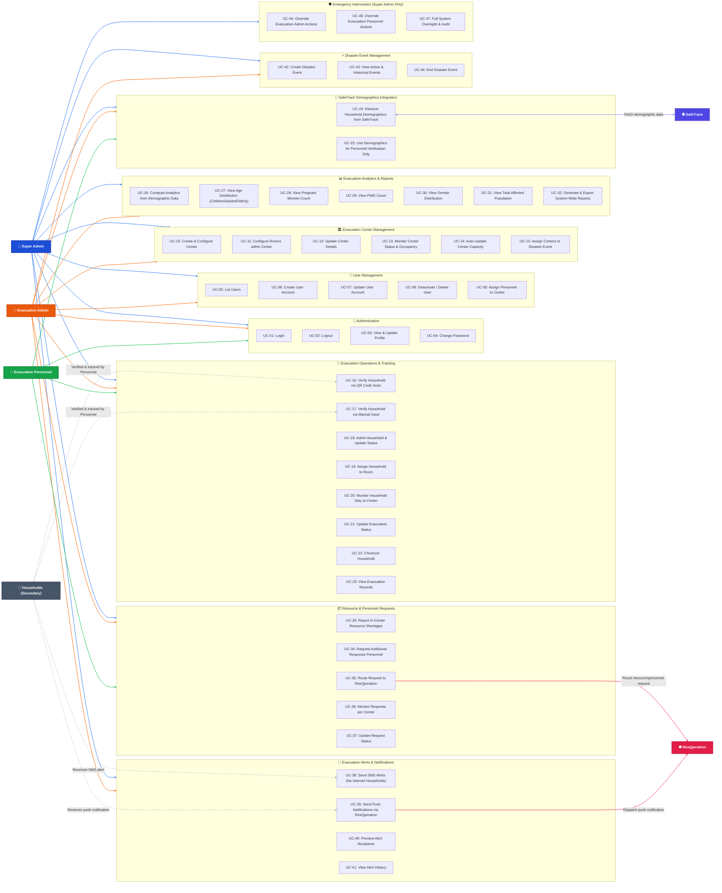

# EvaTrack – Use Case Diagram & Detailed Use Cases

**Project Title:** EVATRACK: Streamlined Evacuation Processes and Coordination Platform Integrating SafeTrack Demographics and ResQperation Response Support
**Proponents:** Klint M. Ruales, Danica Gelbolingo, Anna Rhea Villadolid, Vhenz Cernal

---

## 1. System Overview & Must-Haves Alignment

EvaTrack streamlines evacuation operations, real-time center occupancy tracking, demographic analytics, and response coordination by integrating with **SafeTrack** (for household demographic data retrieval used solely for verification — never visible to households) and **ResQperation** (for emergency response support and push notification dispatch).

### Core Must-Have System Requirements:

1. **SafeTrack Demographics Integration:** Retrieves household demographic data from SafeTrack for identification and verification during evacuation. This data is not visible to households and is used exclusively for verification and analytics purposes.
2. **Evacuation Status Tracking:** Real-time tracking of household evacuation status as `Evacuated` or `Not Evacuated`.
3. **Auto Capacity Updates:** Automatically updates evacuation center capacity and occupancy counts when a household is verified and admitted at that center.
4. **Demographic Analytics Computation:** Automatically computes evacuation analytics from demographic data captured through personnel updates, including age distribution (children, adults, elderly), pregnant women count, PWD count, gender distribution, and total affected population.
5. **Alert & Assistance Routing:** Routes emergency evacuation alerts to households via SMS and push notifications via ResQperation. Routes resource/personnel requests to ResQperation.

---

## 2. System Actors

| Actor | Role Type | Description |
|-------|-----------|-------------|
| **Super Admin** | Primary System Actor | Full system oversight across all centers and roles. Generates and retrieves system-wide reports and evacuation analytics. Holds emergency override access over all Evacuation Admin and Evacuation Personnel actions for emergency intervention or troubleshooting — not for routine use. |
| **Evacuation Admin** | Primary System Actor | Creates and configures evacuation centers and rooms. Monitors ongoing evacuations across centers (status, occupancy, personnel activity). Monitors ongoing requests per center. Sends evacuation alerts (SMS; push via ResQperation). Assigns personnel, edits household/room records, checks evacuation statuses. Inherits all Evacuation Personnel capabilities. |
| **Evacuation Personnel** | Primary System Actor | Assigned to a specific evacuation center. Logs in, verifies arriving households via QR code scanning or manual household input (when QR unavailable). Updates household info post-verification (assigns rooms, monitors household stay, updates evacuation status). Reports in-center needs and requests assistance from ResQperation. |
| **Households / Residents** | Secondary Actor | No direct system access. Receives evacuation alerts via SMS or ResQperation push notifications. Verified by QR code or manual input and tracked by evacuation personnel. |
| **SafeTrack System** | External System | Provides verified household demographic data for identification, verification, and analytics. Data never exposed to households. |
| **ResQperation System** | External System | Receives resource/personnel assistance requests routed from EvaTrack and dispatches push notifications to households with the app. |

## 3. Use Case Diagram

> **Color Legend**
>
> | Color | Actor |
> |-------|-------|
> | 🔵 Blue arrows + blue node | Super Admin |
> | 🟠 Orange arrows + orange node | Evacuation Admin |
> | 🟢 Green arrows + green node | Evacuation Personnel |
> | ⚫ Gray dashed arrows + dark node | Households / Residents (Secondary — passive) |
> | 🟣 Indigo arrows + indigo node | SafeTrack System |
> | 🔴 Rose arrows + red node | ResQperation System |

---

## 4. Detailed Use Cases

### UC-01: Login

| Field | Detail |
|-------|--------|
| **Use Case ID** | UC-01 |
| **Actors** | Super Admin, Evacuation Admin, Evacuation Personnel |
| **Description** | Authorized user logs in using credentials to access role-specific features. |
| **Preconditions** | User has a valid active account. |
| **Postconditions** | User authenticated; Sanctum session token issued; redirected to role dashboard. |
| **Main Flow** | 1. User enters email and password. 2. System validates credentials. 3. System issues token. 4. System redirects to role-based dashboard. |
| **Alternative Flow** | Invalid credentials → error displayed. Deactivated account → "Account deactivated" message. |
| **API Endpoint** | `POST /api/login` |

---

### UC-02: Logout

| Field | Detail |
|-------|--------|
| **Use Case ID** | UC-02 |
| **Actors** | Super Admin, Evacuation Admin, Evacuation Personnel |
| **Description** | User logs out; session token is revoked. |
| **Preconditions** | User is authenticated. |
| **Postconditions** | Token revoked; redirected to Login page. |
| **API Endpoint** | `POST /api/logout` |

---

### UC-03: View & Update Profile

| Field | Detail |
|-------|--------|
| **Use Case ID** | UC-03 |
| **Actors** | Super Admin, Evacuation Admin, Evacuation Personnel |
| **Description** | User views and updates their profile (name, contact number, assigned center). |
| **API Endpoint** | `GET /api/user`, `PUT /api/user/profile` |

---

### UC-04: Change Password

| Field | Detail |
|-------|--------|
| **Use Case ID** | UC-04 |
| **Actors** | Super Admin, Evacuation Admin, Evacuation Personnel |
| **Description** | User changes their password by providing current and new password. |
| **API Endpoint** | `PUT /api/user/password` |

---

### UC-05: List Users

| Field | Detail |
|-------|--------|
| **Use Case ID** | UC-05 |
| **Actors** | Super Admin, Evacuation Admin |
| **Description** | Admin views paginated list of all system users with roles and assigned centers. |
| **API Endpoint** | `GET /api/users` |

---

### UC-06: Create User Account

| Field | Detail |
|-------|--------|
| **Use Case ID** | UC-06 |
| **Actors** | Super Admin, Evacuation Admin |
| **Description** | Admin creates a new Evacuation Admin or Evacuation Personnel account. System generates ID prefix (e.g., `ADM-`, `PER-`) and sets `must_change_password = true`. |
| **API Endpoint** | `POST /api/users` |

---

### UC-07: Update User Account

| Field | Detail |
|-------|--------|
| **Use Case ID** | UC-07 |
| **Actors** | Super Admin, Evacuation Admin |
| **Description** | Admin updates user details, role, or active status. |
| **API Endpoint** | `PUT /api/users/{id}` |

---

### UC-08: Deactivate / Delete User

| Field | Detail |
|-------|--------|
| **Use Case ID** | UC-08 |
| **Actors** | Super Admin, Evacuation Admin |
| **Description** | Admin soft-deletes or deactivates a user account (`deleted_at` timestamp set). |
| **API Endpoint** | `DELETE /api/users/{id}` |

---

### UC-09: Assign Personnel to Center

| Field | Detail |
|-------|--------|
| **Use Case ID** | UC-09 |
| **Actors** | Super Admin, Evacuation Admin |
| **Description** | Admin assigns an Evacuation Personnel user to a specific evacuation center (updates `assigned_center_id`). |
| **API Endpoint** | `POST /api/users/{user}/assign-center` |

---

### UC-10: Create & Configure Evacuation Center

| Field | Detail |
|-------|--------|
| **Use Case ID** | UC-10 |
| **Actors** | Evacuation Admin, Super Admin |
| **Description** | Admin creates a new evacuation center with name, address, max capacity, GPS coordinates, and contact details. |
| **Postconditions** | New center record created and active. |
| **API Endpoint** | `POST /api/evacuation-centers` |

---

### UC-11: Configure Rooms within Evacuation Center

| Field | Detail |
|-------|--------|
| **Use Case ID** | UC-11 |
| **Actors** | Evacuation Admin, Super Admin |
| **Description** | Admin creates and configures accommodation units (rooms/halls) within a center, specifying type and capacity. |
| **Preconditions** | Evacuation center exists. |
| **Postconditions** | Room records created and linked to the center. |
| **API Endpoint** | `POST /api/evacuation-centers/{center}/rooms` |

---

### UC-12: Update Center Details

| Field | Detail |
|-------|--------|
| **Use Case ID** | UC-12 |
| **Actors** | Evacuation Admin, Super Admin |
| **Description** | Admin edits center parameters (capacity, operational status, location). |
| **API Endpoint** | `PUT /api/evacuation-centers/{center}` |

---

### UC-13: Monitor Center Status & Occupancy

| Field | Detail |
|-------|--------|
| **Use Case ID** | UC-13 |
| **Actors** | Evacuation Admin, Super Admin |
| **Description** | Admin monitors real-time status of all centers including occupancy levels, evacuee roster, personnel activity, and ongoing requests. |
| **API Endpoint** | `GET /api/evacuation-centers`, `GET /api/evacuation-centers/{center}` |

---

### UC-14: Auto-Update Center Capacity

| Field | Detail |
|-------|--------|
| **Use Case ID** | UC-14 |
| **Actors** | System (triggered by admission or checkout) |
| **Description** | System automatically increments or decrements center occupancy and remaining capacity when a household is admitted (UC-18) or checked out (UC-22). |
| **Postconditions** | `current_occupancy` updated in real time; remaining capacity percentage recalculated. |
| **API Endpoint** | `GET /api/evacuation-centers/{center}/capacity` |

---

### UC-15: Assign Centers to Disaster Event

| Field | Detail |
|-------|--------|
| **Use Case ID** | UC-15 |
| **Actors** | Evacuation Admin, Super Admin |
| **Description** | Admin assigns active evacuation centers to an ongoing disaster event. |
| **API Endpoint** | `PATCH /api/events/{id}/assign-centers` |

---

### UC-16: Verify Household via QR Code Scan

| Field | Detail |
|-------|--------|
| **Use Case ID** | UC-16 |
| **Actors** | Evacuation Personnel, Evacuation Admin, Super Admin |
| **Description** | Personnel scans household QR code on arrival. System decodes QR, retrieves household demographic data from SafeTrack (UC-24) for personnel-side verification only — never visible to households — and prepares record for admission. |
| **Alternative Flow** | Camera scan fails or QR unavailable → fallback to Manual Input (UC-17). |
| **API Endpoint** | `POST /api/evacuations/process-scan` |

---

### UC-17: Verify Household via Manual Input

| Field | Detail |
|-------|--------|
| **Use Case ID** | UC-17 |
| **Actors** | Evacuation Personnel, Evacuation Admin, Super Admin |
| **Description** | Fallback when QR unavailable. Personnel searches household by name/ID. System retrieves SafeTrack demographics (UC-24) for verification. Personnel selects arriving members. |
| **API Endpoint** | `POST /api/evacuations/verify-manual` |

---

### UC-18: Admit Household & Update Status to Evacuated

| Field | Detail |
|-------|--------|
| **Use Case ID** | UC-18 |
| **Actors** | Evacuation Personnel, Evacuation Admin, Super Admin |
| **Description** | Personnel confirms admission of verified household into the center. Status updated to `Evacuated`. Auto-triggers center capacity update (UC-14). |
| **Preconditions** | Household verified via UC-16 or UC-17. |
| **Postconditions** | Evacuation record created; status = `Evacuated`; center occupancy auto-incremented. |
| **API Endpoint** | `POST /api/evacuations/admit` |

---

### UC-19: Assign Household to Room

| Field | Detail |
|-------|--------|
| **Use Case ID** | UC-19 |
| **Actors** | Evacuation Personnel, Evacuation Admin, Super Admin |
| **Description** | Personnel assigns an admitted household to a specific room/accommodation unit where rooms are available. |
| **Preconditions** | Household admitted (UC-18); rooms configured (UC-11). |
| **API Endpoint** | `POST /api/evacuations/{evacuationId}/assign-room` |

---

### UC-20: Monitor Household Stay at Center

| Field | Detail |
|-------|--------|
| **Use Case ID** | UC-20 |
| **Actors** | Evacuation Personnel, Evacuation Admin, Super Admin |
| **Description** | Personnel monitors duration and status of each household's stay, including tracking admission time and computing stay duration. |
| **API Endpoint** | `GET /api/evacuation-centers/{center}/evacuees` |

---

### UC-21: Update Evacuation Status

| Field | Detail |
|-------|--------|
| **Use Case ID** | UC-21 |
| **Actors** | Evacuation Personnel, Evacuation Admin, Super Admin |
| **Description** | Personnel updates a household's evacuation status (e.g., `Evacuated` / `Not Evacuated`) or updates member-level status. |
| **API Endpoint** | `PATCH /api/evacuations/{evacuationId}/status` |

---

### UC-22: Checkout Household

| Field | Detail |
|-------|--------|
| **Use Case ID** | UC-22 |
| **Actors** | Evacuation Personnel, Evacuation Admin, Super Admin |
| **Description** | Personnel checks out a household leaving the center. Status updated to `Not Evacuated` / `Checked Out`. Auto-triggers center occupancy decrement (UC-14). |
| **Postconditions** | `checkout_at` timestamp set; center occupancy auto-decremented. |
| **API Endpoint** | `POST /api/evacuations/{evacuationId}/checkout` |

---

### UC-23: View Evacuation Records

| Field | Detail |
|-------|--------|
| **Use Case ID** | UC-23 |
| **Actors** | Evacuation Personnel, Evacuation Admin, Super Admin |
| **Description** | View all evacuation records (current and historical) per center or event, including household status, member counts, and timestamps. |
| **API Endpoint** | `GET /api/evacuations` |

---

### UC-24: Retrieve Household Demographics from SafeTrack

| Field | Detail |
|-------|--------|
| **Use Case ID** | UC-24 |
| **Actors** | System (invoked during UC-16 and UC-17) |
| **External System** | SafeTrack |
| **Description** | EvaTrack retrieves verified household demographic data from SafeTrack for personnel-side identification and verification. **This data is never exposed to households or residents.** Data is also used as input for analytics computation (UC-26). |
| **Main Flow** | 1. Personnel initiates QR scan or manual search. 2. System sends household ID to SafeTrack API. 3. SafeTrack returns demographic record (member roster, age groups, gender, vulnerable groups). 4. System displays data to personnel for verification. 5. Data logged for analytics (UC-26). |
| **Alternative Flow** | SafeTrack unavailable → use local demographic snapshot if available; otherwise notify personnel. |

---

### UC-25: Use Demographics for Personnel Verification Only

| Field | Detail |
|-------|--------|
| **Use Case ID** | UC-25 |
| **Actors** | Evacuation Personnel, Evacuation Admin, Super Admin |
| **Description** | Personnel uses retrieved SafeTrack demographic data to confirm arriving members. This view is restricted to system users — households never see this data. |
| **Preconditions** | UC-24 completed successfully. |
| **Postconditions** | Verification confirmed; household ready for admission. |

---

### UC-26: Compute Analytics from Demographic Data

| Field | Detail |
|-------|--------|
| **Use Case ID** | UC-26 |
| **Actors** | System (auto-triggered on admission or member update) |
| **Description** | System computes evacuation analytics from demographic data captured through personnel updates. Includes: children / adult / elderly counts, pregnant women count, PWD count, gender distribution, total affected population. |
| **Postconditions** | Analytics snapshot stored; dashboard reflects updated figures. |

---

### UC-27: View Age Distribution

| Field | Detail |
|-------|--------|
| **Use Case ID** | UC-27 |
| **Actors** | Evacuation Admin, Super Admin |
| **Description** | View computed age distribution of evacuated population: children (0–17), adults (18–59), elderly (60+). |

---

### UC-28: View Pregnant Women Count

| Field | Detail |
|-------|--------|
| **Use Case ID** | UC-28 |
| **Actors** | Evacuation Admin, Super Admin |
| **Description** | View count of pregnant women among the evacuated population, derived from member demographic data. |

---

### UC-29: View PWD Count

| Field | Detail |
|-------|--------|
| **Use Case ID** | UC-29 |
| **Actors** | Evacuation Admin, Super Admin |
| **Description** | View count of evacuees tagged as Persons with Disabilities from demographic data. |

---

### UC-30: View Gender Distribution

| Field | Detail |
|-------|--------|
| **Use Case ID** | UC-30 |
| **Actors** | Evacuation Admin, Super Admin |
| **Description** | View gender breakdown (male / female) of the evacuated population. |

---

### UC-31: View Total Affected Population

| Field | Detail |
|-------|--------|
| **Use Case ID** | UC-31 |
| **Actors** | Evacuation Admin, Super Admin |
| **Description** | View total individuals evacuated and total households affected. |

---

### UC-32: Generate & Export System-Wide Reports

| Field | Detail |
|-------|--------|
| **Use Case ID** | UC-32 |
| **Actors** | Super Admin |
| **Description** | Super Admin generates and retrieves system-wide reports: evacuation analytics, center-level summaries, system-wide summaries, and demographic breakdowns. |
| **API Endpoint** | `GET /api/reports/system-wide`, `GET /api/analytics/export` |

---

### UC-33: Report In-Center Resource Shortages

| Field | Detail |
|-------|--------|
| **Use Case ID** | UC-33 |
| **Actors** | Evacuation Personnel, Evacuation Admin, Super Admin |
| **Description** | Personnel reports shortages of essential resources (food, water, medicine) within the center. Creates resource request record with urgency level. |
| **Postconditions** | Resource request created with status `Pending`; routable to ResQperation (UC-35). |
| **API Endpoint** | `POST /api/resource-requests` |

---

### UC-34: Request Additional Response Personnel

| Field | Detail |
|-------|--------|
| **Use Case ID** | UC-34 |
| **Actors** | Evacuation Personnel, Evacuation Admin, Super Admin |
| **Description** | Personnel requests additional response personnel (medical staff, security) via a resource request. |
| **Postconditions** | Personnel request created; routable to ResQperation (UC-35). |
| **API Endpoint** | `POST /api/resource-requests` |

---

### UC-35: Route Request to ResQperation

| Field | Detail |
|-------|--------|
| **Use Case ID** | UC-35 |
| **Actors** | System (triggered from UC-33 or UC-34); Evacuation Admin, Super Admin |
| **External System** | ResQperation |
| **Description** | EvaTrack routes an in-center resource shortage or personnel request to the ResQperation platform for response dispatch. |
| **Postconditions** | Request forwarded to ResQperation; external reference ID logged; request status updated to `Routed`. |

---

### UC-36: Monitor Ongoing Requests per Center

| Field | Detail |
|-------|--------|
| **Use Case ID** | UC-36 |
| **Actors** | Evacuation Admin, Super Admin |
| **Description** | Admin monitors the list of open and ongoing resource/personnel requests across evacuation centers. |
| **API Endpoint** | `GET /api/resource-requests` |

---

### UC-37: Update Request Status

| Field | Detail |
|-------|--------|
| **Use Case ID** | UC-37 |
| **Actors** | Evacuation Admin, Super Admin |
| **Description** | Admin updates the status of a resource/personnel request (Pending → In Progress → Resolved). |
| **API Endpoint** | `PATCH /api/resource-requests/{id}/status` |

---

### UC-38: Send SMS Alerts to Households (No Internet)

| Field | Detail |
|-------|--------|
| **Use Case ID** | UC-38 |
| **Actors** | Evacuation Admin, Super Admin |
| **Description** | Admin sends evacuation alerts via SMS to households without internet access. |
| **Postconditions** | SMS dispatched to target household contact numbers; notification log updated. |
| **API Endpoint** | `POST /api/notifications/send` |

---

### UC-39: Send Push Notifications via ResQperation

| Field | Detail |
|-------|--------|
| **Use Case ID** | UC-39 |
| **Actors** | Evacuation Admin, Super Admin |
| **External System** | ResQperation |
| **Description** | Admin sends evacuation alerts as push notifications to households with the ResQperation app, routed through the ResQperation platform. |
| **Postconditions** | Push notifications dispatched via ResQperation; delivery logged. |
| **API Endpoint** | `POST /api/notifications/send` |

---

### UC-40: Preview Alert Recipients

| Field | Detail |
|-------|--------|
| **Use Case ID** | UC-40 |
| **Actors** | Evacuation Admin, Super Admin |
| **Description** | Admin previews target household list before sending alert to verify targeting accuracy. |
| **API Endpoint** | `POST /api/notifications/preview` |

---

### UC-41: View Alert History

| Field | Detail |
|-------|--------|
| **Use Case ID** | UC-41 |
| **Actors** | Evacuation Admin, Super Admin |
| **Description** | View log of all sent evacuation alerts including channel (SMS / push), recipients, and delivery status. |
| **API Endpoint** | `GET /api/notifications` |

---

### UC-42: Create Disaster Event

| Field | Detail |
|-------|--------|
| **Use Case ID** | UC-42 |
| **Actors** | Evacuation Admin, Super Admin |
| **Description** | Admin creates a new disaster event (typhoon, flood, etc.) with type, severity, and start date. |
| **API Endpoint** | `POST /api/events` |

---

### UC-43: View Active & Historical Events

| Field | Detail |
|-------|--------|
| **Use Case ID** | UC-43 |
| **Actors** | Evacuation Personnel, Evacuation Admin, Super Admin |
| **Description** | View the currently active disaster event and browse completed historical events. |
| **API Endpoint** | `GET /api/events/active`, `GET /api/events/history` |

---

### UC-44: End Disaster Event

| Field | Detail |
|-------|--------|
| **Use Case ID** | UC-44 |
| **Actors** | Evacuation Admin, Super Admin |
| **Description** | Admin closes an active disaster event. Sets `ended_at` timestamp and closes event status. |
| **API Endpoint** | `PATCH /api/events/{id}/end` |

---

### UC-45: Override Evacuation Admin Actions

| Field | Detail |
|-------|--------|
| **Use Case ID** | UC-45 |
| **Actors** | Super Admin |
| **Description** | Super Admin holds emergency override access to all Evacuation Admin actions — for emergency intervention or troubleshooting **only**, not routine use. |

---

### UC-46: Override Evacuation Personnel Actions

| Field | Detail |
|-------|--------|
| **Use Case ID** | UC-46 |
| **Actors** | Super Admin |
| **Description** | Super Admin holds emergency override access to all Evacuation Personnel actions — for emergency intervention or troubleshooting **only**, not routine use. |

---

### UC-47: Full System Oversight & Audit

| Field | Detail |
|-------|--------|
| **Use Case ID** | UC-47 |
| **Actors** | Super Admin |
| **Description** | Super Admin maintains full oversight of all system operations across all centers and roles. Generates and retrieves system-wide reports, evacuation analytics, center-level and system-wide summaries. |
| **API Endpoint** | `GET /api/reports/system-wide` |

---

## 5. Role-to-Use-Case Traceability Matrix

| Use Case | Super Admin | Evac Admin | Evac Personnel | Households | SafeTrack | ResQperation |
|----------|:-----------:|:----------:|:--------------:|:----------:|:---------:|:------------:|
| UC-01 Login | ✓ | ✓ | ✓ | | | |
| UC-02 Logout | ✓ | ✓ | ✓ | | | |
| UC-03 View/Update Profile | ✓ | ✓ | ✓ | | | |
| UC-04 Change Password | ✓ | ✓ | ✓ | | | |
| UC-05 List Users | ✓ | ✓ | | | | |
| UC-06 Create User | ✓ | ✓ | | | | |
| UC-07 Update User | ✓ | ✓ | | | | |
| UC-08 Deactivate/Delete User | ✓ | ✓ | | | | |
| UC-09 Assign Personnel to Center | ✓ | ✓ | | | | |
| UC-10 Create & Configure Center | ✓ | ✓ | | | | |
| UC-11 Configure Rooms | ✓ | ✓ | | | | |
| UC-12 Update Center Details | ✓ | ✓ | | | | |
| UC-13 Monitor Center Status | ✓ | ✓ | | | | |
| UC-14 Auto-Update Capacity | System | System | System | | | |
| UC-15 Assign Centers to Event | ✓ | ✓ | | | | |
| UC-16 Verify via QR Code | ✓ | ✓ | ✓ | | → UC-24 | |
| UC-17 Verify via Manual Input | ✓ | ✓ | ✓ | | → UC-24 | |
| UC-18 Admit Household | ✓ | ✓ | ✓ | | | |
| UC-19 Assign Household to Room | ✓ | ✓ | ✓ | | | |
| UC-20 Monitor Household Stay | ✓ | ✓ | ✓ | | | |
| UC-21 Update Evacuation Status | ✓ | ✓ | ✓ | | | |
| UC-22 Checkout Household | ✓ | ✓ | ✓ | | | |
| UC-23 View Evacuation Records | ✓ | ✓ | ✓ | | | |
| UC-24 Retrieve SafeTrack Demographics | System | | | | ✓ | |
| UC-25 Use Demographics for Verification | ✓ | ✓ | ✓ | ✗ hidden | ✓ | |
| UC-26 Compute Analytics | System | ✓ | | | | |
| UC-27 View Age Distribution | ✓ | ✓ | | | | |
| UC-28 View Pregnant Women Count | ✓ | ✓ | | | | |
| UC-29 View PWD Count | ✓ | ✓ | | | | |
| UC-30 View Gender Distribution | ✓ | ✓ | | | | |
| UC-31 View Total Affected Population | ✓ | ✓ | | | | |
| UC-32 Generate System-Wide Reports | ✓ | | | | | |
| UC-33 Report Resource Shortages | ✓ | ✓ | ✓ | | | |
| UC-34 Request Additional Personnel | ✓ | ✓ | ✓ | | | |
| UC-35 Route Request to ResQperation | System | ✓ | | | | ✓ |
| UC-36 Monitor Requests per Center | ✓ | ✓ | | | | |
| UC-37 Update Request Status | ✓ | ✓ | | | | |
| UC-38 Send SMS Alerts | ✓ | ✓ | | ← Receives | | |
| UC-39 Send Push Notifications | ✓ | ✓ | | ← Receives | | ✓ |
| UC-40 Preview Alert Recipients | ✓ | ✓ | | | | |
| UC-41 View Alert History | ✓ | ✓ | | | | |
| UC-42 Create Disaster Event | ✓ | ✓ | | | | |
| UC-43 View Events | ✓ | ✓ | ✓ | | | |
| UC-44 End Disaster Event | ✓ | ✓ | | | | |
| UC-45 Override Admin Actions | ✓ | | | | | |
| UC-46 Override Personnel Actions | ✓ | | | | | |
| UC-47 Full System Oversight | ✓ | | | | | |
