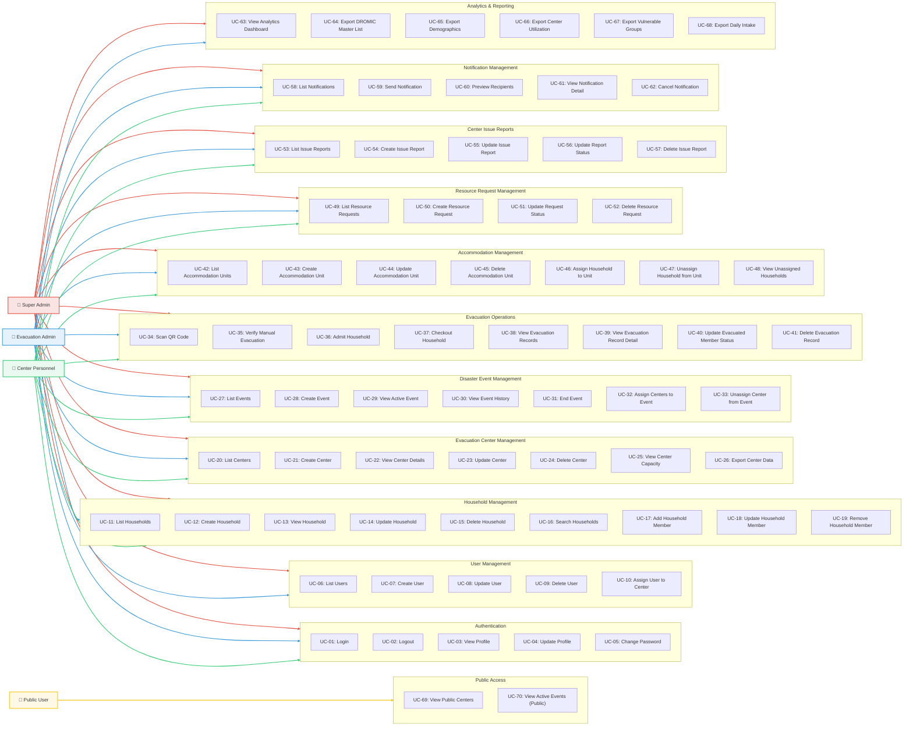

# EvaTrack – Use Case Diagram & Detailed Use Cases

---

## System Actors

| Actor | Description |
|-------|-------------|
| **Super Admin** | Full system access. Manages users, centers, events, analytics, and all operations. |
| **Evacuation Admin** | Manages users, centers, events, and oversees evacuation operations across all centers. |
| **Center Personnel** | Assigned to a specific evacuation center. Manages day-to-day center operations (admissions, reports, requests). |
| **Public User** | Unauthenticated user. Can only view publicly available evacuation center info and active events. |

---
https://www.mermaideditor.io/#pako:eJyVWetu3DYWfhVigiw2gAwMSUlz-VFgIqu1AceeziVA0RQLjkR5BGukWUljxw36EAX6P9jFPsL2vfoIPdIcURpKytj-kcTn8pH8zkfyUPky8BJfDqaDIEqevK1Ic3Kz-BQT-Hn7lsy8PEmz46_L2c-fBn99_f1_ZHnYy5TM_F0Yfxr8cvS6yus-Cu8g8jCJtRBnXoU4Ms4BYS7TLIljGamQ-boKmR82UeiRdSbT0qumBBbiCPjjQ-IfIomTyw6b-1Tst2Tt_Gu2Xl0BzOyQb2Gc0CvnooYofvwwlV45w9X72rp2KKStnYshnZKb5D48TVo7DN2sdCeHXPNz9PMp-RjKJzJPkyCMpBZlYpQ5Jeu9L3LZE2dhnDUlzlbE9xAnsuwpSX0VKGO_YqZJwHrpLj78sCrygT7yQcTiXu6AixeRYOO4NqwyzPKyBJk2txHGjGBuqSzWoApVB40xaKwW2hE0waDJlFzKSHYH0eExig6nZJZl4X1cRpE8QSmdY-TqDji5uru5BJyr5JDJbRL5ryWGojwoRWYUkk4PRaVQpvhRsXooioZWoukNRN3QWje9oSgdailSe0Ox2hSqvZQi9bbfWBVWnULVZ75PGkTK3aZdNKw_Hbcn3JOBYqAghoXcJY_fyOgptOPertwFwDROITxtXllthppjQ6z2EUYnhaEoGFWl1iSJcSgJxrDOOKtLmYswaqGiKhhX3HWjoiiYqSrdHYeKYNbp6I7YCy_Mn_VwVAUDVbif90maq-mKXJyrgfsRigAAl2EmsiLJfYTkV_OPamMj5L9EaRGFImNjRX8Zp4ehstgE1w8XW_jYHcux8HyIscfpX8EcklRnimP5OZTfjf1uQCw9Z-r0Qi0VB1hnBpafF-WPRTOHBGmy05J66zBzTnfCHdzb5b-yF5WAo7o4qGvpiZj8uCAOdAv6bFFcvBCXTMPguaj1QUSNVkBPQYFxe1o2CXnvAcVRBry4arbSe4Brtz8Y1cDHqnRq7QvpwdWp64ejMPikLwN3qH6Jo0jModqgmCmro4osc5Ef9AFNFIxJ1Y5tDXn2fr-9Xi2LDsfzkt0u8Y-5r9xfJqrSZLi_TtHWcdjabCbK0uRqs7WT9BzUkFlfW-dzUFBmfX-dz0FFmbbaZPXdAdusKwWlZY4au6xOKjdaVxqKzKxEVuVKv-vu7Knhwl3erReOC1gLmSWH1JNQ_X8fZPbqk9JEDZsTrKQOqNfRQvFaQ1VHPUXPQNVaVFWxmmynyi0Ul8VUBXtH6CHoerlcu4XK8dy7zrJDkVzcRi87viyUq8WRl34ICEadWqbipBmuR6NCLUvx8a1o1KZlN9grb9Vu8lCX1kiR1wneQ9zt3er6e0C4TfIwwNfPayVlocatMVLXBGvNF_VnTYoeEi7BZrAWa6P0bJDePJWPxf6BQy_chx2Xu42qsynutJMldZ7LNgrPLjpvEXsy6p5ND3ez29nNT6trpzxdYxE9w_MxI_9A5sP4_mUvKBSeXfX0NdSlyLabRKT6zWWj_GxTdVyXi7sP1w5UruyhiiroOShC26pzoGsuFwNj6dEoQrvV063zMAp_7awWKtEeqZyPhyiGJmITSfJDmhz2rWFQOfa4nhSU6Zlcx7l4kOcKMF-_v7kuuhZ8_8O5L7OXbXcbZWhXVzlCdPftIxTiaNjREWbkn8fkd13zffuW_PX1j_83P4NAWxTHx1lBLqUkCuOHbErC2JefZUaG8HR9V31GIRcX31XfKXQbPt11s3q_6o7je0e3lh142zhzWsMVnYRurK4m3X48kXVredy0llbto1PO_mx9HDpHHKXwsnpXfWJqM-d2M-f2Med2Mud2Med2MOd2Mef2MOd2Mud2MeeeYe7rf1vfzE6Zm-jEMQYPGCTOmbeJq20aQ7WjyVBtbTDUNFYM1bYGQ7XxlKHa3mSotiJDTSL-0_wyqKmn5AApILySzXxdwR0PlwbeMn-GlHu4Inz1IRFMslByEEbR9E0wkVxyI8vT5EFO38iR6XEPf714Cv18O2X7z4aXREk6fcM5b6K4FYq0AhZsFAo3J2N_81IUoANRRCACqlCY9LwRfSkKsIArkrCmkUIJqGcOg2-jtPi6KbR2tBaUL8sRhgY1mMEN07AM2xgZY2Ni0CE5Q52OQqlBmUG5QU2DWga1DToy6NigE4MNDUbJGRJ1PMYMxg1mGswymG2wkcHGBpsYvJ5ZD5E6Eq_H7iFtYAxKsrPB9MtgIzJZ_J1voe0aTI-_G_CX93APF2fsOwXD4HhDBd0wG3xBEuffix3clmDORJxdZMVzGjz7NNyJ9FmljIRgwagYDx6Msd90bTYTUbrgtMjDkyTuC0-AB9YkldUbeiKwBr8B1h4aMeiUylk_70_-U-BkaTFsl_dqHQUIM9mYbyCodMETVpbYJjXH9hjNK_k5bwxoDHwYLoOtewolhyIoc5RbwQWgXNtsuCpIxWCWw1zd2D-FVAtXbgXZcrUg92lStCAaYsV_5a0BNU-FF5Q_YBdpmjzp7KP5RmxkdDoSDRjnpwEtIqsGqidTudt1qVyrMI_0Av0GP38D3jXBRg
## Use Case Diagram

---

## Detailed Use Cases

---

### UC-01: Login

| Field | Detail |
|-------|--------|
| **Use Case ID** | UC-01 |
| **Use Case Name** | Login |
| **Actors** | Super Admin, Evacuation Admin, Center Personnel |
| **Description** | An authorized user logs into the system using their credentials to access system features. |
| **Preconditions** | The user has a valid account created by an admin. |
| **Postconditions** | The user is authenticated and receives a session token. |
| **Main Flow** | 1. User navigates to the Login page.   2. User enters username/email and password.   3. System validates credentials.   4. System generates a Sanctum API token.   5. System redirects user to the Dashboard. |
| **Alternative Flow** | 3a. Invalid credentials → System displays "Invalid credentials" error.   3b. Account is deactivated → System displays "Account is deactivated" error. |
| **API Endpoint** | `POST /api/login` |

---

### UC-02: Logout

| Field | Detail |
|-------|--------|
| **Use Case ID** | UC-02 |
| **Use Case Name** | Logout |
| **Actors** | Super Admin, Evacuation Admin, Center Personnel |
| **Description** | The user logs out and their current session token is revoked. |
| **Preconditions** | User is authenticated. |
| **Postconditions** | The session token is invalidated; the user is redirected to the Login page. |
| **Main Flow** | 1. User clicks the "Logout" button.   2. System revokes the current Sanctum token.   3. System redirects to the Login page. |
| **API Endpoint** | `POST /api/logout` |

---

### UC-03: View Profile

| Field | Detail |
|-------|--------|
| **Use Case ID** | UC-03 |
| **Use Case Name** | View Profile |
| **Actors** | Super Admin, Evacuation Admin, Center Personnel |
| **Description** | The user views their own profile information (name, email, role, assigned center). |
| **Preconditions** | User is authenticated. |
| **Postconditions** | Profile information is displayed. |
| **Main Flow** | 1. User navigates to the Profile page.   2. System retrieves the current user's data.   3. System displays name, email, role, contact number, and assigned center. |
| **API Endpoint** | `GET /api/user` |

---

### UC-04: Update Profile

| Field | Detail |
|-------|--------|
| **Use Case ID** | UC-04 |
| **Use Case Name** | Update Profile |
| **Actors** | Super Admin, Evacuation Admin, Center Personnel |
| **Description** | The user updates their profile photo and personal details. |
| **Preconditions** | User is authenticated. |
| **Postconditions** | Profile is updated in the database. |
| **Main Flow** | 1. User navigates to the Profile page.   2. User modifies their name, contact number, or profile photo.   3. User clicks "Save".   4. System validates and saves the changes.   5. System confirms the update with a success message. |
| **Alternative Flow** | 4a. Validation fails → System displays specific error messages. |
| **API Endpoint** | `PUT /api/user/profile` |

---

### UC-05: Change Password

| Field | Detail |
|-------|--------|
| **Use Case ID** | UC-05 |
| **Use Case Name** | Change Password |
| **Actors** | Super Admin, Evacuation Admin, Center Personnel |
| **Description** | The user changes their account password. |
| **Preconditions** | User is authenticated. |
| **Postconditions** | Password is updated; the `must_change_password` flag is cleared if applicable. |
| **Main Flow** | 1. User navigates to the Change Password section.   2. User enters current password, new password, and confirmation.   3. System validates that current password is correct and new password meets requirements.   4. System updates the password hash.   5. System confirms the change. |
| **Alternative Flow** | 3a. Current password is incorrect → System displays error.   3b. New password does not match confirmation → System displays error. |
| **API Endpoint** | `PUT /api/user/password` |

---

### UC-06: List Users

| Field | Detail |
|-------|--------|
| **Use Case ID** | UC-06 |
| **Use Case Name** | List Users |
| **Actors** | Super Admin, Evacuation Admin |
| **Description** | Admin views a paginated list of all system users. |
| **Preconditions** | User is authenticated with `super_admin` or `evac_admin` role. |
| **Postconditions** | A list of users with their roles, statuses, and assigned centers is displayed. |
| **Main Flow** | 1. Admin navigates to User Management page.   2. System retrieves all users with role and center relationships.   3. System displays paginated list with name, role, status, and assigned center. |
| **API Endpoint** | `GET /api/users` |

---

### UC-07: Create User

| Field | Detail |
|-------|--------|
| **Use Case ID** | UC-07 |
| **Use Case Name** | Create User |
| **Actors** | Super Admin, Evacuation Admin |
| **Description** | Admin creates a new system user account (admin or personnel). |
| **Preconditions** | User is authenticated with `super_admin` or `evac_admin` role. |
| **Postconditions** | A new user account is created with a system-generated user ID (e.g., `SUP-2026-XXXXXX`). |
| **Main Flow** | 1. Admin clicks "Add User" button.   2. System displays user creation form.   3. Admin fills in first name, last name, role, contact number, and temporary password.   4. Admin clicks "Create".   5. System generates a unique user ID with role-based prefix.   6. System creates the user with `must_change_password = true`.   7. System displays a success confirmation. |
| **Alternative Flow** | 4a. Validation fails (missing fields) → System shows errors. |
| **API Endpoint** | `POST /api/users` |

---

### UC-08: Update User

| Field | Detail |
|-------|--------|
| **Use Case ID** | UC-08 |
| **Use Case Name** | Update User |
| **Actors** | Super Admin, Evacuation Admin |
| **Description** | Admin modifies an existing user's details (name, role, active status). |
| **Preconditions** | User is authenticated with admin role; the target user exists. |
| **Postconditions** | User record is updated in the database. |
| **Main Flow** | 1. Admin selects a user from the list.   2. System displays the user edit form with current data.   3. Admin modifies the desired fields.   4. Admin clicks "Save".   5. System validates and updates the record. |
| **API Endpoint** | `PUT /api/users/{id}` |

---

### UC-09: Delete User

| Field | Detail |
|-------|--------|
| **Use Case ID** | UC-09 |
| **Use Case Name** | Delete User |
| **Actors** | Super Admin, Evacuation Admin |
| **Description** | Admin soft-deletes a user account. |
| **Preconditions** | User is authenticated with admin role; the target user exists. |
| **Postconditions** | User account is soft-deleted (`deleted_at` timestamp is set). |
| **Main Flow** | 1. Admin clicks "Delete" on a user.   2. System displays a confirmation dialog.   3. Admin confirms deletion.   4. System soft-deletes the user. |
| **Alternative Flow** | 3a. Admin cancels → No changes made. |
| **API Endpoint** | `DELETE /api/users/{id}` |

---

### UC-10: Assign User to Center

| Field | Detail |
|-------|--------|
| **Use Case ID** | UC-10 |
| **Use Case Name** | Assign User to Center |
| **Actors** | Super Admin, Evacuation Admin |
| **Description** | Admin assigns a center personnel to a specific evacuation center. |
| **Preconditions** | User and evacuation center both exist. |
| **Postconditions** | The user's `assigned_center_id` is updated. |
| **Main Flow** | 1. Admin selects a user.   2. Admin selects an evacuation center from the dropdown.   3. Admin clicks "Assign".   4. System updates the user's assigned center. |
| **API Endpoint** | `POST /api/users/{user}/assign-center` |

---

### UC-11: List Households

| Field | Detail |
|-------|--------|
| **Use Case ID** | UC-11 |
| **Use Case Name** | List Households |
| **Actors** | Super Admin, Evacuation Admin, Center Personnel |
| **Description** | User views a paginated list of all registered households. |
| **Preconditions** | User is authenticated. |
| **Postconditions** | Household list is displayed with name, code, member count, and address. |
| **Main Flow** | 1. User navigates to the Household Management page.   2. System retrieves paginated households with address and member count.   3. System displays the list. |
| **API Endpoint** | `GET /api/households` |

---

### UC-12: Create Household

| Field | Detail |
|-------|--------|
| **Use Case ID** | UC-12 |
| **Use Case Name** | Create Household |
| **Actors** | Super Admin, Evacuation Admin, Center Personnel |
| **Description** | User registers a new household with its address and head of family information. |
| **Preconditions** | User is authenticated. |
| **Postconditions** | A new household record is created with a unique household ID and QR code. |
| **Main Flow** | 1. User clicks "Add Household".   2. System displays the household creation form.   3. User enters household name, contact number, emergency contact, and address.   4. User clicks "Save".   5. System generates a unique household ID.   6. System creates the household record and returns it. |
| **API Endpoint** | `POST /api/households` |

---

### UC-13: View Household

| Field | Detail |
|-------|--------|
| **Use Case ID** | UC-13 |
| **Use Case Name** | View Household Details |
| **Actors** | Super Admin, Evacuation Admin, Center Personnel |
| **Description** | User views detailed household information including all members and address. |
| **Preconditions** | Household exists. |
| **Postconditions** | Household details and member list are displayed. |
| **Main Flow** | 1. User clicks on a household from the list.   2. System retrieves the household with members, address, and evacuation history.   3. System displays the details. |
| **API Endpoint** | `GET /api/households/{id}` |

---

### UC-14: Update Household

| Field | Detail |
|-------|--------|
| **Use Case ID** | UC-14 |
| **Use Case Name** | Update Household |
| **Actors** | Super Admin, Evacuation Admin, Center Personnel |
| **Description** | User modifies an existing household's contact and address information. |
| **Preconditions** | Household exists. |
| **Postconditions** | Household record is updated. |
| **Main Flow** | 1. User opens a household's edit form.   2. User modifies contact number, address, or emergency contact.   3. User clicks "Save".   4. System validates and updates the record. |
| **API Endpoint** | `PATCH /api/households/{id}` |

---

### UC-15: Delete Household

| Field | Detail |
|-------|--------|
| **Use Case ID** | UC-15 |
| **Use Case Name** | Delete Household |
| **Actors** | Super Admin, Evacuation Admin, Center Personnel |
| **Description** | User soft-deletes a household record. |
| **Preconditions** | Household exists. |
| **Postconditions** | Household is soft-deleted. |
| **Main Flow** | 1. User clicks "Delete" on a household.   2. System shows confirmation dialog.   3. User confirms.   4. System soft-deletes the household. |
| **API Endpoint** | `DELETE /api/households/{id}` |

---

### UC-16: Search Households

| Field | Detail |
|-------|--------|
| **Use Case ID** | UC-16 |
| **Use Case Name** | Search Households |
| **Actors** | Super Admin, Evacuation Admin, Center Personnel |
| **Description** | User searches for households by name, code, or household number during evacuation operations. |
| **Preconditions** | User is authenticated. |
| **Postconditions** | Matching households are displayed. |
| **Main Flow** | 1. User enters a search query in the search bar.   2. System searches by household name, code, or household number.   3. System returns matching results. |
| **API Endpoint** | `GET /api/evacuations/search-household` |

---

### UC-17: Add Household Member

| Field | Detail |
|-------|--------|
| **Use Case ID** | UC-17 |
| **Use Case Name** | Add Household Member |
| **Actors** | Super Admin, Evacuation Admin, Center Personnel |
| **Description** | User adds a new member to an existing household. |
| **Preconditions** | Household exists. |
| **Postconditions** | A new member is added; the household's `member_count` is incremented. |
| **Main Flow** | 1. User opens a household detail view and clicks "Add Member".   2. System displays the member form with fields for name, birth date, gender, relationship, civil status, and vulnerable group flags.   3. User fills the form and clicks "Save".   4. System creates the member record and links it to the household.   5. System updates the household member count. |
| **API Endpoint** | `POST /api/households/{householdId}/members` |

---

### UC-18: Update Household Member

| Field | Detail |
|-------|--------|
| **Use Case ID** | UC-18 |
| **Use Case Name** | Update Household Member |
| **Actors** | Super Admin, Evacuation Admin, Center Personnel |
| **Description** | User modifies an existing household member's details. |
| **Preconditions** | The member and household exist. |
| **Postconditions** | Member record is updated. |
| **Main Flow** | 1. User selects a member and clicks "Edit".   2. System displays the member edit form.   3. User modifies the fields and clicks "Save".   4. System validates and updates. |
| **API Endpoint** | `PATCH /api/households/{householdId}/members/{memberId}` |

---

### UC-19: Remove Household Member

| Field | Detail |
|-------|--------|
| **Use Case ID** | UC-19 |
| **Use Case Name** | Remove Household Member |
| **Actors** | Super Admin, Evacuation Admin, Center Personnel |
| **Description** | User removes a member from a household. |
| **Preconditions** | The member and household exist. |
| **Postconditions** | Member is soft-deleted; household `member_count` is decremented. |
| **Main Flow** | 1. User clicks "Remove" on a member.   2. System confirms the action.   3. System soft-deletes the member and updates the count. |
| **API Endpoint** | `DELETE /api/households/{householdId}/members/{memberId}` |

---

### UC-20: List Evacuation Centers

| Field | Detail |
|-------|--------|
| **Use Case ID** | UC-20 |
| **Use Case Name** | List Evacuation Centers |
| **Actors** | Super Admin, Evacuation Admin, Center Personnel |
| **Description** | User views all evacuation centers with their status, capacity, and occupancy. |
| **Preconditions** | User is authenticated. |
| **Postconditions** | Center list is displayed. |
| **Main Flow** | 1. User navigates to the Evacuation Centers page.   2. System retrieves all centers with current event and occupancy data.   3. System displays cards/list showing name, status, capacity, and current occupancy. |
| **API Endpoint** | `GET /api/evacuation-centers` |

---

### UC-21: Create Evacuation Center

| Field | Detail |
|-------|--------|
| **Use Case ID** | UC-21 |
| **Use Case Name** | Create Evacuation Center |
| **Actors** | Super Admin, Evacuation Admin |
| **Description** | Admin registers a new evacuation center in the system. |
| **Preconditions** | User has admin role. |
| **Postconditions** | A new evacuation center is created with a unique ID. |
| **Main Flow** | 1. Admin clicks "Add Center".   2. System displays the center creation form.   3. Admin enters name, center type, capacity, coordinates (latitude/longitude), contact person, and contact number.   4. Admin clicks "Save".   5. System generates a unique center ID and creates the record. |
| **API Endpoint** | `POST /api/evacuation-centers` |

---

### UC-22: View Center Details

| Field | Detail |
|-------|--------|
| **Use Case ID** | UC-22 |
| **Use Case Name** | View Center Details |
| **Actors** | Super Admin, Evacuation Admin, Center Personnel |
| **Description** | User views the full detail of an evacuation center including accommodation units, current evacuees, and capacity information. |
| **Preconditions** | Center exists. |
| **Postconditions** | Center details, unit list, and evacuee records are displayed. |
| **Main Flow** | 1. User clicks on a center from the list.   2. System retrieves center details with units, allocations, and evacuation records.   3. System displays tabs for overview, units, evacuees, issues, and resources. |
| **API Endpoint** | `GET /api/evacuation-centers/{center}` |

---

### UC-23: Update Evacuation Center

| Field | Detail |
|-------|--------|
| **Use Case ID** | UC-23 |
| **Use Case Name** | Update Evacuation Center |
| **Actors** | Super Admin, Evacuation Admin |
| **Description** | Admin updates an evacuation center's information. |
| **Preconditions** | Center exists; user has admin role. |
| **Postconditions** | Center record is updated. |
| **Main Flow** | 1. Admin opens a center's edit form.   2. Admin modifies name, capacity, contact info, or status.   3. Admin clicks "Save".   4. System validates and updates. |
| **API Endpoint** | `PUT /api/evacuation-centers/{center}` |

---

### UC-24: Delete Evacuation Center

| Field | Detail |
|-------|--------|
| **Use Case ID** | UC-24 |
| **Use Case Name** | Delete Evacuation Center |
| **Actors** | Super Admin, Evacuation Admin |
| **Description** | Admin soft-deletes an evacuation center. |
| **Preconditions** | Center exists; user has admin role. |
| **Postconditions** | Center is soft-deleted. |
| **Main Flow** | 1. Admin clicks "Delete" on a center.   2. System confirms the action.   3. System soft-deletes the center. |
| **API Endpoint** | `DELETE /api/evacuation-centers/{center}` |

---

### UC-25: View Center Capacity

| Field | Detail |
|-------|--------|
| **Use Case ID** | UC-25 |
| **Use Case Name** | View Center Capacity |
| **Actors** | Super Admin, Evacuation Admin, Center Personnel |
| **Description** | User views the real-time capacity and occupancy of a specific evacuation center. |
| **Preconditions** | Center exists. |
| **Postconditions** | Capacity information is displayed including max capacity, current occupancy, and percentage. |
| **Main Flow** | 1. User navigates to a center's detail page.   2. System retrieves capacity data.   3. System displays capacity bar/card with current vs. max capacity. |
| **API Endpoint** | `GET /api/evacuation-centers/{center}/capacity` |

---

### UC-26: Export Center Data

| Field | Detail |
|-------|--------|
| **Use Case ID** | UC-26 |
| **Use Case Name** | Export Center Data |
| **Actors** | Super Admin, Evacuation Admin, Center Personnel |
| **Description** | User exports the list of households currently evacuated in a center as a downloadable file. |
| **Preconditions** | Center exists and has evacuation records. |
| **Postconditions** | A downloadable file (CSV/Excel) is generated. |
| **Main Flow** | 1. User clicks "Export" on a center's detail page.   2. System compiles all current evacuation records with household and member details.   3. System generates and downloads the file. |
| **API Endpoint** | `GET /api/evacuation-centers/{center}/export` |

---

### UC-27: List Events

| Field | Detail |
|-------|--------|
| **Use Case ID** | UC-27 |
| **Use Case Name** | List Disaster Events |
| **Actors** | Super Admin, Evacuation Admin, Center Personnel |
| **Description** | User views all disaster events (active and past). |
| **Preconditions** | User is authenticated. |
| **Postconditions** | Event list is displayed. |
| **Main Flow** | 1. User navigates to the Events page.   2. System retrieves events with disaster type, severity, and assigned centers.   3. System displays the list. |
| **API Endpoint** | `GET /api/events` |

---

### UC-28: Create Event

| Field | Detail |
|-------|--------|
| **Use Case ID** | UC-28 |
| **Use Case Name** | Create Disaster Event |
| **Actors** | Super Admin, Evacuation Admin |
| **Description** | Admin creates a new disaster event to begin evacuation operations. |
| **Preconditions** | User has admin role. |
| **Postconditions** | A new disaster event is created with a unique ID; assigned centers are activated. |
| **Main Flow** | 1. Admin clicks "Create Event".   2. Admin enters event name, disaster type, severity level, and start date.   3. Admin selects evacuation centers to assign.   4. Admin clicks "Create".   5. System creates the event and assigns the selected centers. |
| **API Endpoint** | `POST /api/events` |

---

### UC-29: View Active Event

| Field | Detail |
|-------|--------|
| **Use Case ID** | UC-29 |
| **Use Case Name** | View Active Event |
| **Actors** | Super Admin, Evacuation Admin, Center Personnel |
| **Description** | User views the currently active disaster event and its assigned centers. |
| **Preconditions** | An active event exists. |
| **Postconditions** | Active event details are displayed. |
| **Main Flow** | 1. System checks for an active event (no `ended_at`).   2. System displays the event name, type, severity, start date, and list of assigned centers. |
| **API Endpoint** | `GET /api/events/active` |

---

### UC-30: View Event History

| Field | Detail |
|-------|--------|
| **Use Case ID** | UC-30 |
| **Use Case Name** | View Event History |
| **Actors** | Super Admin, Evacuation Admin, Center Personnel |
| **Description** | User views past (ended) disaster events with paginated results. |
| **Preconditions** | User is authenticated. |
| **Postconditions** | List of past events is displayed. |
| **Main Flow** | 1. User navigates to the Event History tab.   2. System retrieves ended events ordered by `ended_at` descending.   3. System displays the paginated list. |
| **API Endpoint** | `GET /api/events/history` |

---

### UC-31: End Event

| Field | Detail |
|-------|--------|
| **Use Case ID** | UC-31 |
| **Use Case Name** | End Disaster Event |
| **Actors** | Super Admin, Evacuation Admin |
| **Description** | Admin ends the currently active disaster event. |
| **Preconditions** | An active event exists; user has admin role. |
| **Postconditions** | The event's `ended_at` is set; all assigned centers are unlinked. |
| **Main Flow** | 1. Admin clicks "End Event".   2. System shows confirmation.   3. Admin confirms.   4. System sets `ended_at` to the current timestamp.   5. System clears `current_event_id` on all assigned centers. |
| **API Endpoint** | `PATCH /api/events/{id}/end` |

---

### UC-32: Assign Centers to Event

| Field | Detail |
|-------|--------|
| **Use Case ID** | UC-32 |
| **Use Case Name** | Assign Centers to Event |
| **Actors** | Super Admin, Evacuation Admin |
| **Description** | Admin assigns one or more evacuation centers to an active disaster event. |
| **Preconditions** | An active event exists; centers exist. |
| **Postconditions** | Selected centers are linked to the event. |
| **Main Flow** | 1. Admin opens the "Assign Centers" modal.   2. System lists available centers.   3. Admin selects centers and clicks "Assign".   4. System links each center to the event via `event_center_history`.   5. System sets `current_event_id` on each center. |
| **API Endpoint** | `PATCH /api/events/{id}/assign-centers` |

---

### UC-33: Unassign Center from Event

| Field | Detail |
|-------|--------|
| **Use Case ID** | UC-33 |
| **Use Case Name** | Unassign Center from Event |
| **Actors** | Super Admin, Evacuation Admin |
| **Description** | Admin removes a center from the current active event. |
| **Preconditions** | Center is currently assigned to an active event. |
| **Postconditions** | Center is unlinked; `current_event_id` is cleared. |
| **Main Flow** | 1. Admin clicks "Unassign" on a center.   2. System confirms the action.   3. System clears the center's `current_event_id`. |
| **API Endpoint** | `PATCH /api/centers/{centerId}/unassign` |

---

### UC-34: Scan QR Code

| Field | Detail |
|-------|--------|
| **Use Case ID** | UC-34 |
| **Use Case Name** | Scan QR Code for Evacuation |
| **Actors** | Super Admin, Evacuation Admin, Center Personnel |
| **Description** | Personnel scans a household's QR code to begin the evacuation admission process. |
| **Preconditions** | User is authenticated; an active event exists; the household has registered members. |
| **Postconditions** | The household is identified and ready for admission. |
| **Main Flow** | 1. Personnel opens the QR scanner on the evacuation page.   2. Personnel scans the household's QR code.   3. System decodes the QR code to extract the household ID.   4. System validates that the household exists and has members.   5. System checks that the household is not already evacuated in the current event.   6. System returns the household details for admission. |
| **Alternative Flow** | 4a. Household has no members → System throws "This household has no registered members" error.   5a. Household is already evacuated → System throws "HouseholdAlreadyEvacuatedException". |
| **API Endpoint** | `POST /api/evacuations/process-scan` |

---

### UC-35: Verify Manual Evacuation

| Field | Detail |
|-------|--------|
| **Use Case ID** | UC-35 |
| **Use Case Name** | Verify Manual Evacuation |
| **Actors** | Super Admin, Evacuation Admin, Center Personnel |
| **Description** | Personnel manually verifies a household's identity for evacuation when QR code is unavailable. |
| **Preconditions** | User is authenticated; the household exists; an active event exists. |
| **Postconditions** | An evacuation record is created with method = "manual"; selected members are recorded as evacuated. |
| **Main Flow** | 1. Personnel searches for the household by name or code.   2. Personnel selects specific members to evacuate.   3. Personnel clicks "Verify".   4. System checks that the household is not already evacuated at this center.   5. System checks that selected members are not evacuated at another center.   6. System creates the `evacuation_records` entry with method = "manual".   7. System creates `evacuated_members` entries for each selected member. |
| **Alternative Flow** | 4a. Already evacuated → "HouseholdAlreadyEvacuatedException".   5a. Members elsewhere → "MembersAlreadyEvacuatedException". |
| **API Endpoint** | `POST /api/evacuations/verify-manual` |

---

### UC-36: Admit Household

| Field | Detail |
|-------|--------|
| **Use Case ID** | UC-36 |
| **Use Case Name** | Admit Household |
| **Actors** | Super Admin, Evacuation Admin, Center Personnel |
| **Description** | Personnel confirms the admission of a verified household into the evacuation center. |
| **Preconditions** | Household has been verified (via QR or manual). |
| **Postconditions** | Evacuation record status is updated to "admitted"; center occupancy is incremented. |
| **Main Flow** | 1. After verification, personnel reviews the household and member details.   2. Personnel clicks "Admit".   3. System updates the evacuation record status.   4. System updates the center's current occupancy. |
| **API Endpoint** | `POST /api/evacuations/admit` |

---

### UC-37: Checkout Household

| Field | Detail |
|-------|--------|
| **Use Case ID** | UC-37 |
| **Use Case Name** | Checkout Household |
| **Actors** | Super Admin, Evacuation Admin, Center Personnel |
| **Description** | Personnel checks out a household from the evacuation center when they leave. |
| **Preconditions** | Household has an active evacuation record with status "admitted". |
| **Postconditions** | Evacuation record status is updated to "checked_out"; `checkout_at` timestamp is set; center occupancy is decremented. |
| **Main Flow** | 1. Personnel locates the household in the evacuee list.   2. Personnel clicks "Checkout".   3. System validates the household is currently admitted (not already checked out).   4. System updates the record with `checkout_at` and new status.   5. System decrements the center occupancy. |
| **Alternative Flow** | 3a. Already checked out → System throws exception. |
| **API Endpoint** | `POST /api/evacuations/{evacuationId}/checkout` |

---

### UC-38: View Evacuation Records

| Field | Detail |
|-------|--------|
| **Use Case ID** | UC-38 |
| **Use Case Name** | View Evacuation Records |
| **Actors** | Super Admin, Evacuation Admin, Center Personnel |
| **Description** | User views all evacuation records for a specific center, optionally filtered by event. |
| **Preconditions** | User is authenticated. |
| **Postconditions** | Evacuation record list is displayed. |
| **Main Flow** | 1. User navigates to a center's evacuee tab.   2. System retrieves records with household, member, and status data.   3. System displays the records with filters for status and search. |
| **API Endpoint** | `GET /api/evacuations` |

---

### UC-39: View Evacuation Record Detail

| Field | Detail |
|-------|--------|
| **Use Case ID** | UC-39 |
| **Use Case Name** | View Evacuation Record Detail |
| **Actors** | Super Admin, Evacuation Admin, Center Personnel |
| **Description** | User views detailed information about a specific evacuation record including all evacuated members. |
| **Preconditions** | Record exists. |
| **Postconditions** | Record details are displayed. |
| **Main Flow** | 1. User clicks on an evacuation record.   2. System retrieves the full record with household, members, unit allocation, and verification info.   3. System displays the detail view. |
| **API Endpoint** | `GET /api/evacuations/{evacuation}` |

---

### UC-40: Update Evacuated Member Status

| Field | Detail |
|-------|--------|
| **Use Case ID** | UC-40 |
| **Use Case Name** | Update Evacuated Member Status |
| **Actors** | Super Admin, Evacuation Admin, Center Personnel |
| **Description** | Personnel updates the status of an individual evacuated member (e.g., marking as verified). |
| **Preconditions** | Evacuation record and member exist. |
| **Postconditions** | Member's verification timestamp is updated. |
| **Main Flow** | 1. Personnel views an evacuation record's member list.   2. Personnel clicks on a member to update their status.   3. System updates the member's `verified_at` field. |
| **API Endpoint** | `PATCH /api/evacuations/{evacuationId}/members/{memberId}/status` |

---

### UC-41: Delete Evacuation Record

| Field | Detail |
|-------|--------|
| **Use Case ID** | UC-41 |
| **Use Case Name** | Delete Evacuation Record |
| **Actors** | Super Admin, Evacuation Admin, Center Personnel |
| **Description** | User deletes an evacuation record (e.g., in case of error). |
| **Preconditions** | Record exists. |
| **Postconditions** | Record and associated evacuated members are deleted; center occupancy is adjusted. |
| **Main Flow** | 1. User clicks "Delete" on an evacuation record.   2. System confirms.   3. System deletes the record and its associated evacuated members.   4. System adjusts center occupancy. |
| **API Endpoint** | `DELETE /api/evacuations/{evacuationId}` |

---

### UC-42: List Accommodation Units

| Field | Detail |
|-------|--------|
| **Use Case ID** | UC-42 |
| **Use Case Name** | List Accommodation Units |
| **Actors** | Super Admin, Evacuation Admin, Center Personnel |
| **Description** | User views all accommodation units (rooms, tents, classrooms) in a center. |
| **Preconditions** | Center exists. |
| **Postconditions** | Unit list is displayed with type, capacity, and allocation count. |
| **Main Flow** | 1. User navigates to a center's "Units" tab.   2. System retrieves units with type and allocation data.   3. System displays the unit list. |
| **API Endpoint** | `GET /api/centers/{centerId}/units` |

---

### UC-43: Create Accommodation Unit

| Field | Detail |
|-------|--------|
| **Use Case ID** | UC-43 |
| **Use Case Name** | Create Accommodation Unit |
| **Actors** | Super Admin, Evacuation Admin, Center Personnel |
| **Description** | User adds a new accommodation unit to a center. |
| **Preconditions** | Center exists. |
| **Postconditions** | A new unit record is created. |
| **Main Flow** | 1. User clicks "Add Unit".   2. User enters unit name, type (room, tent, classroom, etc.), and maximum capacity.   3. User clicks "Save".   4. System creates the unit linked to the center. |
| **API Endpoint** | `POST /api/centers/{centerId}/units` |

---

### UC-44: Update Accommodation Unit

| Field | Detail |
|-------|--------|
| **Use Case ID** | UC-44 |
| **Use Case Name** | Update Accommodation Unit |
| **Actors** | Super Admin, Evacuation Admin, Center Personnel |
| **Description** | User modifies a unit's name, type, or capacity. |
| **Preconditions** | Unit exists. |
| **Postconditions** | Unit record is updated. |
| **Main Flow** | 1. User clicks "Edit" on a unit.   2. User modifies the fields.   3. User clicks "Save".   4. System updates the record. |
| **API Endpoint** | `PATCH /api/centers/{centerId}/units/{unitId}` |

---

### UC-45: Delete Accommodation Unit

| Field | Detail |
|-------|--------|
| **Use Case ID** | UC-45 |
| **Use Case Name** | Delete Accommodation Unit |
| **Actors** | Super Admin, Evacuation Admin, Center Personnel |
| **Description** | User removes a unit from a center. |
| **Preconditions** | Unit exists. |
| **Postconditions** | Unit is soft-deleted. |
| **Main Flow** | 1. User clicks "Delete" on a unit.   2. System confirms.   3. System soft-deletes the unit. |
| **API Endpoint** | `DELETE /api/centers/{centerId}/units/{unitId}` |

---

### UC-46: Assign Household to Unit

| Field | Detail |
|-------|--------|
| **Use Case ID** | UC-46 |
| **Use Case Name** | Assign Household to Unit |
| **Actors** | Super Admin, Evacuation Admin, Center Personnel |
| **Description** | Personnel assigns an evacuated household to a specific accommodation unit. |
| **Preconditions** | Household is admitted to the center and not yet assigned to a unit. |
| **Postconditions** | A `unit_allocations` record is created linking the evacuation record to the unit. |
| **Main Flow** | 1. Personnel navigates to a unit's detail.   2. Personnel clicks "Assign Household".   3. System displays unassigned households.   4. Personnel selects a household and confirms.   5. System creates the allocation record. |
| **API Endpoint** | `POST /api/units/{unitId}/allocations` |

---

### UC-47: Unassign Household from Unit

| Field | Detail |
|-------|--------|
| **Use Case ID** | UC-47 |
| **Use Case Name** | Unassign Household from Unit |
| **Actors** | Super Admin, Evacuation Admin, Center Personnel |
| **Description** | Personnel removes a household's assignment from an accommodation unit. |
| **Preconditions** | Allocation exists. |
| **Postconditions** | Allocation record is deleted. |
| **Main Flow** | 1. Personnel clicks "Unassign" on a household within a unit.   2. System confirms.   3. System deletes the allocation record. |
| **API Endpoint** | `DELETE /api/units/{unitId}/allocations/{allocationId}` |

---

### UC-48: View Unassigned Households

| Field | Detail |
|-------|--------|
| **Use Case ID** | UC-48 |
| **Use Case Name** | View Unassigned Households |
| **Actors** | Super Admin, Evacuation Admin, Center Personnel |
| **Description** | User views households that are admitted to a center but not yet assigned to any accommodation unit. |
| **Preconditions** | Center has evacuees. |
| **Postconditions** | List of unassigned households is displayed. |
| **Main Flow** | 1. System retrieves evacuation records that have no corresponding `unit_allocations` record.   2. System displays the list for unit assignment. |
| **API Endpoint** | `GET /api/centers/{centerId}/unassigned` |

---

### UC-49: List Resource Requests

| Field | Detail |
|-------|--------|
| **Use Case ID** | UC-49 |
| **Use Case Name** | List Resource Requests |
| **Actors** | Super Admin, Evacuation Admin, Center Personnel |
| **Description** | User views resource requests, optionally filtered by center, status, or event. |
| **Preconditions** | User is authenticated. |
| **Postconditions** | Resource request list is displayed. |
| **Main Flow** | 1. User navigates to the Resource Requests page.   2. System retrieves requests with center, user, urgency, and status data.   3. System displays with summary cards (pending, acknowledged, approved, delivered counts). |
| **API Endpoint** | `GET /api/resource-requests` |

---

### UC-50: Create Resource Request

| Field | Detail |
|-------|--------|
| **Use Case ID** | UC-50 |
| **Use Case Name** | Create Resource Request |
| **Actors** | Super Admin, Evacuation Admin, Center Personnel |
| **Description** | User creates a request for resources (food, water, medicine, etc.) for a center. |
| **Preconditions** | User is authenticated; center exists. |
| **Postconditions** | A new resource request is created with status "pending". |
| **Main Flow** | 1. User clicks "New Request".   2. User selects center, resource type, item name, quantity, unit, urgency level, and description.   3. User clicks "Submit".   4. System creates the request with `requested_by` set to the current user and status "pending". |
| **API Endpoint** | `POST /api/resource-requests` |

---

### UC-51: Update Resource Request Status

| Field | Detail |
|-------|--------|
| **Use Case ID** | UC-51 |
| **Use Case Name** | Update Resource Request Status |
| **Actors** | Super Admin, Evacuation Admin, Center Personnel |
| **Description** | User updates the status of a resource request (e.g., pending → acknowledged → approved → delivered). |
| **Preconditions** | Request exists. |
| **Postconditions** | Request status is updated; `handled_by` is set to current user. |
| **Main Flow** | 1. User selects a request and clicks "Update Status".   2. User selects the new status from the dropdown.   3. System updates the status and records who handled it. |
| **API Endpoint** | `PATCH /api/resource-requests/{id}/status` |

---

### UC-52: Delete Resource Request

| Field | Detail |
|-------|--------|
| **Use Case ID** | UC-52 |
| **Use Case Name** | Delete Resource Request |
| **Actors** | Super Admin, Evacuation Admin, Center Personnel |
| **Description** | User deletes a resource request. |
| **Preconditions** | Request exists. |
| **Postconditions** | Request record is deleted. |
| **Main Flow** | 1. User clicks "Delete" on a request.   2. System confirms.   3. System deletes the request. |
| **API Endpoint** | `DELETE /api/resource-requests/{id}` |

---

### UC-53: List Issue Reports

| Field | Detail |
|-------|--------|
| **Use Case ID** | UC-53 |
| **Use Case Name** | List Center Issue Reports |
| **Actors** | Super Admin, Evacuation Admin, Center Personnel |
| **Description** | User views all issue reports filed against evacuation centers. |
| **Preconditions** | User is authenticated. |
| **Postconditions** | Issue report list is displayed. |
| **Main Flow** | 1. User navigates to the Issue Reports page.   2. System retrieves reports with center, reporter, category, severity, and status data.   3. System displays the list. |
| **API Endpoint** | `GET /api/center-issue-reports` |

---

### UC-54: Create Issue Report

| Field | Detail |
|-------|--------|
| **Use Case ID** | UC-54 |
| **Use Case Name** | Create Issue Report |
| **Actors** | Super Admin, Evacuation Admin, Center Personnel |
| **Description** | User files an issue report for a center (e.g., infrastructure damage, supply shortage, health concern). |
| **Preconditions** | User is authenticated; center exists. |
| **Postconditions** | A new issue report is created with status "open". |
| **Main Flow** | 1. User clicks "Report Issue".   2. User selects center, category, severity, title, description, and optional attachment.   3. User clicks "Submit".   4. System creates the report with `reported_by` set to the current user. |
| **API Endpoint** | `POST /api/center-issue-reports` |

---

### UC-55: Update Issue Report

| Field | Detail |
|-------|--------|
| **Use Case ID** | UC-55 |
| **Use Case Name** | Update Issue Report |
| **Actors** | Super Admin, Evacuation Admin, Center Personnel |
| **Description** | User updates the details of an existing issue report. |
| **Preconditions** | Report exists. |
| **Postconditions** | Report is updated. |
| **Main Flow** | 1. User opens a report and clicks "Edit".   2. User modifies category, severity, title, description, or attachment.   3. User clicks "Save".   4. System updates the report. |
| **API Endpoint** | `PATCH /api/center-issue-reports/{id}` |

---

### UC-56: Update Issue Report Status

| Field | Detail |
|-------|--------|
| **Use Case ID** | UC-56 |
| **Use Case Name** | Update Issue Report Status |
| **Actors** | Super Admin, Evacuation Admin, Center Personnel |
| **Description** | User changes the status of an issue report (e.g., open → in_progress → resolved). |
| **Preconditions** | Report exists. |
| **Postconditions** | Report status is updated; `handled_by` is set. |
| **Main Flow** | 1. User selects a new status for the report.   2. System updates the status and `handled_by`. |
| **API Endpoint** | `PATCH /api/center-issue-reports/{id}/status` |

---

### UC-57: Delete Issue Report

| Field | Detail |
|-------|--------|
| **Use Case ID** | UC-57 |
| **Use Case Name** | Delete Issue Report |
| **Actors** | Super Admin, Evacuation Admin |
| **Description** | Admin deletes an issue report. |
| **Preconditions** | Report exists; user has admin role. |
| **Postconditions** | Report is deleted. |
| **Main Flow** | 1. Admin clicks "Delete" on a report.   2. System confirms.   3. System deletes the report. |
| **API Endpoint** | `DELETE /api/center-issue-reports/{id}` |

---

### UC-58: List Notifications

| Field | Detail |
|-------|--------|
| **Use Case ID** | UC-58 |
| **Use Case Name** | List Notifications |
| **Actors** | Super Admin, Evacuation Admin, Center Personnel |
| **Description** | User views a paginated list of all sent notifications/alerts. |
| **Preconditions** | User is authenticated. |
| **Postconditions** | Notification list is displayed with status, sent date, and recipient count. |
| **Main Flow** | 1. User navigates to the Alerts page.   2. System retrieves notifications with sender, event, center, and urgency data.   3. System displays the paginated list. |
| **API Endpoint** | `GET /api/notifications` |

---

### UC-59: Send Notification

| Field | Detail |
|-------|--------|
| **Use Case ID** | UC-59 |
| **Use Case Name** | Send Notification / Alert |
| **Actors** | Super Admin, Evacuation Admin |
| **Description** | Admin sends an emergency notification/alert to households via push notification or SMS. |
| **Preconditions** | User has admin role; an active event exists. |
| **Postconditions** | Notification is created; recipients are recorded; delivery is initiated via push or SMS. |
| **Main Flow** | 1. Admin clicks "Send Alert".   2. Admin enters message, selects urgency level, event, center (optional), channel (push/SMS), and target filter.   3. Admin previews the recipient list.   4. Admin clicks "Send".   5. System creates the notification, generates recipients, and dispatches via the selected channel. |
| **API Endpoint** | `POST /api/notifications` |

---

### UC-60: Preview Notification Recipients

| Field | Detail |
|-------|--------|
| **Use Case ID** | UC-60 |
| **Use Case Name** | Preview Notification Recipients |
| **Actors** | Super Admin, Evacuation Admin |
| **Description** | Admin previews which households will receive a notification based on the selected filters. |
| **Preconditions** | Filter criteria are provided. |
| **Postconditions** | A count and list of targeted households is displayed. |
| **Main Flow** | 1. Admin selects filters (event, center, target filter).   2. System calculates the matching households.   3. System displays the count and sample list. |
| **API Endpoint** | `GET /api/notifications/preview` |

---

### UC-61: View Notification Detail

| Field | Detail |
|-------|--------|
| **Use Case ID** | UC-61 |
| **Use Case Name** | View Notification Detail |
| **Actors** | Super Admin, Evacuation Admin, Center Personnel |
| **Description** | User views the full detail of a notification including message, recipients, and delivery status. |
| **Preconditions** | Notification exists. |
| **Postconditions** | Notification detail is displayed. |
| **Main Flow** | 1. User clicks on a notification from the list.   2. System retrieves the notification with sender, recipients, and log data.   3. System displays the details. |
| **API Endpoint** | `GET /api/notifications/{notification}` |

---

### UC-62: Cancel Notification

| Field | Detail |
|-------|--------|
| **Use Case ID** | UC-62 |
| **Use Case Name** | Cancel Notification |
| **Actors** | Super Admin, Evacuation Admin |
| **Description** | Admin cancels a pending or scheduled notification. |
| **Preconditions** | Notification exists and is in a cancellable state. |
| **Postconditions** | Notification status is set to "cancelled". |
| **Main Flow** | 1. Admin clicks "Cancel" on a notification.   2. System confirms.   3. System updates the notification status to "cancelled". |
| **API Endpoint** | `DELETE /api/notifications/{notification}` |

---

### UC-63: View Analytics Dashboard

| Field | Detail |
|-------|--------|
| **Use Case ID** | UC-63 |
| **Use Case Name** | View Analytics Dashboard |
| **Actors** | Super Admin, Evacuation Admin |
| **Description** | Admin views aggregated analytics data including demographics, capacity, and evacuation trends. |
| **Preconditions** | User has admin role; analytics snapshots have been generated. |
| **Postconditions** | Dashboard with charts and statistics is displayed. |
| **Main Flow** | 1. Admin navigates to the Analytics page.   2. Admin selects an event and optionally a center.   3. System retrieves aggregated data (demographics, vulnerable groups, capacity utilization, daily intake).   4. System displays charts and summary statistics. |
| **API Endpoint** | `GET /api/analytics/dashboard` |

---

### UC-64: Export DROMIC Master List

| Field | Detail |
|-------|--------|
| **Use Case ID** | UC-64 |
| **Use Case Name** | Export DROMIC Master List |
| **Actors** | Super Admin, Evacuation Admin |
| **Description** | Admin exports the DROMIC (Disaster Response Operations Monitoring and Information Center) master list report. |
| **Preconditions** | Analytics data exists for the selected event. |
| **Postconditions** | An Excel/CSV file is generated and downloaded. |
| **Main Flow** | 1. Admin clicks "Export" and selects "DROMIC Master List".   2. Admin selects the event and center filters.   3. System compiles the DROMIC report.   4. System downloads the file. |
| **API Endpoint** | `GET /api/analytics/export/dromic` |

---

### UC-65: Export Demographics

| Field | Detail |
|-------|--------|
| **Use Case ID** | UC-65 |
| **Use Case Name** | Export Demographics Summary |
| **Actors** | Super Admin, Evacuation Admin |
| **Description** | Admin exports a demographic summary of evacuees (age groups, gender distribution). |
| **Preconditions** | Analytics data exists. |
| **Postconditions** | A downloadable report is generated. |
| **Main Flow** | 1. Admin selects "Demographics" export.   2. System generates the report.   3. System downloads the file. |
| **API Endpoint** | `GET /api/analytics/export/demographics` |

---

### UC-66: Export Center Utilization

| Field | Detail |
|-------|--------|
| **Use Case ID** | UC-66 |
| **Use Case Name** | Export Center Utilization |
| **Actors** | Super Admin, Evacuation Admin |
| **Description** | Admin exports center utilization data showing occupancy trends over time. |
| **Preconditions** | Analytics data exists. |
| **Postconditions** | A downloadable report is generated. |
| **Main Flow** | 1. Admin selects "Center Utilization" export.   2. System generates the report.   3. System downloads the file. |
| **API Endpoint** | `GET /api/analytics/export/utilization` |

---

### UC-67: Export Vulnerable Groups

| Field | Detail |
|-------|--------|
| **Use Case ID** | UC-67 |
| **Use Case Name** | Export Vulnerable Groups Report |
| **Actors** | Super Admin, Evacuation Admin |
| **Description** | Admin exports a report of vulnerable populations (PWDs, seniors, pregnant, children). |
| **Preconditions** | Analytics data exists. |
| **Postconditions** | A downloadable report is generated. |
| **Main Flow** | 1. Admin selects "Vulnerable Groups" export.   2. System generates the report.   3. System downloads the file. |
| **API Endpoint** | `GET /api/analytics/export/vulnerable` |

---

### UC-68: Export Daily Intake

| Field | Detail |
|-------|--------|
| **Use Case ID** | UC-68 |
| **Use Case Name** | Export Daily Intake Report |
| **Actors** | Super Admin, Evacuation Admin |
| **Description** | Admin exports a daily intake report showing the number of households and individuals admitted per day. |
| **Preconditions** | Analytics data exists. |
| **Postconditions** | A downloadable report is generated. |
| **Main Flow** | 1. Admin selects "Daily Intake" export.   2. System generates the report.   3. System downloads the file. |
| **API Endpoint** | `GET /api/analytics/export/daily-intake` |

---

### UC-69: View Public Evacuation Centers

| Field | Detail |
|-------|--------|
| **Use Case ID** | UC-69 |
| **Use Case Name** | View Public Evacuation Centers |
| **Actors** | Public User |
| **Description** | An unauthenticated user views the list of active evacuation centers with their locations and capacity. |
| **Preconditions** | None (public access). |
| **Postconditions** | Public center list is displayed with map view. |
| **Main Flow** | 1. Public user navigates to the landing page or public portal.   2. System retrieves active centers with coordinates, capacity, and occupancy.   3. System displays the centers on a map and/or list. |
| **API Endpoint** | `GET /api/public/evacuation-centers` |

---

### UC-70: View Active Events (Public)

| Field | Detail |
|-------|--------|
| **Use Case ID** | UC-70 |
| **Use Case Name** | View Active Events (Public) |
| **Actors** | Public User |
| **Description** | An unauthenticated user views currently active disaster events. |
| **Preconditions** | None (public access). |
| **Postconditions** | Active event information is displayed. |
| **Main Flow** | 1. Public user navigates to the landing page.   2. System retrieves the currently active event with type and severity.   3. System displays the event name, type, severity, and start date. |
| **API Endpoint** | `GET /api/public/events/active` |

---

## Use Case Summary by Actor

| Actor | Use Cases | Count |
|-------|-----------|-------|
| **Super Admin** | UC-01 to UC-68 | 68 |
| **Evacuation Admin** | UC-01 to UC-68 | 68 |
| **Center Personnel** | UC-01 to UC-05, UC-11 to UC-22, UC-25 to UC-27, UC-29 to UC-56, UC-58, UC-61 | 52 |
| **Public User** | UC-69, UC-70 | 2 |
