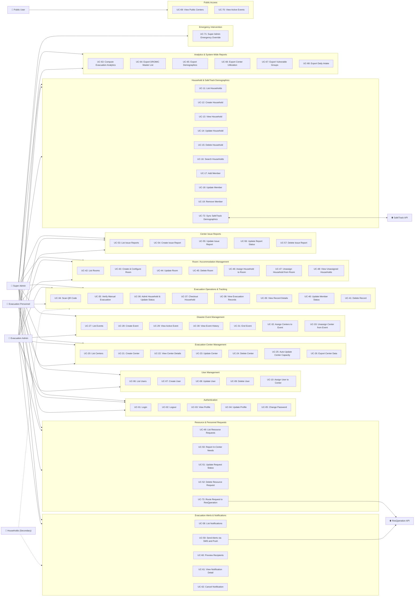

# EvaTrack – Use Case Diagram & Detailed Use Cases

**Project Title:** EVATRACK: Streamlined Evacuation Processes and Coordination Platform Integrating SafeTrack Demographics and ResQperation Response Support  
**Proponents:** Klint M. Ruales, Danica Gelbolingo, Anna Rhea Villadolid, Vhenz Cernal  

---

## 1. System Overview & Must-Haves Alignment

EvaTrack provides streamlined evacuation operations, real-time center occupancy tracking, demographic analytics, and response coordination by integrating with **SafeTrack** (for household demographic data retrieval) and **ResQperation** (for emergency response support and push notification dispatch).

### Core Must-Have System Requirements:

1. **SafeTrack Demographics Integration:** Retrieves household demographic data from SafeTrack for identification and verification during evacuation. This data is not visible to households and is used exclusively for verification and analytics purposes.
2. **Evacuation Status Tracking:** Real-time tracking of household evacuation status as `Evacuated` or `Not Evacuated`.
3. **Auto Capacity Updates:** Automatically updates evacuation center capacity and occupancy counts when a household is verified and admitted at that center.
4. **Demographic Analytics Computation:** Automatically computes evacuation analytics from demographic data captured through personnel updates, including:
   - Age distribution (children, adults, elderly)
   - Pregnant women count
   - Persons with Disabilities (PWD) count
   - Gender distribution
   - Total affected population
5. **Alert & Assistance Routing:**
   - Routes emergency evacuation alerts to households via SMS (for those without internet access) and push notifications via ResQperation (for those with the app).
   - Routes resource shortages and personnel assistance requests directly to ResQperation.
6. **Role-Based Workflows & Super Admin Override:**
   - **Evacuation Personnel:** Log in, verify arriving households (QR code or manual input), perform post-verification updates (assign rooms, monitor stay duration, update evacuation status), report in-center resource/personnel shortages, and request assistance from ResQperation.
   - **Evacuation Admin:** Log in, create/configure evacuation centers and rooms, monitor ongoing evacuations and requests per center, send evacuation alerts (SMS/push), assign personnel, edit household/room records, and **generate/retrieve system-wide and center-level reports** (DROMIC master list, demographics, vulnerable groups, center utilization, daily intake summaries). **Inherits all operational capabilities of Evacuation Personnel** (QR scanning, manual verification, household admission, room assignment, reporting shortages, requesting assistance).
   - **Super Admin:** Log in, generate and retrieve system-wide reports & analytics, maintain full oversight of all system operations across all centers and roles, and hold **emergency override access** over all Evacuation Admin and Personnel actions for emergency intervention or troubleshooting.
   - **Households / Residents (Secondary Actor):** Receive alerts via SMS or push; verified and tracked by personnel without direct system login.

---

## 2. System Actors

| Actor | Role Type | Description |
|-------|-----------|-------------|
| **Super Admin** | Primary System Actor | Full system oversight across all centers and roles. Generates and retrieves system-wide reports and evacuation analytics. Holds emergency override access over all Evacuation Admin and Evacuation Personnel actions for emergency intervention or troubleshooting. |
| **Evacuation Admin** | Primary System Actor | Holds full administrative, reporting, and operational capabilities across all centers. Creates/configures centers and rooms, monitors evacuations & requests, sends alerts (SMS/push), assigns personnel, edits records, and **generates & retrieves all system reports** (DROMIC master list, demographics, vulnerable groups, utilization, daily intake). Performs all Evacuation Personnel actions. |
| **Evacuation Personnel** | Primary System Actor | Assigned to a specific evacuation center. Logs in, verifies arriving households via QR code scanning or manual input. Updates household info post-verification (assigns rooms, monitors stay, updates evacuation status). Reports in-center needs (essential resource shortages, personnel requests) and requests assistance from ResQperation. |
| **Households / Residents** | Secondary Actor | Secondary user with no direct system access. Receives evacuation alerts via SMS (no internet) or ResQperation push notifications. Verified by QR code or manual input and tracked by evacuation personnel. |
| **Public User** | Unauthenticated Actor | Accesses public landing portal to view active disaster events and public evacuation center status/locations. |
| **SafeTrack System** | External System | External demographic database system providing verified household demographic data for identification and analytics. |
| **ResQperation System** | External System | External response platform receiving resource/personnel assistance requests and dispatching mobile push notifications. |

---

## 3. Use Case Diagram

---

## 4. Detailed Use Cases

---

### UC-01: Login

| Field | Detail |
|-------|--------|
| **Use Case ID** | UC-01 |
| **Use Case Name** | Login |
| **Actors** | Super Admin, Evacuation Admin, Evacuation Personnel |
| **Description** | An authorized user logs into the system using their credentials to access role-specific system features. |
| **Preconditions** | User has a valid active account created by an admin. |
| **Postconditions** | User is authenticated and receives a Sanctum session token with role claims. |
| **Main Flow** | 1. User navigates to the Login page. 2. User enters username/email and password. 3. System validates credentials. 4. System issues Sanctum API token. 5. System redirects user to their role-based dashboard. |
| **Alternative Flow** | 3a. Invalid credentials → System displays error. 3b. Account deactivated → System displays "Account deactivated". |
| **API Endpoint** | `POST /api/login` |

---

### UC-02: Logout

| Field | Detail |
|-------|--------|
| **Use Case ID** | UC-02 |
| **Use Case Name** | Logout |
| **Actors** | Super Admin, Evacuation Admin, Evacuation Personnel |
| **Description** | The user logs out and their current session token is revoked. |
| **Preconditions** | User is authenticated. |
| **Postconditions** | Session token is revoked; user is redirected to Login page. |
| **Main Flow** | 1. User clicks "Logout". 2. System revokes current API token. 3. System redirects to Login page. |
| **API Endpoint** | `POST /api/logout` |

---

### UC-03: View Profile

| Field | Detail |
|-------|--------|
| **Use Case ID** | UC-03 |
| **Use Case Name** | View Profile |
| **Actors** | Super Admin, Evacuation Admin, Evacuation Personnel |
| **Description** | User views their own profile information (name, email, role, assigned center). |
| **Preconditions** | User is authenticated. |
| **Postconditions** | Profile information is displayed. |
| **Main Flow** | 1. User navigates to Profile page. 2. System retrieves user details. 3. System displays name, role, contact info, and assigned center. |
| **API Endpoint** | `GET /api/user` |

---

### UC-04: Update Profile

| Field | Detail |
|-------|--------|
| **Use Case ID** | UC-04 |
| **Use Case Name** | Update Profile |
| **Actors** | Super Admin, Evacuation Admin, Evacuation Personnel |
| **Description** | User updates their contact details or profile photo. |
| **Preconditions** | User is authenticated. |
| **Postconditions** | User profile is updated. |
| **Main Flow** | 1. User edits contact details on Profile page. 2. User clicks "Save". 3. System validates and updates profile. |
| **API Endpoint** | `PUT /api/user/profile` |

---

### UC-05: Change Password

| Field | Detail |
|-------|--------|
| **Use Case ID** | UC-05 |
| **Use Case Name** | Change Password |
| **Actors** | Super Admin, Evacuation Admin, Evacuation Personnel |
| **Description** | User changes their password. |
| **Preconditions** | User is authenticated. |
| **Postconditions** | Password hash is updated in database. |
| **Main Flow** | 1. User enters current password and new password. 2. System verifies current password. 3. System updates password hash. |
| **API Endpoint** | `PUT /api/user/password` |

---

### UC-06: List Users

| Field | Detail |
|-------|--------|
| **Use Case ID** | UC-06 |
| **Use Case Name** | List System Users |
| **Actors** | Super Admin, Evacuation Admin |
| **Description** | Admin views a paginated list of all system users across roles. |
| **Preconditions** | User has `super_admin` or `evac_admin` role. |
| **Postconditions** | Paginated user list is displayed. |
| **Main Flow** | 1. Admin navigates to User Management. 2. System retrieves users with roles and assigned centers. 3. System displays user list. |
| **API Endpoint** | `GET /api/users` |

---

### UC-07: Create User

| Field | Detail |
|-------|--------|
| **Use Case ID** | UC-07 |
| **Use Case Name** | Create System User Account |
| **Actors** | Super Admin, Evacuation Admin |
| **Description** | Admin creates a new Evacuation Admin or Evacuation Personnel account. |
| **Preconditions** | Admin is authenticated. |
| **Postconditions** | New user record created with system-generated ID prefix (e.g. `SUP-`, `ADM-`, `PER-`). |
| **Main Flow** | 1. Admin fills in user form (name, role, contact number, temporary password). 2. System creates user record with `must_change_password = true`. |
| **API Endpoint** | `POST /api/users` |

---

### UC-08: Update User

| Field | Detail |
|-------|--------|
| **Use Case ID** | UC-08 |
| **Use Case Name** | Update User Account |
| **Actors** | Super Admin, Evacuation Admin |
| **Description** | Admin updates a user's details, role, or active status. |
| **Preconditions** | Target user exists. |
| **Postconditions** | User record is updated. |
| **Main Flow** | 1. Admin edits user details. 2. System validates and updates database record. |
| **API Endpoint** | `PUT /api/users/{id}` |

---

### UC-09: Delete User

| Field | Detail |
|-------|--------|
| **Use Case ID** | UC-09 |
| **Use Case Name** | Delete User Account |
| **Actors** | Super Admin, Evacuation Admin |
| **Description** | Admin soft-deletes a user account. |
| **Preconditions** | Target user exists. |
| **Postconditions** | User account soft-deleted (`deleted_at` timestamp set). |
| **Main Flow** | 1. Admin selects "Delete User". 2. Admin confirms action. 3. System soft-deletes user. |
| **API Endpoint** | `DELETE /api/users/{id}` |

---

### UC-10: Assign User to Center

| Field | Detail |
|-------|--------|
| **Use Case ID** | UC-10 |
| **Use Case Name** | Assign Personnel to Center |
| **Actors** | Super Admin, Evacuation Admin |
| **Description** | Admin assigns an Evacuation Personnel user to a specific evacuation center. |
| **Preconditions** | Personnel user and center exist. |
| **Postconditions** | User's `assigned_center_id` is updated. |
| **Main Flow** | 1. Admin selects personnel user. 2. Admin selects evacuation center. 3. System updates assignment link. |
| **API Endpoint** | `POST /api/users/{user}/assign-center` |

---

### UC-11: List Households

| Field | Detail |
|-------|--------|
| **Use Case ID** | UC-11 |
| **Use Case Name** | List Registered Households |
| **Actors** | Super Admin, Evacuation Admin, Evacuation Personnel |
| **Description** | View registered households, member counts, address, and current evacuation status. |
| **Preconditions** | User is authenticated. |
| **Postconditions** | Household list displayed with live status (`Evacuated` / `Not Evacuated`). |
| **Main Flow** | 1. User opens Household Management. 2. System fetches household records and evacuation status. 3. System displays paginated list. |
| **API Endpoint** | `GET /api/households` |

---

### UC-12: Create Household

| Field | Detail |
|-------|--------|
| **Use Case ID** | UC-12 |
| **Use Case Name** | Create Household Record |
| **Actors** | Super Admin, Evacuation Admin, Evacuation Personnel |
| **Description** | Manually registers a new household in EvaTrack when SafeTrack lookup is pending. |
| **Preconditions** | User is authenticated. |
| **Postconditions** | Household created with unique ID and QR code. |
| **Main Flow** | 1. User inputs household name, contact, emergency contact, and address. 2. System generates unique ID & QR code. 3. System saves household. |
| **API Endpoint** | `POST /api/households` |

---

### UC-13: View Household Details

| Field | Detail |
|-------|--------|
| **Use Case ID** | UC-13 |
| **Use Case Name** | View Household Details |
| **Actors** | Super Admin, Evacuation Admin, Evacuation Personnel |
| **Description** | View full household profile, individual member list, demographic flags, and stay history. |
| **Preconditions** | Household exists. |
| **Postconditions** | Details displayed. Demographic data used for verification (hidden from households). |
| **Main Flow** | 1. User selects household. 2. System retrieves members, demographic attributes, and evacuation history. 3. System renders details view. |
| **API Endpoint** | `GET /api/households/{id}` |

---

### UC-14: Update Household

| Field | Detail |
|-------|--------|
| **Use Case ID** | UC-14 |
| **Use Case Name** | Update Household Profile |
| **Actors** | Super Admin, Evacuation Admin, Evacuation Personnel |
| **Description** | Edit household contact details, address, or emergency info. |
| **Preconditions** | Household exists. |
| **Postconditions** | Household record updated. |
| **Main Flow** | 1. User modifies household details. 2. System validates and saves updates. |
| **API Endpoint** | `PATCH /api/households/{id}` |

---

### UC-15: Delete Household

| Field | Detail |
|-------|--------|
| **Use Case ID** | UC-15 |
| **Use Case Name** | Delete Household Record |
| **Actors** | Super Admin, Evacuation Admin, Evacuation Personnel |
| **Description** | Soft-delete a household record from EvaTrack. |
| **Preconditions** | Household exists. |
| **Postconditions** | Household soft-deleted. |
| **Main Flow** | 1. User clicks "Delete Household". 2. User confirms. 3. System soft-deletes record. |
| **API Endpoint** | `DELETE /api/households/{id}` |

---

### UC-16: Search Households

| Field | Detail |
|-------|--------|
| **Use Case ID** | UC-16 |
| **Use Case Name** | Search Household Records |
| **Actors** | Super Admin, Evacuation Admin, Evacuation Personnel |
| **Description** | Search households by name, household ID code, head of family, or contact number. |
| **Preconditions** | User authenticated. |
| **Postconditions** | Matching results returned. |
| **Main Flow** | 1. Personnel types search query. 2. System queries database and returns matching records. |
| **API Endpoint** | `GET /api/evacuations/search-household` |

---

### UC-17: Add Household Member

| Field | Detail |
|-------|--------|
| **Use Case ID** | UC-17 |
| **Use Case Name** | Add Member to Household |
| **Actors** | Super Admin, Evacuation Admin, Evacuation Personnel |
| **Description** | Add an individual member to a household, specifying demographics (age, gender, PWD status, pregnancy status). |
| **Preconditions** | Household exists. |
| **Postconditions** | Member added; household member count updated; demographic analytics updated. |
| **Main Flow** | 1. Personnel fills member details (name, DOB, age, gender, PWD flag, pregnancy flag). 2. System creates member record. 3. System updates household total member count. |
| **API Endpoint** | `POST /api/households/{householdId}/members` |

---

### UC-18: Update Household Member

| Field | Detail |
|-------|--------|
| **Use Case ID** | UC-18 |
| **Use Case Name** | Update Household Member Demographics |
| **Actors** | Super Admin, Evacuation Admin, Evacuation Personnel |
| **Description** | Update member demographic details (age group, vulnerable status). |
| **Preconditions** | Member exists. |
| **Postconditions** | Member record updated. |
| **Main Flow** | 1. User edits member fields. 2. System updates database record. |
| **API Endpoint** | `PATCH /api/households/{householdId}/members/{memberId}` |

---

### UC-19: Remove Household Member

| Field | Detail |
|-------|--------|
| **Use Case ID** | UC-19 |
| **Use Case Name** | Remove Member from Household |
| **Actors** | Super Admin, Evacuation Admin, Evacuation Personnel |
| **Description** | Soft-deletes a member record from a household. |
| **Preconditions** | Member exists. |
| **Postconditions** | Member soft-deleted; member count updated. |
| **Main Flow** | 1. Personnel removes member. 2. System soft-deletes member record and recalculates count. |
| **API Endpoint** | `DELETE /api/households/{householdId}/members/{memberId}` |

---

### UC-20: List Evacuation Centers

| Field | Detail |
|-------|--------|
| **Use Case ID** | UC-20 |
| **Use Case Name** | List Evacuation Centers |
| **Actors** | Super Admin, Evacuation Admin, Evacuation Personnel |
| **Description** | Displays all configured evacuation centers with real-time status, capacity, and current occupancy. |
| **Preconditions** | User is authenticated. |
| **Postconditions** | Center list displayed. |
| **Main Flow** | 1. User navigates to Evacuation Centers. 2. System retrieves center details and occupancy. 3. System displays summary list. |
| **API Endpoint** | `GET /api/evacuation-centers` |

---

### UC-21: Create Evacuation Center

| Field | Detail |
|-------|--------|
| **Use Case ID** | UC-21 |
| **Use Case Name** | Create Evacuation Center |
| **Actors** | Super Admin, Evacuation Admin |
| **Description** | Evacuation Admin or Super Admin creates and configures a new evacuation center. |
| **Preconditions** | Admin authenticated. |
| **Postconditions** | New center record created. |
| **Main Flow** | 1. Admin inputs center name, address, max capacity, GPS coordinates, and contact details. 2. System creates new center record. |
| **API Endpoint** | `POST /api/evacuation-centers` |

---

### UC-22: View Center Details

| Field | Detail |
|-------|--------|
| **Use Case ID** | UC-22 |
| **Use Case Name** | View Center Details |
| **Actors** | Super Admin, Evacuation Admin, Evacuation Personnel |
| **Description** | View center overview, occupancy breakdown, configured rooms/units, assigned personnel, and evacuee list. |
| **Preconditions** | Center exists. |
| **Postconditions** | Center details displayed. |
| **Main Flow** | 1. User selects center. 2. System retrieves center profile, rooms, occupancy, and evacuees. |
| **API Endpoint** | `GET /api/evacuation-centers/{center}` |

---

### UC-23: Update Evacuation Center

| Field | Detail |
|-------|--------|
| **Use Case ID** | UC-23 |
| **Use Case Name** | Update Center Configuration |
| **Actors** | Super Admin, Evacuation Admin |
| **Description** | Admin edits evacuation center parameters (capacity, operational status, location). |
| **Preconditions** | Center exists. |
| **Postconditions** | Center configuration updated. |
| **Main Flow** | 1. Admin modifies center details. 2. System updates database record. |
| **API Endpoint** | `PUT /api/evacuation-centers/{center}` |

---

### UC-24: Delete Evacuation Center

| Field | Detail |
|-------|--------|
| **Use Case ID** | UC-24 |
| **Use Case Name** | Delete Evacuation Center |
| **Actors** | Super Admin, Evacuation Admin |
| **Description** | Soft-delete an evacuation center. |
| **Preconditions** | Center exists. |
| **Postconditions** | Center soft-deleted. |
| **Main Flow** | 1. Admin selects "Delete Center". 2. System confirms and soft-deletes center. |
| **API Endpoint** | `DELETE /api/evacuation-centers/{center}` |

---

### UC-25: Auto-Update Center Capacity

| Field | Detail |
|-------|--------|
| **Use Case ID** | UC-25 |
| **Use Case Name** | Auto-Update Evacuation Center Capacity |
| **Actors** | System, Evacuation Personnel, Evacuation Admin, Super Admin |
| **Description** | System automatically increments or decrements center occupancy and updates remaining capacity when a household is verified/admitted or checked out. |
| **Preconditions** | Household verification or checkout action performed. |
| **Postconditions** | Center `current_occupancy` and capacity percentage updated in real time. |
| **Main Flow** | 1. Household verified/admitted at center. 2. System increments center `current_occupancy` by count of admitted members. 3. System recalculates remaining capacity percentage. 4. Live indicators reflect updated occupancy instantly. |
| **API Endpoint** | `GET /api/evacuation-centers/{center}/capacity` |

---

### UC-26: Export Center Data

| Field | Detail |
|-------|--------|
| **Use Case ID** | UC-26 |
| **Use Case Name** | Export Center Evacuee Data |
| **Actors** | Super Admin, Evacuation Admin, Evacuation Personnel |
| **Description** | Export CSV report of evacuees currently staying in a center. |
| **Preconditions** | Center exists. |
| **Postconditions** | Downloadable CSV file generated. |
| **Main Flow** | 1. User clicks "Export". 2. System compiles evacuee roster and initiates download. |
| **API Endpoint** | `GET /api/evacuation-centers/{center}/export` |

---

### UC-27: List Disaster Events

| Field | Detail |
|-------|--------|
| **Use Case ID** | UC-27 |
| **Use Case Name** | List Disaster Events |
| **Actors** | Super Admin, Evacuation Admin, Evacuation Personnel |
| **Description** | View active and historical disaster events. |
| **Preconditions** | User authenticated. |
| **Postconditions** | Event list displayed. |
| **Main Flow** | 1. User navigates to Events page. 2. System retrieves event records. 3. System displays active and past events. |
| **API Endpoint** | `GET /api/events` |

---

### UC-28: Create Disaster Event

| Field | Detail |
|-------|--------|
| **Use Case ID** | UC-28 |
| **Use Case Name** | Create Disaster Event |
| **Actors** | Super Admin, Evacuation Admin |
| **Description** | Admin initiates a new disaster event to manage evacuations. |
| **Preconditions** | Admin authenticated. |
| **Postconditions** | Disaster event created and active. |
| **Main Flow** | 1. Admin inputs event title, disaster type, severity level, and start date. 2. System creates event record. |
| **API Endpoint** | `POST /api/events` |

---

### UC-29: View Active Disaster Event

| Field | Detail |
|-------|--------|
| **Use Case ID** | UC-29 |
| **Use Case Name** | View Active Event Details |
| **Actors** | Super Admin, Evacuation Admin, Evacuation Personnel |
| **Description** | View details of currently active disaster event and assigned centers. |
| **Preconditions** | Active event exists. |
| **Postconditions** | Active event details displayed. |
| **Main Flow** | 1. System retrieves active event (`ended_at = null`). 2. System displays active event parameters and assigned centers. |
| **API Endpoint** | `GET /api/events/active` |

---

### UC-30: View Event History

| Field | Detail |
|-------|--------|
| **Use Case ID** | UC-30 |
| **Use Case Name** | View Disaster Event History |
| **Actors** | Super Admin, Evacuation Admin, Evacuation Personnel |
| **Description** | Browse completed/past disaster events. |
| **Preconditions** | User authenticated. |
| **Postconditions** | Historical events list displayed. |
| **Main Flow** | 1. User opens Event History tab. 2. System lists past events with start and end dates. |
| **API Endpoint** | `GET /api/events/history` |

---

### UC-31: End Disaster Event

| Field | Detail |
|-------|--------|
| **Use Case ID** | UC-31 |
| **Use Case Name** | End Disaster Event |
| **Actors** | Super Admin, Evacuation Admin |
| **Description** | Admin marks an active disaster event as ended. |
| **Preconditions** | Active event exists. |
| **Postconditions** | Event timestamp `ended_at` set; active status closed. |
| **Main Flow** | 1. Admin clicks "End Event". 2. Admin confirms. 3. System sets `ended_at` timestamp. |
| **API Endpoint** | `PATCH /api/events/{id}/end` |

---

### UC-32: Assign Centers to Event

| Field | Detail |
|-------|--------|
| **Use Case ID** | UC-32 |
| **Use Case Name** | Assign Evacuation Centers to Event |
| **Actors** | Super Admin, Evacuation Admin |
| **Description** | Assign active evacuation centers to a disaster event. |
| **Preconditions** | Active event exists. |
| **Postconditions** | Centers linked to event. |
| **Main Flow** | 1. Admin selects centers. 2. System links centers to event via history mapping. |
| **API Endpoint** | `PATCH /api/events/{id}/assign-centers` |

---

### UC-33: Unassign Center from Event

| Field | Detail |
|-------|--------|
| **Use Case ID** | UC-33 |
| **Use Case Name** | Unassign Center from Event |
| **Actors** | Super Admin, Evacuation Admin |
| **Description** | Unlink an evacuation center from an active event. |
| **Preconditions** | Center assigned to event. |
| **Postconditions** | Center unlinked from event. |
| **Main Flow** | 1. Admin unassigns center. 2. System clears center `current_event_id`. |
| **API Endpoint** | `PATCH /api/centers/{centerId}/unassign` |

---

### UC-34: Scan QR Code

| Field | Detail |
|-------|--------|
| **Use Case ID** | UC-34 |
| **Use Case Name** | Verify Household Arrival via QR Code |
| **Actors** | Evacuation Personnel, Evacuation Admin, Super Admin |
| **Description** | Personnel scans a household's QR code on arrival at an evacuation center. System decodes QR code, fetches household demographic data from SafeTrack for verification (hidden from households), and prepares record for admission. |
| **Preconditions** | Personnel logged in; household presents QR code; active event exists. |
| **Postconditions** | Household identity verified; ready for room assignment and admission. |
| **Main Flow** | 1. Personnel opens QR Scanner tool. 2. Personnel scans household QR code. 3. System decodes ID and retrieves demographic data from SafeTrack. 4. System displays member roster for verification. 5. Personnel verifies arriving members. |
| **Alternative Flow** | 2a. Camera scan fails or QR missing → Fallback to Manual Verification (UC-35). |
| **API Endpoint** | `POST /api/evacuations/process-scan` |

---

### UC-35: Verify Manual Evacuation

| Field | Detail |
|-------|--------|
| **Use Case ID** | UC-35 |
| **Use Case Name** | Manual Household Verification |
| **Actors** | Evacuation Personnel, Evacuation Admin, Super Admin |
| **Description** | Fallback verification when QR code is unavailable. Personnel searches household by name or ID, fetches SafeTrack demographics for identity verification, and selects arriving members. |
| **Preconditions** | Personnel logged in; household present without QR code. |
| **Postconditions** | Household manually verified and ready for admission. |
| **Main Flow** | 1. Personnel inputs household name, ID, or head of family. 2. System retrieves SafeTrack demographic record. 3. Personnel selects members physically present. 4. System records manual verification. |
| **API Endpoint** | `POST /api/evacuations/verify-manual` |

---

### UC-36: Admit Household & Update Status

| Field | Detail |
|-------|--------|
| **Use Case ID** | UC-36 |
| **Use Case Name** | Admit Household & Update Evacuation Status |
| **Actors** | Evacuation Personnel, Evacuation Admin, Super Admin |
| **Description** | Personnel confirms admission of verified household members into the evacuation center, updates household status to `Evacuated`, triggers auto capacity update for the center, and monitors stay duration. |
| **Preconditions** | Household verified via QR (UC-34) or manual input (UC-35). |
| **Postconditions** | Evacuation record created; status set to `Evacuated`; center occupancy incremented automatically. |
| **Main Flow** | 1. Personnel confirms member count. 2. Personnel selects room (if configured). 3. Personnel clicks "Admit Household". 4. System marks household evacuation status as `Evacuated`. 5. System automatically updates center occupancy (UC-25). |
| **API Endpoint** | `POST /api/evacuations/admit` |

---

### UC-37: Checkout Household

| Field | Detail |
|-------|--------|
| **Use Case ID** | UC-37 |
| **Use Case Name** | Checkout Household |
| **Actors** | Evacuation Personnel, Evacuation Admin, Super Admin |
| **Description** | Personnel checks out a household when leaving the center. Updates status to `Not Evacuated` / `Checked Out` and auto-decrements center occupancy. |
| **Preconditions** | Household currently admitted. |
| **Postconditions** | Record updated with `checkout_at` timestamp; status updated; center occupancy decremented. |
| **Main Flow** | 1. Personnel selects household from evacuee roster. 2. Personnel clicks "Checkout". 3. System sets `checkout_at` timestamp. 4. System updates center occupancy automatically. |
| **API Endpoint** | `POST /api/evacuations/{evacuationId}/checkout` |

---

### UC-38: View Evacuation Records

| Field | Detail |
|-------|--------|
| **Use Case ID** | UC-38 |
| **Use Case Name** | View Evacuation Roster & Records |
| **Actors** | Super Admin, Evacuation Admin, Evacuation Personnel |
| **Description** | View active and past evacuation records for centers. |
| **Preconditions** | User authenticated. |
| **Postconditions** | Evacuation records list displayed. |
| **Main Flow** | 1. User opens Evacuees page. 2. System displays records with search and status filters. |
| **API Endpoint** | `GET /api/evacuations` |

---

### UC-39: View Evacuation Record Detail

| Field | Detail |
|-------|--------|
| **Use Case ID** | UC-39 |
| **Use Case Name** | View Evacuation Record Details |
| **Actors** | Super Admin, Evacuation Admin, Evacuation Personnel |
| **Description** | View individual evacuation record, room assignment, admission timestamp, and verified member list. |
| **Preconditions** | Record exists. |
| **Postconditions** | Full record details displayed. |
| **Main Flow** | 1. User selects record. 2. System displays record overview, assigned room, and member list. |
| **API Endpoint** | `GET /api/evacuations/{evacuation}` |

---

### UC-40: Update Member Status

| Field | Detail |
|-------|--------|
| **Use Case ID** | UC-40 |
| **Use Case Name** | Update Evacuated Member Status |
| **Actors** | Evacuation Personnel, Evacuation Admin, Super Admin |
| **Description** | Personnel updates individual member verification status or special condition within a center. |
| **Preconditions** | Member record exists. |
| **Postconditions** | Member status updated. |
| **Main Flow** | 1. Personnel clicks member. 2. Personnel updates status/flag. 3. System saves change. |
| **API Endpoint** | `PATCH /api/evacuations/{evacuationId}/members/{memberId}/status` |

---

### UC-41: Delete Evacuation Record

| Field | Detail |
|-------|--------|
| **Use Case ID** | UC-41 |
| **Use Case Name** | Delete Evacuation Record |
| **Actors** | Super Admin, Evacuation Admin, Evacuation Personnel |
| **Description** | Delete erroneous evacuation entry and restore center capacity. |
| **Preconditions** | Record exists. |
| **Postconditions** | Record deleted; capacity recalculated. |
| **Main Flow** | 1. User selects "Delete Record". 2. User confirms. 3. System deletes record and recalculates capacity. |
| **API Endpoint** | `DELETE /api/evacuations/{evacuationId}` |

---

### UC-42: List Accommodation Rooms / Units

| Field | Detail |
|-------|--------|
| **Use Case ID** | UC-42 |
| **Use Case Name** | List Rooms / Accommodation Units |
| **Actors** | Super Admin, Evacuation Admin, Evacuation Personnel |
| **Description** | View all configured rooms/units within an evacuation center with room capacity and current assignment count. |
| **Preconditions** | Center exists. |
| **Postconditions** | Room list displayed. |
| **Main Flow** | 1. User navigates to Center Rooms. 2. System displays list of rooms, capacity, and current occupants. |
| **API Endpoint** | `GET /api/centers/{centerId}/units` |

---

### UC-43: Create & Configure Room / Unit

| Field | Detail |
|-------|--------|
| **Use Case ID** | UC-43 |
| **Use Case Name** | Create and Configure Center Room |
| **Actors** | Super Admin, Evacuation Admin |
| **Description** | Evacuation Admin or Super Admin creates and configures individual rooms/units (classrooms, tents, designated areas) within an evacuation center. |
| **Preconditions** | Evacuation center exists. |
| **Postconditions** | New room configured for center. |
| **Main Flow** | 1. Admin inputs room name/number, unit type (room/tent/classroom), and room capacity. 2. System saves room configuration linked to center. |
| **API Endpoint** | `POST /api/centers/{centerId}/units` |

---

### UC-44: Update Room / Unit

| Field | Detail |
|-------|--------|
| **Use Case ID** | UC-44 |
| **Use Case Name** | Update Room Configuration |
| **Actors** | Super Admin, Evacuation Admin |
| **Description** | Modify room name, type, or capacity. |
| **Preconditions** | Room exists. |
| **Postconditions** | Room updated. |
| **Main Flow** | 1. Admin edits room fields. 2. System updates database record. |
| **API Endpoint** | `PATCH /api/centers/{centerId}/units/{unitId}` |

---

### UC-45: Delete Room / Unit

| Field | Detail |
|-------|--------|
| **Use Case ID** | UC-45 |
| **Use Case Name** | Delete Room / Unit |
| **Actors** | Super Admin, Evacuation Admin |
| **Description** | Soft-delete a room configuration from a center. |
| **Preconditions** | Room exists. |
| **Postconditions** | Room deleted. |
| **Main Flow** | 1. Admin selects "Delete Room". 2. System confirms and soft-deletes room. |
| **API Endpoint** | `DELETE /api/centers/{centerId}/units/{unitId}` |

---

### UC-46: Assign Household to Room

| Field | Detail |
|-------|--------|
| **Use Case ID** | UC-46 |
| **Use Case Name** | Assign Household to Room / Unit |
| **Actors** | Evacuation Personnel, Evacuation Admin, Super Admin |
| **Description** | Post-verification step: Personnel assigns an admitted household to a specific room or accommodation unit within the center. |
| **Preconditions** | Household admitted to center; room configured. |
| **Postconditions** | Household allocated to room. |
| **Main Flow** | 1. Personnel views unassigned households or room details. 2. Personnel selects household and target room. 3. System creates room allocation link. |
| **API Endpoint** | `POST /api/units/{unitId}/allocations` |

---

### UC-47: Unassign Household from Room

| Field | Detail |
|-------|--------|
| **Use Case ID** | UC-47 |
| **Use Case Name** | Unassign Household from Room |
| **Actors** | Evacuation Personnel, Evacuation Admin, Super Admin |
| **Description** | Relocate or remove a household from an assigned room. |
| **Preconditions** | Room allocation exists. |
| **Postconditions** | Household unassigned from room. |
| **Main Flow** | 1. Personnel clicks "Unassign". 2. System deletes allocation record. |
| **API Endpoint** | `DELETE /api/units/{unitId}/allocations/{allocationId}` |

---

### UC-48: View Unassigned Households

| Field | Detail |
|-------|--------|
| **Use Case ID** | UC-48 |
| **Use Case Name** | View Unassigned Households in Center |
| **Actors** | Evacuation Personnel, Evacuation Admin, Super Admin |
| **Description** | View households that are admitted to the center but not yet assigned to any room. |
| **Preconditions** | Center has admitted households. |
| **Postconditions** | List of unassigned households displayed. |
| **Main Flow** | 1. Personnel views room management tab. 2. System lists admitted households without active room allocations. |
| **API Endpoint** | `GET /api/centers/{centerId}/unassigned` |

---

### UC-49: List Resource Requests

| Field | Detail |
|-------|--------|
| **Use Case ID** | UC-49 |
| **Use Case Name** | List Resource & Personnel Requests |
| **Actors** | Super Admin, Evacuation Admin, Evacuation Personnel |
| **Description** | Monitor ongoing requests across evacuation centers, including essential resource shortages and personnel assistance requests. |
| **Preconditions** | User authenticated. |
| **Postconditions** | Requests list displayed with summary cards. |
| **Main Flow** | 1. User navigates to Resource Requests. 2. System retrieves requests, urgency levels, and status counts. 3. System displays requests dashboard. |
| **API Endpoint** | `GET /api/resource-requests` |

---

### UC-50: Report In-Center Needs & Requests

| Field | Detail |
|-------|--------|
| **Use Case ID** | UC-50 |
| **Use Case Name** | Report In-Center Needs & Request Assistance |
| **Actors** | Evacuation Personnel, Evacuation Admin, Super Admin |
| **Description** | Evacuation Personnel reports in-center needs, including essential resource shortages (food, medical, sanitation) and requests for additional response personnel assistance. Request is submitted and routed to ResQperation. |
| **Preconditions** | Personnel logged in; evacuation center active. |
| **Postconditions** | Request created with `pending` status and routed to ResQperation. |
| **Main Flow** | 1. Personnel clicks "New Request". 2. Personnel specifies request category (supplies or response personnel), items/count, urgency level, and description. 3. Personnel submits request. 4. System logs request and triggers ResQperation integration dispatch (UC-73). |
| **API Endpoint** | `POST /api/resource-requests` |

---

### UC-51: Update Request Status

| Field | Detail |
|-------|--------|
| **Use Case ID** | UC-51 |
| **Use Case Name** | Update Request Status |
| **Actors** | Evacuation Admin, Super Admin, Evacuation Personnel |
| **Description** | Update status of a request (`pending` → `acknowledged` → `approved` → `delivered` / `rejected`). |
| **Preconditions** | Request exists. |
| **Postconditions** | Request status updated; handler recorded. |
| **Main Flow** | 1. Admin/Personnel selects request. 2. User updates status dropdown. 3. System records update timestamp and handler user ID. |
| **API Endpoint** | `PATCH /api/resource-requests/{id}/status` |

---

### UC-52: Delete Resource Request

| Field | Detail |
|-------|--------|
| **Use Case ID** | UC-52 |
| **Use Case Name** | Delete Resource Request |
| **Actors** | Super Admin, Evacuation Admin, Evacuation Personnel |
| **Description** | Delete a duplicate or invalid resource request. |
| **Preconditions** | Request exists. |
| **Postconditions** | Request deleted. |
| **Main Flow** | 1. User selects "Delete Request". 2. System confirms and deletes record. |
| **API Endpoint** | `DELETE /api/resource-requests/{id}` |

---

### UC-53: List Issue Reports

| Field | Detail |
|-------|--------|
| **Use Case ID** | UC-53 |
| **Use Case Name** | List Center Issue Reports |
| **Actors** | Super Admin, Evacuation Admin, Evacuation Personnel |
| **Description** | View filed issue reports for evacuation centers (facility damage, safety issues, health incidents). |
| **Preconditions** | User authenticated. |
| **Postconditions** | Issue reports list displayed with status/severity summary cards. |
| **Main Flow** | 1. User opens Issue Reports page. 2. System displays reports with category, severity, and center filters. |
| **API Endpoint** | `GET /api/center-issue-reports` |

---

### UC-54: Create Issue Report

| Field | Detail |
|-------|--------|
| **Use Case ID** | UC-54 |
| **Use Case Name** | Create Center Issue Report |
| **Actors** | Evacuation Personnel, Evacuation Admin, Super Admin |
| **Description** | File an issue report for a center regarding infrastructure, health, or safety problems. |
| **Preconditions** | User authenticated. |
| **Postconditions** | Issue report created with `open` status. |
| **Main Flow** | 1. User clicks "Report Issue". 2. User fills category, title, description, severity, and photo attachment. 3. System saves issue report. |
| **API Endpoint** | `POST /api/center-issue-reports` |

---

### UC-55: Update Issue Report

| Field | Detail |
|-------|--------|
| **Use Case ID** | UC-55 |
| **Use Case Name** | Update Issue Report |
| **Actors** | Super Admin, Evacuation Admin, Evacuation Personnel |
| **Description** | Edit issue report details or upload additional attachment. |
| **Preconditions** | Report exists. |
| **Postconditions** | Report updated. |
| **Main Flow** | 1. User edits report details. 2. System updates record. |
| **API Endpoint** | `PATCH /api/center-issue-reports/{id}` |

---

### UC-56: Update Issue Report Status

| Field | Detail |
|-------|--------|
| **Use Case ID** | UC-56 |
| **Use Case Name** | Update Issue Report Status |
| **Actors** | Evacuation Admin, Super Admin, Evacuation Personnel |
| **Description** | Update issue report resolution status (`open` → `in_progress` → `resolved` → `closed`). |
| **Preconditions** | Report exists. |
| **Postconditions** | Report status updated. |
| **Main Flow** | 1. User changes status. 2. System saves status change and handler ID. |
| **API Endpoint** | `PATCH /api/center-issue-reports/{id}/status` |

---

### UC-57: Delete Issue Report

| Field | Detail |
|-------|--------|
| **Use Case ID** | UC-57 |
| **Use Case Name** | Delete Issue Report |
| **Actors** | Super Admin, Evacuation Admin |
| **Description** | Delete an issue report entry. |
| **Preconditions** | Report exists. |
| **Postconditions** | Report deleted. |
| **Main Flow** | 1. Admin deletes report. 2. System removes database record. |
| **API Endpoint** | `DELETE /api/center-issue-reports/{id}` |

---

### UC-58: List Notifications & Alerts

| Field | Detail |
|-------|--------|
| **Use Case ID** | UC-58 |
| **Use Case Name** | List Notifications & Alerts |
| **Actors** | Super Admin, Evacuation Admin, Evacuation Personnel |
| **Description** | View log of sent evacuation alerts and notifications. |
| **Preconditions** | User authenticated. |
| **Postconditions** | Notifications list displayed. |
| **Main Flow** | 1. User opens Alerts page. 2. System lists dispatched notifications with delivery status. |
| **API Endpoint** | `GET /api/notifications` |

---

### UC-59: Send Evacuation Alerts via SMS and Push

| Field | Detail |
|-------|--------|
| **Use Case ID** | UC-59 |
| **Use Case Name** | Send Evacuation Alerts to Households |
| **Actors** | Evacuation Admin, Super Admin |
| **Description** | Admin dispatches emergency evacuation alerts to target households. The system automatically routes SMS messages to households without internet access and mobile push notifications via ResQperation for households with the app installed. |
| **Preconditions** | Admin logged in; active event selected. |
| **Postconditions** | Notification logged; alerts dispatched via SMS gateway and ResQperation push service. |
| **Main Flow** | 1. Admin inputs alert message, urgency, target location/center. 2. Admin chooses target filter. 3. Admin previews target recipient count. 4. Admin clicks "Send Alert". 5. System dispatches SMS for offline households and ResQperation push notifications for app users. |
| **API Endpoint** | `POST /api/notifications` |

---

### UC-60: Preview Notification Recipients

| Field | Detail |
|-------|--------|
| **Use Case ID** | UC-60 |
| **Use Case Name** | Preview Notification Recipients |
| **Actors** | Evacuation Admin, Super Admin |
| **Description** | Calculate and preview households targeted for an alert prior to sending. |
| **Preconditions** | Filter parameters selected. |
| **Postconditions** | Target recipient count and sample list displayed. |
| **Main Flow** | 1. Admin sets recipient filters. 2. System queries matching households and displays preview count. |
| **API Endpoint** | `GET /api/notifications/preview` |

---

### UC-61: View Notification Detail

| Field | Detail |
|-------|--------|
| **Use Case ID** | UC-61 |
| **Use Case Name** | View Notification Detail |
| **Actors** | Super Admin, Evacuation Admin, Evacuation Personnel |
| **Description** | View alert text, dispatch timestamp, target centers, and recipient logs. |
| **Preconditions** | Notification exists. |
| **Postconditions** | Alert detail view displayed. |
| **Main Flow** | 1. User selects notification. 2. System retrieves notification summary and dispatch log. |
| **API Endpoint** | `GET /api/notifications/{notification}` |

---

### UC-62: Cancel Scheduled Notification

| Field | Detail |
|-------|--------|
| **Use Case ID** | UC-62 |
| **Use Case Name** | Cancel Scheduled Notification |
| **Actors** | Evacuation Admin, Super Admin |
| **Description** | Cancel a pending or scheduled emergency alert before dispatch. |
| **Preconditions** | Notification status is `pending` or `scheduled`. |
| **Postconditions** | Notification marked as `cancelled`. |
| **Main Flow** | 1. Admin clicks "Cancel Alert". 2. System updates notification status to `cancelled`. |
| **API Endpoint** | `DELETE /api/notifications/{notification}` |

---

### UC-63: Compute Evacuation Analytics

| Field | Detail |
|-------|--------|
| **Use Case ID** | UC-63 |
| **Use Case Name** | Compute & View Evacuation Analytics |
| **Actors** | Super Admin, Evacuation Admin |
| **Description** | Automatically computes and displays evacuation analytics derived from SafeTrack demographic data and live personnel verification updates. Metrics include: age distribution (children: 0-12, adults: 13-59, elderly: 60+), pregnant women count, PWD count, gender distribution, and total affected population. |
| **Preconditions** | Active event or event history selected; demographic data captured. |
| **Postconditions** | Demographic dashboard and analytic breakdown displayed. |
| **Main Flow** | 1. Admin navigates to Analytics Dashboard. 2. System computes aggregate age brackets, gender totals, pregnant women, PWDs, and total affected population. 3. System renders visual charts and summary metric cards. |
| **API Endpoint** | `GET /api/analytics/dashboard` |

---

### UC-64: Export DROMIC Master List Report

| Field | Detail |
|-------|--------|
| **Use Case ID** | UC-64 |
| **Use Case Name** | Generate System-Wide DROMIC Master List |
| **Actors** | Super Admin, Evacuation Admin |
| **Description** | Generates and retrieves official DSWD DROMIC (Disaster Response Operations Monitoring and Information Center) master list report for centers or system-wide. |
| **Preconditions** | Admin authenticated. |
| **Postconditions** | Downloadable DROMIC master list spreadsheet generated. |
| **Main Flow** | 1. Admin clicks "Export DROMIC Master List". 2. Admin filters by event or center. 3. System compiles master list and initiates download. |
| **API Endpoint** | `GET /api/analytics/export/dromic` |

---

### UC-65: Export Demographics Report

| Field | Detail |
|-------|--------|
| **Use Case ID** | UC-65 |
| **Use Case Name** | Export Demographics Summary Report |
| **Actors** | Super Admin, Evacuation Admin |
| **Description** | Export detailed demographic summary report (age distribution, gender, vulnerable groups). |
| **Preconditions** | Analytics snapshot available. |
| **Postconditions** | Downloadable report generated. |
| **Main Flow** | 1. Admin selects "Export Demographics". 2. System compiles demographic breakdown report. |
| **API Endpoint** | `GET /api/analytics/export/demographics` |

---

### UC-66: Export Center Utilization Report

| Field | Detail |
|-------|--------|
| **Use Case ID** | UC-66 |
| **Use Case Name** | Export Center Utilization Summary |
| **Actors** | Super Admin, Evacuation Admin |
| **Description** | Export capacity, occupancy rate, and shelter utilization report. |
| **Preconditions** | Analytics data exists. |
| **Postconditions** | Downloadable report generated. |
| **Main Flow** | 1. Admin exports utilization report. 2. System generates CSV/Excel download. |
| **API Endpoint** | `GET /api/analytics/export/utilization` |

---

### UC-67: Export Vulnerable Groups Report

| Field | Detail |
|-------|--------|
| **Use Case ID** | UC-67 |
| **Use Case Name** | Export Vulnerable Groups Report |
| **Actors** | Super Admin, Evacuation Admin |
| **Description** | Export detailed listing of PWDs, pregnant women, senior citizens, and children for targeted relief. |
| **Preconditions** | Evacuee records present. |
| **Postconditions** | Downloadable report generated. |
| **Main Flow** | 1. Admin selects "Export Vulnerable Groups". 2. System compiles report. |
| **API Endpoint** | `GET /api/analytics/export/vulnerable` |

---

### UC-68: Export Daily Intake Report

| Field | Detail |
|-------|--------|
| **Use Case ID** | UC-68 |
| **Use Case Name** | Export Daily Intake Report |
| **Actors** | Super Admin, Evacuation Admin |
| **Description** | Export day-by-day admission and checkout timeline report. |
| **Preconditions** | Evacuation logs exist. |
| **Postconditions** | Downloadable report generated. |
| **Main Flow** | 1. Admin exports daily intake timeline. 2. System generates report. |
| **API Endpoint** | `GET /api/analytics/export/daily-intake` |

---

### UC-69: View Public Evacuation Centers

| Field | Detail |
|-------|--------|
| **Use Case ID** | UC-69 |
| **Use Case Name** | View Public Evacuation Centers |
| **Actors** | Public User |
| **Description** | Unauthenticated public user views open evacuation centers, map locations, and live capacity status. |
| **Preconditions** | Public access. |
| **Postconditions** | Public shelter map and list displayed. |
| **Main Flow** | 1. Public user visits landing page. 2. System displays open centers, status, and occupancy percentage. |
| **API Endpoint** | `GET /api/public/evacuation-centers` |

---

### UC-70: View Active Events (Public)

| Field | Detail |
|-------|--------|
| **Use Case ID** | UC-70 |
| **Use Case Name** | View Active Events (Public) |
| **Actors** | Public User |
| **Description** | Public user views details of active disaster events and emergency advisories. |
| **Preconditions** | Public access. |
| **Postconditions** | Active event advisories displayed. |
| **Main Flow** | 1. Public user visits public portal. 2. System displays active event name, type, and advisory notice. |
| **API Endpoint** | `GET /api/public/events/active` |

---

### UC-71: Super Admin Emergency Override

| Field | Detail |
|-------|--------|
| **Use Case ID** | UC-71 |
| **Use Case Name** | Super Admin Emergency Override |
| **Actors** | Super Admin |
| **Description** | Super Admin exercises full administrative override access over any Evacuation Admin or Evacuation Personnel action. Used exclusively for emergency intervention, system troubleshooting, unlocking locked records, force-updating evacuation status, or overriding center assignments. |
| **Preconditions** | Super Admin logged in (`super_admin` role). |
| **Postconditions** | Override action executed; audit log entry recorded. |
| **Main Flow** | 1. Super Admin encounters locked, disputed, or erroneous record/action. 2. Super Admin invokes Emergency Override tool. 3. System verifies `super_admin` privileges. 4. System executes requested modification/override. 5. System logs override action in administrative audit trail. |
| **API Endpoint** | `POST /api/admin/emergency-override` |

---

### UC-72: Sync SafeTrack Demographics

| Field | Detail |
|-------|--------|
| **Use Case ID** | UC-72 |
| **Use Case Name** | Sync SafeTrack Household Demographics |
| **Actors** | System, Evacuation Personnel, Evacuation Admin, Super Admin |
| **Description** | System automatically queries and retrieves household demographic data from SafeTrack during verification and registration. Data is used for identification and analytics calculation, and is kept hidden from household views. |
| **Preconditions** | SafeTrack integration API active; valid household identifier provided. |
| **Postconditions** | Demographic attributes synced into EvaTrack database. |
| **Main Flow** | 1. Personnel initiates QR scan or manual search. 2. System issues secure API query to SafeTrack. 3. SafeTrack returns demographic payload (head of family, members, age, gender, PWD, pregnancy flags). 4. System stores demographic data for verification and analytics computation. |
| **API Endpoint** | `POST /api/integration/safetrack/sync` |

---

### UC-73: Route Assistance Requests to ResQperation

| Field | Detail |
|-------|--------|
| **Use Case ID** | UC-73 |
| **Use Case Name** | Route Assistance Requests to ResQperation |
| **Actors** | System, Evacuation Personnel, Evacuation Admin, Super Admin |
| **Description** | System routes in-center resource shortages and personnel assistance requests directly to the ResQperation response platform for rapid emergency response dispatch. |
| **Preconditions** | Resource request created with target agency `ResQperation`. |
| **Postconditions** | Request dispatched to ResQperation webhook/API. |
| **Main Flow** | 1. Request submitted by Evacuation Personnel or Admin. 2. System validates request details. 3. System dispatches payload to ResQperation API. 4. ResQperation confirms receipt and provides dispatch tracking ID. |
| **API Endpoint** | `POST /api/integration/resqperation/route-request` |

---

## 5. Use Case Summary Matrix by Actor

| Actor | Accessible Use Cases | Total Count |
|-------|----------------------|-------------|
| **Super Admin** | UC-01 to UC-68, UC-71 to UC-73 | 71 |
| **Evacuation Admin** | UC-01 to UC-68, UC-72 to UC-73 | 70 |
| **Evacuation Personnel** | UC-01 to UC-05, UC-11 to UC-20, UC-22, UC-25 to UC-27, UC-29 to UC-30, UC-34 to UC-42, UC-46 to UC-61, UC-72 to UC-73 | 55 |
| **Households / Residents (Secondary)** | UC-34 to UC-37 (verified/tracked), UC-59 (receive SMS/push alerts) | 5 (passive) |
| **Public User** | UC-69, UC-70 | 2 |

---

## 6. Requirements Traceability Matrix

| Must-Have Requirement | Functional Feature | Mapped Use Cases |
|-----------------------|--------------------|------------------|
| SafeTrack Demographics Retrieval | Retrieves household demographics for identification & verification (not visible to households) | UC-13, UC-34, UC-35, UC-72 |
| Evacuation Status Tracking | Tracks household status as `Evacuated` or `Not Evacuated` | UC-11, UC-36, UC-37 |
| Auto Center Capacity Updates | Automatically updates center capacity upon household verification/checkout | UC-25, UC-36, UC-37 |
| Evacuation Demographic Analytics | Computes age (children, adults, elderly), pregnant count, PWD count, gender, total population | UC-17, UC-18, UC-63, UC-65, UC-67 |
| Alert & Request Routing | Routes alerts to households (SMS / push) and requests to ResQperation | UC-50, UC-59, UC-73 |
| Evacuation Personnel Workflows | Log in, QR/manual verification, room assignment, monitor stay, report needs, request assistance | UC-01, UC-34, UC-35, UC-36, UC-46, UC-50, UC-73 |
| Evacuation Admin Workflows | Log in, configure centers & rooms, monitor evacuations & requests, send alerts (SMS/push), assign personnel | UC-01, UC-07, UC-10, UC-21, UC-43, UC-49, UC-59 |
| Super Admin Full Oversight & Emergency Override | Full operational oversight, generate system reports, emergency override access over all actions | UC-01 to UC-68, UC-71 |
| Household Alerts & Tracking | Receive SMS/push alerts, verified & tracked by personnel without direct system login | UC-34, UC-35, UC-36, UC-59 |
